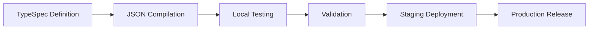

---
描述：具有架构 v1.5、TypeSpec 集成和 Microsoft 365 Agents Toolkit 工作流的 Microsoft 365 Copilot 声明式代理的综合开发指南
applyTo: "**.json, **.ts, **.tsp, **manifest.json, **agent.json, **declarative-agent.json"
---

# Microsoft 365 声明式代理开发指南

## 概述

Microsoft 365 Copilot 声明性代理是功能强大的自定义 AI 助手，可通过专业功能、企业数据访问和自定义行为扩展 Microsoft 365 Copilot。这些指南提供了全面的开发实践，用于使用最新的 v1.5 JSON 架构规范和完整的 Microsoft 365 代理工具包集成来创建生产就绪的代理。

## 架构规范 v1.5

### 核心特性

```json
{
  "$schema": "https://developer.microsoft.com/json-schemas/copilot/declarative-agent/v1.5/schema.json",
  "version": "v1.5",
  "name": "string (max 100 characters)",
  "description": "string (max 1000 characters)", 
  "instructions": "string (max 8000 characters)",
  "capabilities": ["array (max 5 items)"],
  "conversation_starters": ["array (max 4 items, optional)"]
}
```

### 字符限制和约束
- **名称**： 最多 100 个字符，必填
- **描述**：最多 1000 个字符，必填  
- **说明**：最多 8000 个字符，必填
- **功能**：最多 5 项，最少 1 项
- **对话开头**：最多 4 项，可选

## 可用功能

### 核心能力
1. **WebSearch**：互联网搜索和实时信息访问
2. **OneDriveAndSharePoint**：文件访问、文档搜索、内容管理
3. **GraphConnectors**：来自第三方系统的企业数据集成
4. **MicrosoftGraph**：访问 Microsoft 365 服务和数据

### 沟通与协作
5. **TeamsAndOutlook**：团队聊天、会议、电子邮件集成
6. **CopilotForMicrosoft365**：高级 Copilot 功能和工作流程

### 商业应用
7. **PowerPlatform**：Power Apps、Power Automate、Power BI 集成
8. **BusinessDataProcessing**：高级数据分析和处理
9. **WordAndExcel**：文档创建、编辑、分析
10. **企业应用**：第三方业务系统集成
11. **CustomConnectors**：自定义 API 和服务集成

## Microsoft 365 代理工具包集成

### VS Code 扩展设置
```bash
# Install Microsoft 365 Agents Toolkit
# Extension ID: teamsdevapp.ms-teams-vscode-extension
```

### TypeSpec 开发工作流程

#### 1. 现代代理定义
```typespec
import "@typespec/json-schema";

using TypeSpec.JsonSchema;

@jsonSchema("/schemas/declarative-agent/v1.5/schema.json")
namespace DeclarativeAgent;

/** Microsoft 365 Declarative Agent */
model Agent {
  /** Schema version */
  @minLength(1)
  $schema: "https://developer.microsoft.com/json-schemas/copilot/declarative-agent/v1.5/schema.json";
  
  /** Agent version */
  version: "v1.5";
  
  /** Agent name (max 100 characters) */
  @maxLength(100)
  @minLength(1)
  name: string;
  
  /** Agent description (max 1000 characters) */
  @maxLength(1000)
  @minLength(1)  
  description: string;
  
  /** Agent instructions (max 8000 characters) */
  @maxLength(8000)
  @minLength(1)
  instructions: string;
  
  /** Agent capabilities (1-5 items) */
  @minItems(1)
  @maxItems(5)
  capabilities: AgentCapability[];
  
  /** Conversation starters (max 4 items) */
  @maxItems(4)
  conversation_starters?: ConversationStarter[];
}

/** Available agent capabilities */
union AgentCapability {
  "WebSearch",
  "OneDriveAndSharePoint", 
  "GraphConnectors",
  "MicrosoftGraph",
  "TeamsAndOutlook",
  "PowerPlatform",
  "BusinessDataProcessing",
  "WordAndExcel",
  "CopilotForMicrosoft365",
  "EnterpriseApplications",
  "CustomConnectors"
}

/** Conversation starter definition */
model ConversationStarter {
  /** Starter text (max 100 characters) */
  @maxLength(100)
  @minLength(1)
  text: string;
}
```

#### 2. 编译为JSON
```bash
# Compile TypeSpec to JSON manifest
tsp compile agent.tsp --emit=@typespec/json-schema
```

### 环境配置

#### 开发环境
```json
{
  "name": "${DEV_AGENT_NAME}",
  "description": "Development version: ${AGENT_DESCRIPTION}",
  "instructions": "${AGENT_INSTRUCTIONS}",
  "capabilities": ["${REQUIRED_CAPABILITIES}"]
}
```

#### 生产环境
```json
{
  "name": "${PROD_AGENT_NAME}",
  "description": "${AGENT_DESCRIPTION}",
  "instructions": "${AGENT_INSTRUCTIONS}",
  "capabilities": ["${PRODUCTION_CAPABILITIES}"]
}
```

## 开发最佳实践

### 1. 模式验证
```typescript
// Validate against v1.5 schema
const schema = await fetch('https://developer.microsoft.com/json-schemas/copilot/declarative-agent/v1.5/schema.json');
const validator = new JSONSchema(schema);
const isValid = validator.validate(agentManifest);
```

### 2. 字符限制管理
```typescript
// Validation helper functions
function validateName(name: string): boolean {
  return name.length > 0 && name.length <= 100;
}

function validateDescription(description: string): boolean {
  return description.length > 0 && description.length <= 1000;
}

function validateInstructions(instructions: string): boolean {
  return instructions.length > 0 && instructions.length <= 8000;
}
```

### 3. 能力选择策略
- **从简单开始**：从 1-2 个核心功能开始
- **增量添加**：根据用户反馈添加功能
- **性能测试**：彻底测试每个功能组合
- **企业准备情况**：考虑合规性和安全影响

## 特工游乐场测试

### 本地测试设置
```bash
# Start Agents Playground
npm install -g @microsoft/agents-playground
agents-playground start --manifest=./agent.json
```

### 测试场景
1. **能力验证**：测试每个声明的能力
2. **对话流程**：验证对话开始者
3. **错误处理**：测试无效输入和边缘情况
4. **性能**：测量响应时间和可靠性

## 部署和生命周期管理

### 1. 开发生命周期


### 2.版本管理
```json
{
  "name": "MyAgent v1.2.0",
  "description": "Production agent with enhanced capabilities",
  "version": "v1.5",
  "metadata": {
    "version": "1.2.0",
    "build": "20241208.1",
    "environment": "production"
  }
}
```

### 3. 环境促进
- **开发**：全面调试、详细日志记录
- **分期**：类似生产的测试、性能监控  
- **生产**：优化的性能，最少的日志记录

## 高级功能

### 行为覆盖
```json
{
  "instructions": "You are a specialized financial analyst agent. Always provide disclaimers for financial advice.",
  "behavior_overrides": {
    "response_tone": "professional",
    "max_response_length": 2000,
    "citation_requirements": true
  }
}
```

### 本地化支持
```json
{
  "name": {
    "en-US": "Financial Assistant",
    "es-ES": "Asistente Financiero",
    "fr-FR": "Assistant Financier"
  },
  "description": {
    "en-US": "Provides financial analysis and insights",
    "es-ES": "Proporciona análisis e insights financieros",
    "fr-FR": "Fournit des analyses et insights financiers"
  }
}
```

## 监控与分析

### 绩效指标
- 每项功能的响应时间
- 用户与对话发起者的互动
- 错误率和故障模式
- 能力利用率统计

### 记录策略
```typescript
// Structured logging for agent interactions
const log = {
  timestamp: new Date().toISOString(),
  agentName: "MyAgent",
  version: "1.2.0",
  userId: "user123",
  capability: "WebSearch",
  responseTime: 1250,
  success: true
};
```

## 安全与合规性

### 数据隐私
- 对敏感信息实施适当的数据处理
- 确保遵守 GDPR、CCPA 和组织政策
- 对企业功能使用适当的访问控制

### 安全考虑  
- 验证所有输入和输出
- 实施速率限制和滥用预防
- 监控可疑活动模式
- 定期安全审核和更新

## 故障排除

### 常见问题
1. **架构验证错误**：检查字符限制和必填字段
2. **功能冲突**：验证支持功能组合
3. **性能问题**：监控响应时间并优化指令
4. **部署失败**：验证环境配置和权限

### 调试工具
- TypeSpec 编译器诊断
- Agents Playground 调试
- Microsoft 365 代理工具包日志
- 模式验证实用程序

此综合指南可确保 Microsoft 365 Copilot 声明性代理具有强大的、可扩展且可维护的功能，并具有完整的 TypeSpec 和 Microsoft 365 Agents Toolkit 集成。