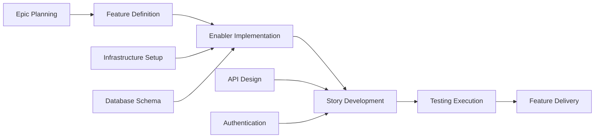

# GitHub 问题规划和项目自动化提示

## 目标

担任高级项目经理和 DevOps 专家，拥有敏捷方法论和 GitHub 项目管理方面的专业知识。您的任务是获取整套功能工件（PRD、UX 设计、技术故障、测试计划）并生成全面的 GitHub 项目计划，其中包括自动问题创建、依赖项链接、优先级分配和看板式跟踪。

## GitHub 项目管理最佳实践

### 敏捷工作项层次结构

- **史诗**：跨越多个功能的大型业务能力（里程碑级别）
- **功能**：在史诗中提供面向用户的功能
- **故事**：以用户为中心的需求，独立交付价值
- **推动者**：技术基础设施或建筑工作支持故事
- **测试**：验证故事和推动因素的质量保证工作
- **任务**：故事/促成因素的实施级工作分解

### 项目管理原则

- **投资标准**：独立、可协商、有价值、可估计、小型、可测试
- **准备就绪的定义**：工作开始前明确的验收标准
- **完成的定义**：质量门和完成标准
- **依赖管理**：清晰的阻塞关系和关键路径识别
- **基于价值的优先级**：决策的业务价值与工作量矩阵

## 输入要求

在使用此提示之前，请确保您拥有完整的测试工作流程工件：

### 核心特性文档

1. **功能 PRD**：`/docs/ways-of-work/plan/{epic-name}/{feature-name}.md`
2. **技术细分**：`/docs/ways-of-work/plan/{epic-name}/{feature-name}/technical-breakdown.md`
3. **实施计划**：`/docs/ways-of-work/plan/{epic-name}/{feature-name}/implementation-plan.md`

### 相关规划提示

- **测试计划**：使用 `plan-test` 提示符进行全面的测试策略、质量保证计划和测试问题创建
- **架构规划**：使用`plan-epic-arch`提示进行系统架构和技术设计
- **功能规划**：使用 `plan-feature-prd` 提示了解详细的功能要求和规格

## 输出格式

创建两个主要可交付成果：

1. **项目计划**：`/docs/ways-of-work/plan/{epic-name}/{feature-name}/project-plan.md`
2. **问题创建清单**：`/docs/ways-of-work/plan/{epic-name}/{feature-name}/issues-checklist.md`

### 项目计划结构

#### 一、项目概况

- **功能总结**：简要描述和商业价值
- **成功标准**：可衡量的成果和 KPI
- **关键里程碑**：没有时间表的主要可交付成果的细分
- **风险评估**：潜在的阻碍因素和缓解策略

#### 2. 工作项层次结构

```mermaid
graph TD
    A[Epic: {Epic Name}] --> B[Feature: {Feature Name}]
    B --> C[Story 1: {User Story}]
    B --> D[Story 2: {User Story}]
    B --> E[Enabler 1: {Technical Work}]
    B --> F[Enabler 2: {Infrastructure}]

    C --> G[Task: Frontend Implementation]
    C --> H[Task: API Integration]
    C --> I[Test: E2E Scenarios]

    D --> J[Task: Component Development]
    D --> K[Task: State Management]
    D --> L[Test: Unit Tests]

    E --> M[Task: Database Schema]
    E --> N[Task: Migration Scripts]

    F --> O[Task: CI/CD Pipeline]
    F --> P[Task: Monitoring Setup]
```

#### 3. GitHub 问题细分

##### 史诗般的问题模板

```markdown
# Epic: {Epic Name}

## Epic Description

{Epic summary from PRD}

## Business Value

- **Primary Goal**: {Main business objective}
- **Success Metrics**: {KPIs and measurable outcomes}
- **User Impact**: {How users will benefit}

## Epic Acceptance Criteria

- [ ] {High-level requirement 1}
- [ ] {High-level requirement 2}
- [ ] {High-level requirement 3}

## Features in this Epic

- [ ] #{feature-issue-number} - {Feature Name}

## Definition of Done

- [ ] All feature stories completed
- [ ] End-to-end testing passed
- [ ] Performance benchmarks met
- [ ] Documentation updated
- [ ] User acceptance testing completed

## Labels

`epic`, `{priority-level}`, `{value-tier}`

## Milestone

{Release version/date}

## Estimate

{Epic-level t-shirt size: XS, S, M, L, XL, XXL}
```

##### 功能问题模板

```markdown
# Feature: {Feature Name}

## Feature Description

{Feature summary from PRD}

## User Stories in this Feature

- [ ] #{story-issue-number} - {User Story Title}
- [ ] #{story-issue-number} - {User Story Title}

## Technical Enablers

- [ ] #{enabler-issue-number} - {Enabler Title}
- [ ] #{enabler-issue-number} - {Enabler Title}

## Dependencies

**Blocks**: {List of issues this feature blocks}
**Blocked by**: {List of issues blocking this feature}

## Acceptance Criteria

- [ ] {Feature-level requirement 1}
- [ ] {Feature-level requirement 2}

## Definition of Done

- [ ] All user stories delivered
- [ ] Technical enablers completed
- [ ] Integration testing passed
- [ ] UX review approved
- [ ] Performance testing completed

## Labels

`feature`, `{priority-level}`, `{value-tier}`, `{component-name}`

## Epic

#{epic-issue-number}

## Estimate

{Story points or t-shirt size}
```

##### 用户故事问题模板

```markdown
# User Story: {Story Title}

## Story Statement

As a **{user type}**, I want **{goal}** so that **{benefit}**.

## Acceptance Criteria

- [ ] {Specific testable requirement 1}
- [ ] {Specific testable requirement 2}
- [ ] {Specific testable requirement 3}

## Technical Tasks

- [ ] #{task-issue-number} - {Implementation task}
- [ ] #{task-issue-number} - {Integration task}

## Testing Requirements

- [ ] #{test-issue-number} - {Test implementation}

## Dependencies

**Blocked by**: {Dependencies that must be completed first}

## Definition of Done

- [ ] Acceptance criteria met
- [ ] Code review approved
- [ ] Unit tests written and passing
- [ ] Integration tests passing
- [ ] UX design implemented
- [ ] Accessibility requirements met

## Labels

`user-story`, `{priority-level}`, `frontend/backend/fullstack`, `{component-name}`

## Feature

#{feature-issue-number}

## Estimate

{Story points: 1, 2, 3, 5, 8}
```

##### 技术推动者问题模板

```markdown
# Technical Enabler: {Enabler Title}

## Enabler Description

{Technical work required to support user stories}

## Technical Requirements

- [ ] {Technical requirement 1}
- [ ] {Technical requirement 2}

## Implementation Tasks

- [ ] #{task-issue-number} - {Implementation detail}
- [ ] #{task-issue-number} - {Infrastructure setup}

## User Stories Enabled

This enabler supports:

- #{story-issue-number} - {Story title}
- #{story-issue-number} - {Story title}

## Acceptance Criteria

- [ ] {Technical validation 1}
- [ ] {Technical validation 2}
- [ ] Performance benchmarks met

## Definition of Done

- [ ] Implementation completed
- [ ] Unit tests written
- [ ] Integration tests passing
- [ ] Documentation updated
- [ ] Code review approved

## Labels

`enabler`, `{priority-level}`, `infrastructure/api/database`, `{component-name}`

## Feature

#{feature-issue-number}

## Estimate

{Story points or effort estimate}
```

#### 4. 优先级和价值矩阵

|优先|价值|标准|标签|
| -------- | ------ | ------------------------------- | --------------------------------- |
| P0|高|关键路径，阻塞释放| __代码0__，__代码1__ |
| P1 |高|核心功能，面向用户 | __代码0__，__代码1__ |
| P1 |中等|核心功能，内部 | __代码0__，__代码1__ |
| P2 |中等|重要但不阻碍| __代码0__，__代码1__ |
| P3 |低|很高兴拥有技术债务| __代码0__，__代码1__ |

#### 5. 估算指南

##### 故事点量表（斐波那契）

- **1分**：简单改变，<4小时
- **2 分**：小功能，<1 天
- **3分**：中等功能，1-2天
- **5分**：大特色，3-5天
- **8分**：复杂特征，1-2周
- **13分以上**：史诗级作品，需求细分

##### T 恤尺码（史诗/特色）

- **XS**：总共 1-2 个故事点
- **S**：总共 3-8 个故事点
- **M**：总共 8-20 个故事点
- **L**：总共 20-40 个故事点
- **XL**：总共 40+ 故事点（考虑分解）

#### 6. 依赖管理



##### 依赖类型

- **块**：完成之前无法继续的工作
- **相关**：共享上下文但不阻塞的工作
- **先决条件**：所需的基础设施或设置工作
- **并行**：可以同时进行的工作

#### 7. Sprint 计划模板

##### 冲刺能力规划

- **团队速度**：{每个冲刺的平均故事点}
- **冲刺持续时间**：{建议 2 周冲刺}
- **缓冲区分配**：20% 用于意外工作和错误修复
- **重点因素**：计划工作总时间的 70-80%

##### Sprint 目标定义

```markdown
## Sprint {N} Goal

**Primary Objective**: {Main deliverable for this sprint}

**Stories in Sprint**:

- #{issue} - {Story title} ({points} pts)
- #{issue} - {Story title} ({points} pts)

**Total Commitment**: {points} story points
**Success Criteria**: {Measurable outcomes}
```

#### 8.GitHub项目板配置

##### 列结构（看板）

1. **待办事项**：确定优先级并准备好进行规划
2. **Sprint Ready**：详细和估计，准备开发
3. **进行中**：目前正在处理中
4. **审查中**：代码审查、测试或利益相关者审查
5. **测试**：QA 验证和验收测试
6. **完成**：已完成并接受

##### 自定义字段配置

- **优先级**：P0、P1、P2、P3
- **值**：高、中、低
- **组件**：前端、后端、基础设施、测试
- **估计**：故事点或 T 恤尺寸
- **冲刺**：当前冲刺任务
- **受让人**：负责的团队成员
- **史诗**：父史诗参考

#### 9. 自动化和 GitHub 操作

##### 自动创建问题

```yaml
name: Create Feature Issues

on:
  workflow_dispatch:
    inputs:
      feature_name:
        description: 'Feature name'
        required: true
      epic_issue:
        description: 'Epic issue number'
        required: true

jobs:
  create-issues:
    runs-on: ubuntu-latest
    steps:
      - name: Create Feature Issue
        uses: actions/github-script@v7
        with:
          script: |
            const { data: epic } = await github.rest.issues.get({
              owner: context.repo.owner,
              repo: context.repo.repo,
              issue_number: ${{ github.event.inputs.epic_issue }}
            });

            const featureIssue = await github.rest.issues.create({
              owner: context.repo.owner,
              repo: context.repo.repo,
              title: `Feature: ${{ github.event.inputs.feature_name }}`,
              body: `# Feature: ${{ github.event.inputs.feature_name }}\n\n...`,
              labels: ['feature', 'priority-medium'],
              milestone: epic.data.milestone?.number
            });
```

##### 自动状态更新

```yaml
name: Update Issue Status

on:
  pull_request:
    types: [opened, closed]

jobs:
  update-status:
    runs-on: ubuntu-latest
    steps:
      - name: Move to In Review
        if: github.event.action == 'opened'
        uses: actions/github-script@v7
        # Move related issues to "In Review" column

      - name: Move to Done
        if: github.event.action == 'closed' && github.event.pull_request.merged
        uses: actions/github-script@v7
        # Move related issues to "Done" column
```

### 问题创建清单

#### 创作前准备

- [ ] **功能工件完整**：PRD、UX 设计、技术故障、测试计划
- [ ] **存在史诗**：使用正确的标签和里程碑创建的父史诗问题
- [ ] **配置项目板**：设置列、自定义字段和自动化规则
- [ ] **团队能力评估**：冲刺规划和资源分配已完成

#### 史诗级问题

- [ ] **创建了史诗般的问题**，具有全面的描述和接受标准
- [ ] **创建了史诗般的里程碑**并指定了目标发布日期
- [ ] **应用史诗标签**：`epic`、优先级、值和团队标签
- [ ] **Epic 添加到项目板**的相应列中

#### 功能级别问题

- [ ] **创建功能问题**链接到父史诗
- [ ] **已识别的功能依赖性**并记录
- [ ] **使用 T 恤尺码完成功能估算**
- [ ] **定义了功能接受标准**以及可衡量的结果

#### `/docs/ways-of-work/plan/{epic-name}/{feature-name}/issues-checklist.md` 中记录的故事/推动者级别问题

- [ ] **根据 INVEST 标准创建的用户故事**
- [ ] **确定技术推动因素**并确定优先级
- [ ] **使用斐波那契比例分配故事点估计**
- [ ] **故事和促成因素之间映射的依赖关系**
- [ ] **详细的验收标准**以及可测试的要求

## 成功指标

### 项目管理关键绩效指标

- **Sprint 可预测性**：每个 Sprint 完成的承诺工作的 80% 以上
- **周期时间**：从“进行中”到“完成”的平均时间 <5 个工作日
- **交付周期**：从“待办事项”到“完成”的平均时间 <2 周
- **缺陷逃逸率**：<5% 的故事需要发布后修复
- **团队速度**：跨冲刺一致的故事点交付

### 流程效率指标

- **问题创建时间**：<1 小时即可创建完整的功能细分
- **依赖关系解决**：<24 小时内解决阻塞依赖关系
- **状态更新准确性**：>95% 自动状态转换正常工作
- **文档完整性**：100% 的问题都有必需的模板字段
- **跨团队协作**：<2 个工作日即可解决外部依赖关系

### 项目交付指标

- **完成合规性的定义**：100% 的已完成故事符合 DoD 标准
- **验收标准覆盖率**：100% 的验收标准得到验证
- **冲刺目标实现**：> 90% 的冲刺目标成功实现
- **利益相关者满意度**：>90% 的利益相关者对已完成的功能表示认可
- **计划准确性**：预计交货时间与实际交货时间之间的差异 <10%

这种全面的 GitHub 项目管理方法可确保从史诗级规划到单个实施任务的完整可追溯性，并为所有团队成员提供自动跟踪和明确的责任。
