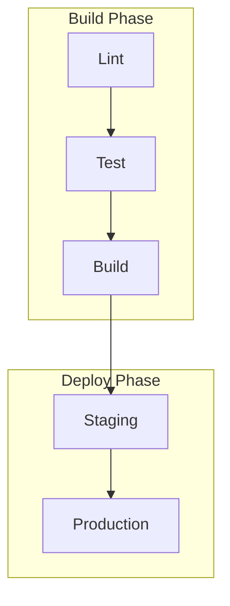

---
代理人：“代理人”
描述：“为现有 GitHub Actions CI/CD 工作流程创建正式规范，针对 AI 消耗和工作流程维护进行优化。”
工具：['更改'，'搜索/代码库'，'编辑/编辑文件'，'扩展'，'网络/获取'，'findTestFiles'，'githubRepo'，'新'，'openSimpleBrowser'，'问题'，'runCommands'，'runInTerminal2'，'runNotebooks'，'runTasks'，'runTests'， '搜索'、'搜索/searchResults'、'runCommands/terminalLastCommand'、'runCommands/terminalSelection'、'testFailure'、'用法'、'vscodeAPI'、'microsoft.docs.mcp'、'github'、'Microsoft Docs']
---
# 创建 GitHub Actions 工作流程规范

为 GitHub Actions 工作流程创建全面的规范：`${input:WorkflowFile}`。

该规范用作工作流的行为、要求和约束的规范。它必须与实现无关，关注工作流完成的**内容**而不是**如何**实现。

## AI优化的要求

- **代币效率**：使用简洁的语言而不牺牲清晰度
- **结构化数据**：利用表格、列表和图表获取密集信息
- **语义清晰度**：始终如一地使用精确的术语
- **实现抽象**：避免特定的语法、命令或工具版本
- **可维护性**：设计可随着工作流程的发展轻松更新

## 规格模板

另存为：`/spec/spec-process-cicd-[workflow-name].md`

```md
---
title: CI/CD Workflow Specification - [Workflow Name]
version: 1.0
date_created: [YYYY-MM-DD]
last_updated: [YYYY-MM-DD]
owner: DevOps Team
tags: [process, cicd, github-actions, automation, [domain-specific-tags]]
---

## Workflow Overview

**Purpose**: [One sentence describing workflow's primary goal]
**Trigger Events**: [List trigger conditions]
**Target Environments**: [Environment scope]

## Execution Flow Diagram

```mermaid
图解TD
    A[触发事件] --> B[作业 1]
    B --> C[作业 2]
    C --> D[作业 3]
    D --> E[结束]
    
    B --> F[并行作业]
    F-->D
    
    A 风格填充：#e1f5fe
    E 型填充：#e8f5e8
```

## Jobs & Dependencies

| Job Name | Purpose | Dependencies | Execution Context |
|----------|---------|--------------|-------------------|
| job-1 | [Purpose] | [Prerequisites] | [Runner/Environment] |
| job-2 | [Purpose] | job-1 | [Runner/Environment] |

## Requirements Matrix

### Functional Requirements
| ID | Requirement | Priority | Acceptance Criteria |
|----|-------------|----------|-------------------|
| REQ-001 | [Requirement] | High | [Testable criteria] |
| REQ-002 | [Requirement] | Medium | [Testable criteria] |

### Security Requirements
| ID | Requirement | Implementation Constraint |
|----|-------------|---------------------------|
| SEC-001 | [Security requirement] | [Constraint description] |

### Performance Requirements
| ID | Metric | Target | Measurement Method |
|----|-------|--------|-------------------|
| PERF-001 | [Metric] | [Target value] | [How measured] |

## Input/Output Contracts

### Inputs

```yaml
# 环境变量
ENV_VAR_1: string # 目的: [描述]
ENV_VAR_2: 秘密 # 目的: [描述]

# 存储库触发器
paths: [路径过滤器列表]
分支：[分支模式列表]
```

### Outputs

```yaml
# 工作产出
job_1_output: string # 描述: [目的]
build_artifact: 文件 # 描述: [内容类型]
```

### Secrets & Variables

| Type | Name | Purpose | Scope |
|------|------|---------|-------|
| Secret | SECRET_1 | [Purpose] | Workflow |
| Variable | VAR_1 | [Purpose] | Repository |

## Execution Constraints

### Runtime Constraints

- **Timeout**: [Maximum execution time]
- **Concurrency**: [Parallel execution limits]
- **Resource Limits**: [Memory/CPU constraints]

### Environmental Constraints

- **Runner Requirements**: [OS/hardware needs]
- **Network Access**: [External connectivity needs]
- **Permissions**: [Required access levels]

## Error Handling Strategy

| Error Type | Response | Recovery Action |
|------------|----------|-----------------|
| Build Failure | [Response] | [Recovery steps] |
| Test Failure | [Response] | [Recovery steps] |
| Deployment Failure | [Response] | [Recovery steps] |

## Quality Gates

### Gate Definitions

| Gate | Criteria | Bypass Conditions |
|------|----------|-------------------|
| Code Quality | [Standards] | [When allowed] |
| Security Scan | [Thresholds] | [When allowed] |
| Test Coverage | [Percentage] | [When allowed] |

## Monitoring & Observability

### Key Metrics

- **Success Rate**: [Target percentage]
- **Execution Time**: [Target duration]
- **Resource Usage**: [Monitoring approach]

### Alerting

| Condition | Severity | Notification Target |
|-----------|----------|-------------------|
| [Condition] | [Level] | [Who/Where] |

## Integration Points

### External Systems

| System | Integration Type | Data Exchange | SLA Requirements |
|--------|------------------|---------------|------------------|
| [System] | [Type] | [Data format] | [Requirements] |

### Dependent Workflows

| Workflow | Relationship | Trigger Mechanism |
|----------|--------------|-------------------|
| [Workflow] | [Type] | [How triggered] |

## Compliance & Governance

### Audit Requirements

- **Execution Logs**: [Retention policy]
- **Approval Gates**: [Required approvals]
- **Change Control**: [Update process]

### Security Controls

- **Access Control**: [Permission model]
- **Secret Management**: [Rotation policy]
- **Vulnerability Scanning**: [Scan frequency]

## Edge Cases & Exceptions

### Scenario Matrix

| Scenario | Expected Behavior | Validation Method |
|----------|-------------------|-------------------|
| [Edge case] | [Behavior] | [How to verify] |

## Validation Criteria

### Workflow Validation

- **VLD-001**: [Validation rule]
- **VLD-002**: [Validation rule]

### Performance Benchmarks

- **PERF-001**: [Benchmark criteria]
- **PERF-002**: [Benchmark criteria]

## Change Management

### Update Process

1. **Specification Update**: Modify this document first
2. **Review & Approval**: [Approval process]
3. **Implementation**: Apply changes to workflow
4. **Testing**: [Validation approach]
5. **Deployment**: [Release process]

### Version History

| Version | Date | Changes | Author |
|---------|------|---------|--------|
| 1.0 | [Date] | Initial specification | [Author] |

## Related Specifications

- [Link to related workflow specs]
- [Link to infrastructure specs]
- [Link to deployment specs]

```

## 分析说明

分析工作流程文件时：

1. **提取核心目的**：确定主要业务目标
2. **映射作业流程**：创建显示执行顺序的依赖关系图
3. **识别合同**：记录输入、输出和接口
4. **捕获约束**：提取超时、权限和限制
5. **定义质量关卡**：确定验证和批准点
6. **记录错误路径**：映射故障场景和恢复
7. **抽象实现**：关注行为，而不是语法

## 美人鱼图指南

### 流量类型
- **顺序**：`A --> B --> C`
- **并行**：`A --> B & A --> C; B --> D & C --> D`
- **有条件**：`A --> B{Decision}; B -->|Yes| C; B -->|No| D`

### 造型
```mermaid
style TriggerNode fill:#e1f5fe
style SuccessNode fill:#e8f5e8
style FailureNode fill:#ffebee
style ProcessNode fill:#f3e5f5
```

### 复杂的工作流程
对于包含 5 个以上作业的工作流程，请使用子图：


## 代币优化策略

1. **使用表格**：结构化格式的密集信息
2. **一致缩写**：定义一次，自始至终使用
3. **要点**：避免散文段落
4. **代码块**：叙述性的结构化数据
5. **交叉引用**：链接而不是重复信息

专注于创建既充当工作流程更新的文档又充当模板的规范。
