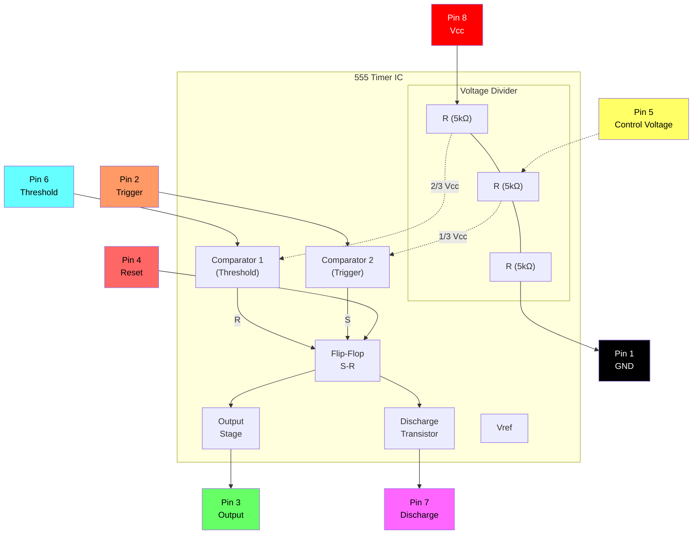
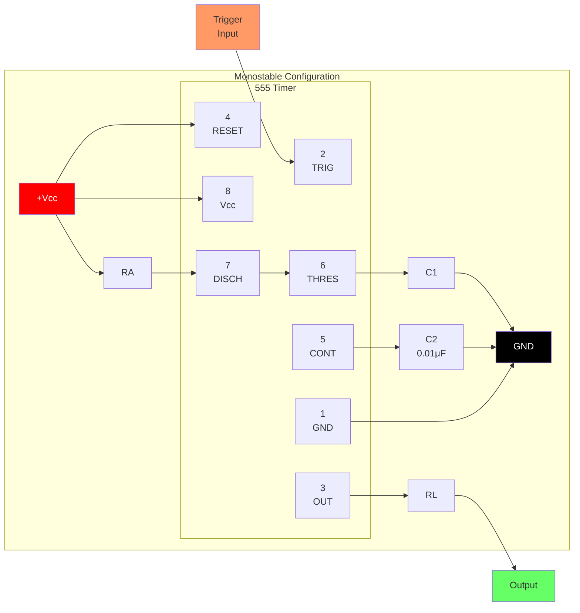
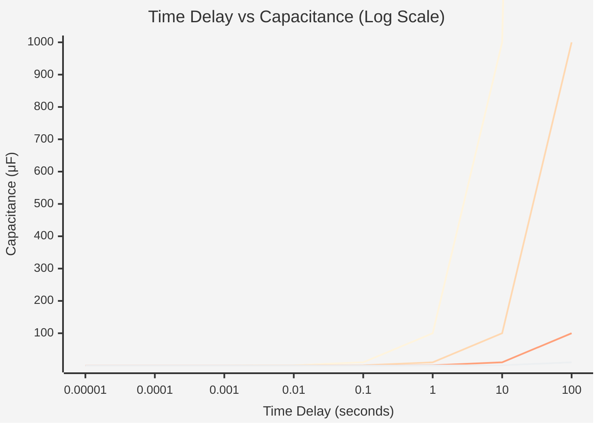
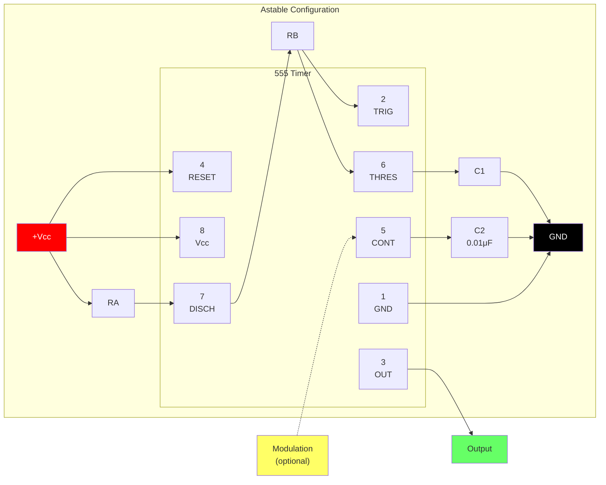
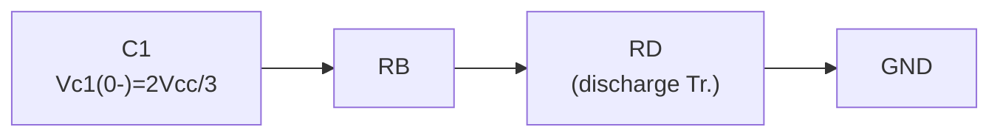
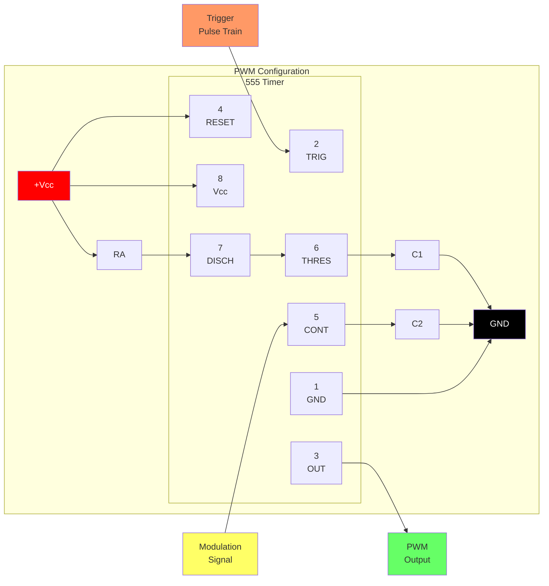
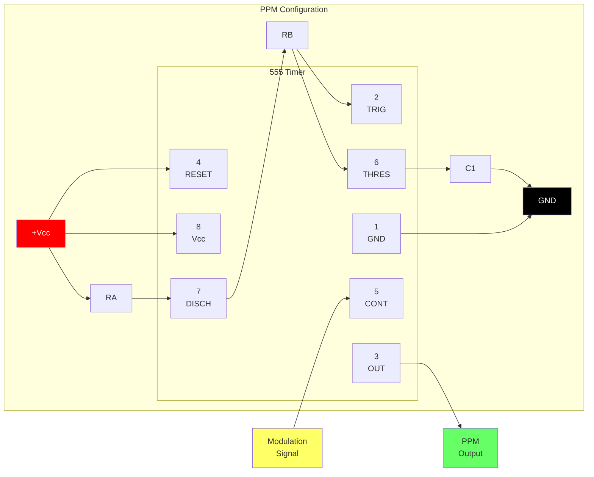
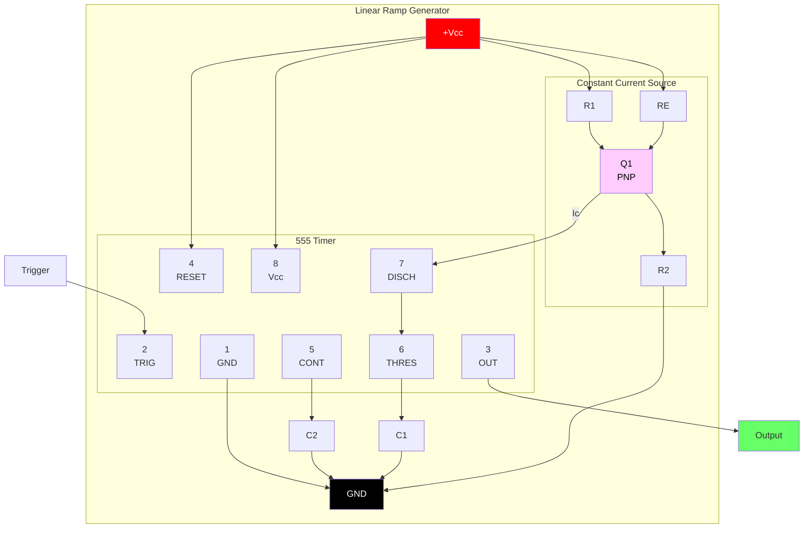

# 555

[www.fairchildsemi.com](www.fairchildsemi.com)

LM555/NE555/SA555是一款高度稳定的控制器，能够产生精确的定时脉冲。在单稳态操作中，时间延迟由一个外部电阻器和一个电容器控制。在非稳定操作下，频率和占空比由两个外部电阻器和一个电容器精确控制。

## 特点

- 高电流驱动能力（200mA）
- 可调占空比
- 温度稳定性为 0.005%/°C
- 计时从微秒到小时
- 关闭时间小于 2μSec

## 应用领域

- 精准计时
- 脉冲产生
- 延时产生
- 顺序计时

## 内部框图



**引脚配置：**

|针 |名称 |功能|
|:---:|:---|:---|
| 1 |接地 |接地参考|
| 2 |触发|触发输入（< 1/3 Vcc 开始计时）|
| 3 |输出 |输出（高或低）|
| 4 |重置 |低电平有效复位|
| 5 |继续 |控制电压（2/3 Vcc 参考）|
| 6 |阈值 |阈值输入（> 2/3 Vcc 结束计时）|
| 7 |迪施 |放电（集电极开路）|
| 8 |电源电压|电源电压（+4.5V 至 +16V）|

## 绝对最大额定值 (Ta = 25°C)

|参数|符号|价值|单位|
| :--- | :--- | :--- | :--- |
|电源电压|电源电压| 16 | 16 V |
|引线温度（焊接 10 秒）|特莱德 | 300 | 300 ℃ |
|功耗 | PD | 600 |毫瓦|
|工作温度范围<br>LM555/NE555<br>SA555 |托普尔 | - 65 ~ + 150 | ℃ |

## 电气特性

（TA = 250C，vcc = 5 15V，除非另有说明）

|参数|符号|条件|分钟。 |典型值。 |最大限度。 |单位|
| :--- | :--- | :--- | :--- |:--- | :--- | :--- |
|电源电压| VCCC | - | 4.5 | 4.5 - | 16 | 16 V |
|电源电流（低稳定）（注 1）|国际会议中心 | Vcc = 5V，Rl = 无穷大<hr>Vcc = 15V，Rl = 无穷大 | -<小时>- | 3<小时>7.5 | 6<小时>15 | mA<小时>mA |
|时序误差（单稳态）<br>初始精度（注 2）<br>温度漂移（注 4）<br>电源电压漂移（注 4）<br> | ACCUR<br>Δt/ΔT<br>Δt/ΔVcc | Ra = 1kΩ 至 100kΩ<br>C = 0.1μF | - | 1.0<br>50<br>0.1 | 3.0<br><br>0.5 | %<br>ppm/°C<br>%/V |
|时序误差（不稳定）<br>初始精度（注 2）<br>温度漂移（注 4）<br>电源电压漂移（注 4）| ACCUR<br>Δt/ΔT<br>Δt/ΔVcc | Ra = 1kΩ 至 100kΩ<br> C = 0.1μF | - | 2.25<br>150<br>0.3 | 2.25<br>150<br>0.3 - | %<br>ppm/°C<br>%/V |
|控制电压| VC | Vcc = 15V<小时> Vcc = 5V | 9.0<小时>2.6 | 10.0<小时>3.33 | 11.0<小时>4.0 | V<小时>V |
|阈值电压|室内机| VCC = 15V<hr>VCC = 5V | -<小时>- | 10.0<小时>3.33 | -<小时>- | V<小时>V |
|阈值电流（注3）|伊思| - | - | 0.1 | 0.1 0.25 | 0.25微安|
|触发电压|录像机| VCC = 5V<小时>VCC = 15V | 1.1<小时>4.5 | 1.67<小时>5 | 2.2<小时>5.6 | V<小时>V |
|触发电流|国际贸易规则 |录像机 = 0V | 0.01 | 0.01 2.0 |微安|
|复位电压| VRST | - | 0.4 | 0.4 0.7 | 0.7 1.0 | V |
|复位电流| IRST | - | 0.1 | 0.1 0.4 | 0.4毫安|
|低输出电压|音量 | VCC = 15V<br>ISINK = 10mA<br>ISINK = 50mA<hr>VCC = 5V<br>ISINK = 5mA | -<小时>- | 0.06<br>0.3<小时>0.05 | 0.25<br>0.75<小时>0.35 | V<br>V<hr>V |
|高输出电压 |声音| VCC = 15V<br>ISOURCE = 200mA<br>ISOURCE = 100mA<hr>VCC = 5V<br>ISOURCE = 100mA | 12.75<小时>2.75 | 12.5<br>13.3<小时>3.3 | -<小时>- | V<br>V<hr>V |
|输出上升时间（注4）| tR | - | - | 100 | 100 - | ns |
|输出下降时间（注4）| tF | - | - | 100 | 100 - | ns |
|放电漏电流|伊尔克格 | - | - | 20 | 100 | 100不适用 |

**注释：**

1. 当输出为高电平时。电源电流通常比 VCC = 5V 时小 1mA。
2. 在 VCC = 5.0V 和 VCC = 15V 下测试。
3. 这将确定 15V 运行时 RA + RB 的最大值，即最大总 R = 20MQ。对于 5V 操作，最大/
   - 总电阻 8.7MΩ
4. 这些参数虽然有保证。未在生产中进行 100% 测试。

## 申请信息

下表1是555定时器的基本操作表：

|阈值电压<br>（Vth）（引脚6）|触发电压<br>(Vtr)(PIN 2) |重置（PIN 4）|输出（引脚3）|放电Tr.<br>(PIN 7) |
| :--- | :--- | :--- | :--- | :--- |
|不关心|不关心|低|低|开 |
| Vth > 2Vcc / 3 | Vth > 2Vcc / 3 |高|低|开 |
| Vcc/3 < Vth < 2 Vcc/3 | Vcc/3 < Vth < 2 Vcc/3 |高| - | - |
| Vth < Vcc / 3 | Vth < Vcc / 3 |高|高|关闭 |

当低信号输入施加到复位端子时，无论阈值电压或触发电压如何，定时器输出都保持低电平。只有当高电平信号施加到复位端时，定时器的输出才会根据阈值电压和触发电压发生变化。当阈值电压超过电源电压的2/3且定时器输出为高电平时，定时器的内部放电Tr。导通，将阈值电压降低至电源电压的 1/3 以下。在此期间，定时器输出保持低电平。随后，如果向触发电压施加低信号，使其变为电源电压的1/3，定时器的内部放电Tr。关闭，增加阈值电压并再次驱动定时器输出为高电平。

### 1. 单稳态运行

#### 图 1. 单稳态电路



**组件值：**

- RA：定时电阻（典型值为 1kΩ 至 10MΩ）
- C1：定时电容
- C2：旁路电容（推荐0.01μF）
- RL：负载电阻

**延时公式：**
$$t_d = 1.1 \乘以R_A \乘以C_1$$

#### 图 2. 电阻和电容与时间延迟 (td) 的关系



| RA | C1 |时间延迟 (td) |
|:---|:---|:---|
| 1kΩ | 0.1μF | 110 微秒 |
| 10kΩ| 0.1μF | 1.1 毫秒 |
| 100kΩ| 0.1μF | 11 毫秒 |
| 1兆欧| 1μF | 1.1 秒 |
| 10兆欧| 10μF| 110 秒 |

#### 图 3. 单稳态工作波形

```mermaid
%%{init: {'theme': 'base'}}%%
gantt
    title Monostable Waveforms (Normal Operation)
    dateFormat X
    axisFormat %s
    
    section Trigger
    High (Vcc)    :a1, 0, 2
    Low (<Vcc/3)  :crit, a2, 2, 3
    High (Vcc)    :a3, 3, 10
    
    section Output
    Low (0V)      :b1, 0, 2
    High (Vcc)    :active, b2, 2, 8
    Low (0V)      :b3, 8, 10
    
    section Threshold (Vc1)
    Charging      :c1, 2, 8
```



```
    Trigger ─────┐     ┌─────────────────────
    (Pin 2)      └─────┘  
                    ↓ Trigger pulse
                    
    Output  ─────────┐          ┌───────────
    (Pin 3)         └──────────┘
                    |←── td ───→|
                    
    Threshold        /‾‾‾‾‾‾‾‾\
    (Pin 6)    ─────/          \────────────
               0V  ↗            ↘  
                  Vcc/3      2Vcc/3
                  
    td = 1.1 × RA × C1
```

图 1 展示了一个单稳态电路。在此模式下，只要触发电压低于 Vcc/3，定时器就会生成固定脉冲。当施加到 #2 引脚的触发脉冲电压低于 Vcc/3，同时定时器输出为低电平时，定时器的内部触发器将打开放电 Tr。关闭并通过对外部电容器 C1 充电并同时设置触发器输出来使定时器输出变高。外部电容器C1、VC1两端的电压随着时间常数t=RA*C呈指数增加，并在td=1.1RA*C时达到2Vcc/3。因此，电容器C1通过电阻器RA充电。时间常数RAC越大，VC1达到2Vcc/3所需的时间就越长。换句话说，时间常数RAC控制输出脉冲宽度。当施加到电容器C1的电压达到2Vcc/3时，触发端上的比较器使触发器复位，使放电Tr导通。在。此时，C1开始放电，定时器输出变为低电平。这样，工作在单稳态的定时器就重复上述过程。图 2 显示了基于 RA 和 C 的时间常数关系。图 3 显示了单稳态操作期间的一般波形。必须注意的是，为了正常工作，在定时器输出变低之前，触发脉冲电压需要保持最低Vcc/3。也就是说，即使在输出为高电平时施加不同的触发脉冲，输出也不会受到影响，但如果输出脉冲结束时的触发脉冲电压保持在 Vcc/3 以下，则可能会受到影响，并且波形无法正常工作。图4显示了这样一个定时器输出异常情况。

#### 图 4. 单稳态工作波形（异常）

```
    Trigger ─────┐  ┌──┐  ┌─────────────────
    (Pin 2)      └──┘  └──┘  
                 ↓     ↓ Retriggering during output high
                    
    Output  ─────────┐                ┌─────
    (Pin 3)         └────────────────┘
                    |←── extended td ──→|
                    
    Threshold        /‾‾‾‾‾‾‾‾‾‾‾‾‾‾‾‾\
    (Pin 6)    ─────/                  \────
               0V  ↗                    ↘  
                  Vcc/3              2Vcc/3

    ⚠️ ABNORMAL: Trigger held low extends output pulse!
    Trigger must return high before output goes low.
```

**注意：** 对于正常操作，触发脉冲电压必须在定时器输出变低之前返回到 Vcc/3 以上。如果触发保持在Vcc/3以下，输出脉冲将异常延长。

### 2. 运行不稳定

#### 图 5. 非稳态电路



**组件值：**

- RA：充电电阻（控制高电平时间）
- RB：充电/放电电阻（同时影响高电平和低电平时间）  
- C1：定时电容
- C2：旁路电容（推荐0.01μF）

**计时公式：**

- 高时间：$t_H = 0.693 \times (R_A + R_B) \times C_1$
- 低电平时间：$t_L = 0.693 \times R_B \times C_1$
- 周期：$T = t_H + t_L = 0.693 \times (R_A + 2R_B) \times C_1$
- 频率：$f = \frac{1.44}{(R_A + 2R_B) \times C_1}$
- 占空比：$D = \frac{R_A + R_B}{R_A + 2R_B}$

#### 图 6. 电容和电阻与频率的关系

```mermaid
%%{init: {'theme': 'base'}}%%
xychart-beta
    title "Free Running Frequency vs Capacitance"
    x-axis "Frequency (Hz)" [0.1, 1, 10, 100, 1000, 10000, 100000]
    y-axis "Capacitance (μF)" 0.001 --> 100
```

| (RA + 2RB) | C1 |频率|
|:---|:---|:---|
| 1.44kΩ| 1μF | 1 kHz |
| 14.4kΩ| 1μF | 100赫兹|
| 144kΩ| 1μF | 10赫兹|
| 14.4kΩ| 0.1μF | 1 kHz |
| 14.4kΩ| 0.01μF| 10 kHz |

#### 图 7. 非稳态工作波形

```
    Output  ────┐     ┌─────┐     ┌─────┐     ┌────
    (Pin 3)    └─────┘     └─────┘     └─────┘
               |←tL→|←─tH─→|←tL→|←─tH─→|
               
    Threshold       /\        /\        /\
    (Pin 6)   ─────/  \──────/  \──────/  \──────
              Vcc/3    2Vcc/3
              
              ├────── T ──────┤
              T = tH + tL = 0.693(RA + 2RB)C1
              
    Charging:   C1 charges through RA + RB
    Discharging: C1 discharges through RB only
```

**典型值：** RA = 1kΩ，RB = 1kΩ，C1 = 1μF，Vcc = 5V

通过在图1中添加电阻RB并如图5所示进行配置，可以实现非稳态定时器操作。在非稳态操作中，触发端子和阈值端子连接，从而形成自触发，作为多谐振荡器进行操作。当定时器输出为高电平时，其内部Tr.放电。关断，VC1 以时间常数 (RA+RB)*C 的指数函数增加。当VC1或阈值电压达到2Vcc/3时，触发端子上的比较器输出变高，重置F/F并使定时器输出变低。这又会打开放电 Tr。 C1通过RB和放电Tr形成的放电通道进行放电。当VC1下降到Vcc/3以下时，触发端上的比较器输出变高，定时器输出再次变高。放电Tr。关闭，VC1 再次上升。上述过程中，定时器输出为高电平的时间段为VC1从Vcc/3上升到2Vcc/3所需的时间，定时器输出为低电平的时间段为VC1从2Vcc/3下降到Vcc/3所需的时间。当定时器输出为高电平时，对电容C1充电的等效电路如下：

#### 公式 1：充电电路等效值


**充电方程式：**
$$C_1 \frac{dV_{C1}}{dt} = \frac{V_{CC} - V_{(0-)}}{R_A + R_B} \quad (1)$$

$$V_{C1}(0^+) = \frac{V_{CC}}{3} \quad (2)$$

$$V_{C1}(t) = V_{CC} \left[ 1 - \frac{2}{3} e^{-\frac{t}{(R_A + R_B)C_1}} \right] \quad (3)$$

由于定时器输出高电平状态的持续时间 (tH) 是 VC1(t) 达到 2Vcc/3 所需的时间，

#### 公式 2：高时间计算

$$\frac{2}{3}V_{CC} = V_{CC} \left[ 1 - \frac{2}{3} e^{-\frac{t_H}{(R_A + R_B)C_1}} \right] \quad (4)$$

$$t_H = C_1(R_A + R_B) \ln 2 = 0.693(R_A + R_B)C_1 \quad (5)$$

当定时器输出为低电平时，电容器 C1 放电的等效电路如下：

#### 公式 3：放电电路等效值



**放电方程式：**
$$C_1 \frac{dV_{C1}}{dt} + \frac{1}{R_A + R_B} V_{C1} = 0 \quad (6)$$

$$V_{C1}(t) = \frac{2}{3} V_{CC} e^{-\frac{t}{(R_A + R_B)C_1}} \quad (7)$$

由于定时器输出低电平状态的持续时间 (tL) 是 VC1(t) 达到 Vcc/3 所需的时间，

#### 公式 4：低时间计算

$$\frac{1}{3}V_{CC} = \frac{2}{3}V_{CC} e^{-\frac{t_L}{(R_B + R_D)C_1}} \quad (8)$$

$$t_L = C_1(R_B + R_D) \ln 2 = 0.693(R_A + R_B)C_1 \quad (9)$$

由于 RD 通常为 RB>>RD，但与放电 Tr. 的大小有关，因此 tL=0.693RBC1 (10)
因此，如果定时器工作在非稳定状态，则周期与“T=tH+tL=0.693(RA+RB)C1+0.693RBC1=0.693(RA+2RB)C1”相同，因为该周期是充电时间和放电时间的总和。由于频率是周期的倒数，因此以下公式适用。

#### 公式 5：频率公式

$$f = \frac{1}{T} = \frac{1.44}{(R_A + 2R_B)C_1} \quad (11)$$

### 3.分频器

通过调整定时周期的长度，可以使图1的基本电路用作分频器。图
8. 图 1 说明了一个除三电路，该电路利用了在定时周期内不能发生重新触发这一事实。

#### 图 8. 分频器工作波形

```
    Trigger ─┐ ┌─┐ ┌─┐ ┌─┐ ┌─┐ ┌─┐ ┌─┐ ┌─┐ ┌─┐ ┌─┐ ┌─
    (Input)  └─┘ └─┘ └─┘ └─┘ └─┘ └─┘ └─┘ └─┘ └─┘ └─┘
             1   2   3   1   2   3   1   2   3
             
    Output  ─┐        ┌──┐        ┌──┐        ┌──────
    (÷3)     └────────┘  └────────┘  └────────┘
             |← skip →|  |← skip →|  |← skip →|
                2,3          2,3         2,3
                
    Threshold      /‾‾‾‾\        /‾‾‾‾\        /‾‾‾‾\
    (Vc1)    ─────/      \──────/      \──────/
             
    RA = 9.1kΩ, RB = 1kΩ, C1 = 0.01μF, Vcc = 5V
    
    ⚙️ Divide-by-N: Set timing so output ignores (N-1) trigger pulses
```

### 4. 脉宽调制

可以通过调制施加到定时器引脚5的控制电压并改变定时器内部比较器的参考来改变定时器输出波形。图 9 说明了脉宽调制电路。当连续触发脉冲串应用于单稳态模式时，定时器输出宽度根据施加到控制端子的信号进行调制。正弦波以及其他波形可以作为信号施加到控制端子。图 10 显示了脉宽调制波形的示例。

#### 图 9. 脉宽调制电路



#### 图 10. 脉宽调制波形

```
    Control  ╭──────╮      ╭──────╮      ╭──────╮
    (Pin 5)  │      │      │      │      │      │
          ───╯      ╰──────╯      ╰──────╯      ╰───
             |← Modulation Signal (e.g., Sine) →|
                    
    Trigger ─┐ ┌─┐ ┌─┐ ┌─┐ ┌─┐ ┌─┐ ┌─┐ ┌─┐ ┌─┐ ┌─┐
             └─┘ └─┘ └─┘ └─┘ └─┘ └─┘ └─┘ └─┘ └─┘ └─┘
             
    Output  ─┐  ┌─┐   ┌───┐   ┌─┐  ┌─┐   ┌───┐   ┌─
    (PWM)    └──┘ └───┘   └───┘ └──┘ └───┘   └───┘
             |←w1→|←w2─→|←w3──→|
             
    Pulse width varies with control voltage:
    - Higher control voltage → Longer pulse width
    - Lower control voltage → Shorter pulse width
    
    RA = 3.9kΩ, RB = 1kΩ, RL = 1kΩ, C1 = 0.01μF, Vcc = 5V
```

### 5. 脉冲位置调制

如果将调制信号施加到控制端子，同时连接定时器进行非稳态操作，如图 11 所示，则定时器将成为脉冲位置调制器。在脉冲位置调制器中，定时器内部比较器的参考值被调制，进而根据施加到控制端子的调制信号调制定时器输出。图 12 示出了调制信号的正弦波以及所得到的输出脉冲位置调制：然而，可以使用任何波形。

#### 图 11. 脉冲位置调制电路



#### 图 12. 脉冲位置调制波形

```
    Control  ╭────────────╮          ╭────────────╮
    (Pin 5)  │            │          │            │
          ───╯            ╰──────────╯            ╰───
                Modulation Signal (Sine Wave)
                    
    Threshold     /\    /\      /\      /\    /\
    (Pin 6)  ────/  \──/  \────/  \────/  \──/  \────
                        
    Output  ─┐ ┌─┐  ┌──┐    ┌────┐    ┌──┐  ┌─┐ ┌─
    (PPM)    └─┘ └──┘  └────┘    └────┘  └──┘ └─┘
             |←t1→|←t2─→|←─t3──→|←t4─→|←t5→|
             
    Pulse spacing varies with control voltage:
    - Higher control voltage → Longer period
    - Lower control voltage → Shorter period
    
    RA = 1kΩ, RB = 1kΩ, C1 = 1nF, Vcc = 5V
```

### 6. 线性斜坡

当图1所示单稳态电路中的上拉电阻RA替换为恒流源时，VC1线性增加，产生线性斜坡。图 13 显示了线性斜坡生成电路，图 14 显示了生成的线性斜坡波形。

#### 图 13. 线性斜坡电路



#### 图 14. 线性斜坡波形

```
    Trigger ─────┐     ┌───────────────────────────
    (Pin 2)      └─────┘  
                    ↓ Trigger pulse
                    
    Output  ─────────┐              ┌───────────────
    (Pin 3)         └──────────────┘
                    |←──── td ────→|
                    
    Threshold        ╱              Linear ramp (not exponential)
    (Pin 6)    ─────╱               
               0V  ↗                 
                  Vcc/3           2Vcc/3
                  
    Linear ramp: Vc1 = (Ic/C1) × t
    Slope S = Ic/C1
    
    R1 = 47kΩ, R2 = 100kΩ, RE = 2.7kΩ, RL = 1kΩ, C1 = 0.01μF, Vcc = 5V
```

在图 13 中，电流源由 PNP 晶体管 Q1 和电阻器 R1、R2 和 RE 创建。

#### 公式 6：电流源计算

$$I_C = \frac{V_{CC} - V_E}{R_E} \quad (12)$$

这里，VE是：

$$V_E = V_{BE} + \frac{R_2}{R_1 + R_2} V_{CC} \quad (13)$$

例如，如果Vcc=15V，RE=20kΩ，R1=5kW，R2=10kΩ，VBE=0.7V，则VE=0.7V+10V=10.7V Ic=(15-10.7)/20k=0.215mA

当如图 13 所示配置的定时器中的触发器启动时，流经电容器 C1 的电流变为由 PNP 晶体管和电阻器产生的恒定电流。因此，VC 是线性斜坡函数，如图 14 所示。线性斜坡函数的梯度 S 定义如下：

#### 方程 7：斜坡斜率

$$S = \frac{V_{P-P}}{T} \quad (14)$$

这里的Vp-p是峰峰值电压。如果电容器中累积的电荷量除以电容量，则 VC 如下：

```
V = Q/C (15)
```

上面的方程两边除以 T 得到

#### 方程 8：简化的斜坡斜率

$$\frac{V}{T} = \frac{Q/T}{C} \quad (16)$$

并且可以简化为以下等式。

```
S = I/C (17)
```

换句话说，可以通过使用流经电容器的恒定电流来获得电容器两端出现的线性斜坡函数的梯度。如果流过电容的恒流为0.215mA，电容为0.02μF，则电容两端斜坡函数的梯度为S=0.215m/0.022μ=9.77V/ms。

# 机械尺寸

## 套餐

### 8-DIP（双列直插式封装）

```
    ┌─────────────────────────────────────┐
    │  ●                                  │
    │  #1                             #8  │
    │  ┌──┐                         ┌──┐  │
    │  │  │                         │  │  │
    │  └──┘                         └──┘  │
    │  #2                             #7  │
    │  ┌──┐       555 TIMER         ┌──┐  │
    │  │  │                         │  │  │
    │  └──┘                         └──┘  │
    │  #3                             #6  │
    │  ┌──┐                         ┌──┐  │
    │  │  │                         │  │  │
    │  └──┘                         └──┘  │
    │  #4                             #5  │
    │  ┌──┐                         ┌──┐  │
    │  │  │                         │  │  │
    │  └──┘                         └──┘  │
    └─────────────────────────────────────┘
```

**8-DIP 尺寸（以毫米为单位）：**

|参数|最小 |名义 |最大|
|:---|:---:|:---:|:---:|
|包装长度| - | 9.60 | 9.60 - |
|包装宽度| 6.20 | 6.20 6.40 | 6.40 6.60 | 6.60
|包装高度| - | 5.08 | - |
|引线间距 | - | 2.54 | 2.54 - |
|引线宽度| 0.36 | 0.36 0.46 | 0.46 0.56 | 0.56
|铅厚度| - | 0.33 | 0.33 - |
|引线长度| 2.92 | 2.92 3.30 | 3.30 3.68 | 3.68
|对峙| 0.51 | 0.51 - | - |

```
              6.40 ± 0.20
         ┌────────────────┐
         │                │
    ┌────┤                ├────┐
    │    │                │    │  9.60
    │    │                │    │  MAX
    │    │                │    │
    └────┤                ├────┘
         │                │
         └────────────────┘
              ↕ 2.54 (pin pitch)
         
    Side View:
         ┌────────────────┐
    5.08 │                │
    MAX  └──┬──┬──┬──┬──┬─┘
            │  │  │  │  │   3.30 ± 0.30
            │  │  │  │  │   (lead length)
         ═══╧══╧══╧══╧══╧═══
                ↕ 0.33 MIN
```

### 8-SOP（小外形封装）

```
    ┌───────────────────────────────┐
    │  ●                            │
    │  #1                       #8  │
    │  ─┐                       ┌─  │
    │   │                       │   │
    ├───┴───────────────────────┴───┤
    │           555 TIMER           │
    ├───┬───────────────────────┬───┤
    │   │                       │   │
    │  ─┘                       └─  │
    │  #4                       #5  │
    └───────────────────────────────┘
```

**8-SOP 尺寸（以毫米为单位）：**

|参数|最小 |名义 |最大|
|:---|:---:|:---:|:---:|
|包装长度| 4.72 | 4.72 4.92 | 4.92 5.12 | 5.12
|包装宽度| 5.70 | 5.70 6.00 | 6.30 | 6.30
|包装高度| - | 1.55 | 1.55 1.75 | 1.75
|引线间距 | - | 1.27 | 1.27 - |
|引线宽度| 0.31 | 0.31 0.41 | 0.41 0.51 | 0.51
|引线长度（趾）| 0.40 | 0.40 0.80 | 1.27 | 1.27
|对峙| 0.05 | 0.05 0.15 | 0.15 0.25 | 0.25
|总宽度（含引线）| - | 6.00 | - |

```
              6.00 ± 0.30
         ┌────────────────┐
    ─┐   │                │   ┌─
     │   │                │   │   4.92 ± 0.20
    ─┘   │                │   └─
         └────────────────┘
              ↕ 1.27 (pin pitch)
         
    Side View:
              1.55 ± 0.20
         ┌────────────────┐
    MAX  │                │
         └──┬──┬──┬──┬──┬─┘
            └──┴──┴──┴──┴── 0.10~0.25 standoff
```

## 引脚分配总结

|针 |符号| 8-DIP | 8-SOP |描述 |
|:---:|:---:|:---:|:---:|:---|
| 1 |接地 | ●| ●|接地（0V）|
| 2 |触发| ●| ●|触发输入|
| 3 |输出 | ●| ●|输出|
| 4 |重置 | ●| ●|复位（低电平有效）|
| 5 |继续 | ●| ●|控制电压|
| 6 |阈值 | ●| ●|阈值输入|
| 7 |迪施 | ●| ●|放电|
| 8 |电源电压| ●| ●|电源电压|
