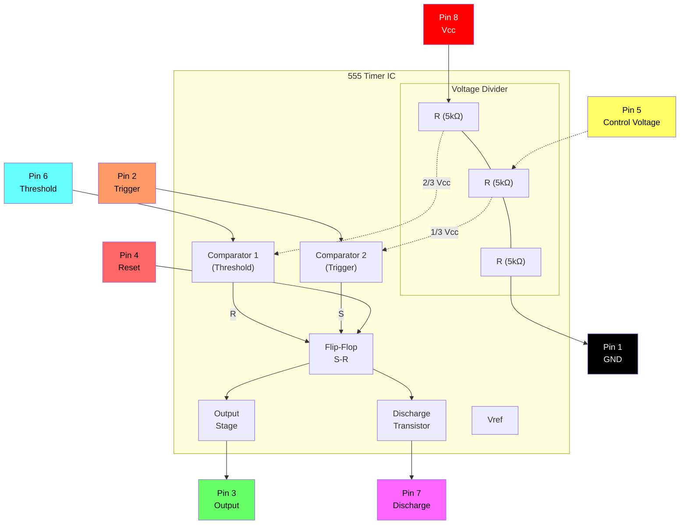

# 连接电子元件

本指南提供了在面包板上构建电子电路的分步说明。每个版本都会逐步引入新的组件和概念。

---

## 基本组件构建说明

### 构建 1 — 单 LED

**组件：** 红色 LED、黑色跳线、红色跳线、带支架的电池

**步骤：**

1. 将黑色跳线从 **A5** 到 **A14** 插入面包板。
2. 将红色跳线从 **J5** 到 **J14** 插入面包板。
3. 将红色 LED 放入第 14 行，正极引脚（两条引脚中较长的一个）位于右侧，与红线对齐，负极引脚位于左侧，与黑线对齐。
4. 将电池插入电池座并将其放入面包板中，将负极连接到黑色，将正极连接到红色。

**结果：** 当您插入电池时，LED 将会亮起。

**故障排除：**

- 你的LED插反了吗？
- 跳线是否与 LED 引线在同一排？
- 跳线是否与电池端子在同一排？

---

### 构建 2 — 单按钮

**组件：** 红色 LED、按钮、黑色跳线、红色跳线、带支架的电池

**步骤：**

1. 将黑色跳线从 **A5** 到 **A16** 插入面包板。
2. 将红色跳线从 **J5** 到 **J12** 插入面包板。
3. 将红色 LED 放入面包板，正极脚（两个脚中较长的一个）插入 **H15**，负极脚插入 **G17**。
4. 将按钮水平放置在面包板中间，使左下角引脚位于第 16 行（与黑色跳线对齐），右上角引脚位于第 14 行（与红色 LED 的负极引脚对齐）。
5. 将电池插入电池座并将其放入面包板中，将负极连接到黑色，将正极连接到红色。

**结果：** 当您按下按钮时，LED 将亮起。

**故障排除：**

- 你的LED插反了吗？
- 跳线是否与 LED 引线在同一排？
- 跳线是否与电池端子在同一排？

---

### 构建 3 — 光敏电阻调光 LED

**组件：** 绿色 LED、光敏电阻、黑色跳线、红色跳线、带支架的电池

**步骤：**

1. 将黑色跳线从 **A5** 到 **A12** 插入面包板。
2. 将红色跳线从 **J5** 到 **J13** 插入面包板。
3. 将绿色 LED 放入面包板，正极脚（两个脚中较长的一个）插入 **F13**，负极脚插入 **E13**。
4. 将光敏电阻从 **C12** 到 **D13** 插入面包板。
5. 将电池插入电池座并将其放入面包板中，将负极连接到黑色，将正极连接到红色。

**结果：** 当您插入电池时，LED 将会亮起。覆盖光敏电阻会导致 LED 变暗。

---

### 构建 4 — 双 LED 按钮

**组件：** 红色 LED、绿色 LED、220Ω 电阻、按钮、黑色跳线、红色跳线、带支架的电池

**步骤：**

1. 将黑色跳线从 **A5** 到 **A11** 插入面包板。
2. 将红色跳线从 **J5** 到 **J11** 插入面包板。
3. 将 220Ω 电阻从 **I11** 到 **I15** 插入面包板。
4. 将按钮水平放置在面包板中间，使顶部引脚位于第 15 行且位于面包板的相对两侧。
5. 将红色 LED 放入面包板，正极脚（两个脚中较长的一个）插入 **C17**，负极脚插入 **B11**。
6. 将绿色 LED 放入面包板，正极脚插入 **G15**，负极脚插入 **E11**。
7. 将电池插入电池座并将其放入面包板中，将负极连接到黑色，将正极连接到红色。

**结果：** 当您插入电池时，绿色 LED 将亮起。当您按下按钮时，绿色 LED 将关闭，红色 LED 将点亮。

### 构建 5 - 光敏电阻闪烁 LED

- 将黑色跳线从 A3 到 A12 插入面包板。
- 将红色跳线从 J3 到 J12 插入面包板。
- 将 555 集成电路芯片放入面包板中间，顶部引脚位于第 12 行。
- 将跳线插入面包板，将 D15 连接到 G12。
- 将跳线插入面包板，将 D13 连接到 G14。
- 将 1000Ω 电阻插入面包板的 C14 至 H17。
- 将光敏电阻插入面包板的 B14 至 B15 处。
- 将电容器从 A13 到 B12 插入面包板。
- 将绿色 LED 放入面包板，正极脚（两个脚中较长的一个）插入 F17，负极脚插入 C12。
- 将红色 LED 放入面包板，正极脚插入 I12，负极脚插入 J17。
- 将电池插入电池座并将其放入面包板中，将负极连接到黑色，将正极连接到红色。

当您插入电池时，两个 LED 将开始快速闪烁。遮住光敏电阻会减慢 LED 的闪烁频率。

---

## 555 定时器 IC 参考

555 定时器是一种多功能集成电路，用于定时、脉冲生成和振荡器应用。以下部分提供引脚排列信息和内部电路详细信息。

### 555引脚图

```
    ┌─────────────────────────────────────┐
    │  ●                                  │
    │  #1                             #8  │
    │  ┌──┐                         ┌──┐  │
    │  │  │                         │  │  │
    │  └──┘                         └──┘  │
    │  #2                             #7  │
    │  ┌──┐       555 TIMER         ┌──┐  │
    │  │  │                         │  │  │
    │  └──┘                         └──┘  │
    │  #3                             #6  │
    │  ┌──┐                         ┌──┐  │
    │  │  │                         │  │  │
    │  └──┘                         └──┘  │
    │  #4                             #5  │
    │  ┌──┐                         ┌──┐  │
    │  │  │                         │  │  │
    │  └──┘                         └──┘  │
    └─────────────────────────────────────┘
```

### 555 引脚说明

|针 |符号|功能|
|:---:|:---:|:---|
| 1 |接地 |接地参考（0V）|
| 2 |触发|触发输入 — 当电压低于 ⅓ Vcc | 时启动计时周期
| 3 |输出 |输出—提供高或低信号|
| 4 |重置 |复位输入（低电平有效）— 接地时强制输出为低电平 |
| 5 |继续 |控制电压 — 提供对内部分压器的访问 (⅔ Vcc) |
| 6 |阈值 |阈值输入 — 当电压超过 ⅔ Vcc | 时结束时序周期
| 7 |迪施 |放电—集电极开路输出，用于定时电容器放电|
| 8 |电源电压|电源电压（+4.5V 至 +16V）|

### 555内部框图



---

### 构建 6 — 按钮蜂鸣器

**组件：** 555定时器IC、压电扬声器、220Ω电阻、1000Ω电阻、电容器、按钮、跳线、带支架的电池

**步骤：**

1. 将黑色跳线从 **A1** 到 **A11** 插入面包板。
2. 将红色跳线从 **J1** 到 **J11** 插入面包板。
3. 将 555 集成电路芯片放入面包板中间，顶部引脚位于第 11 行。
4. 将跳线插入面包板，将 **D12** 连接到 **G13**。
5. 将跳线插入面包板，将 **D14** 连接到 **G11**。
6. 将电容器从 **A12** 到 **B11** 插入面包板。
7. 将 220Ω 电阻插入面包板的 **C12** 至 **C13**。
8. 将按钮水平放置在面包板中间，使顶部引脚位于第 15 行且位于面包板的相对两侧。
9. 将压电扬声器插入面包板，正极引脚位于 **A9** 中，负极引脚位于 **A6** 中。
10. 将 1000Ω 电阻插入面包板的 **E6** 至 **A13**。
11. 将跳线插入面包板，将 **C9** 连接到 **D15**。
12. 将跳线插入面包板，将 **G17** 连接到 **I11**。
13. 将电池插入电池座并将其放入面包板中，将负极连接到黑色，将正极连接到红色。

**结果：** 当您按下按钮时，蜂鸣器会发出声音。

---

### 构建 7 — 光敏电阻特雷门琴

**组件：** 555定时器IC、压电扬声器、光敏电阻、1000Ω电阻、电容器、按钮、跳线、带支架的电池

**步骤：**

1. 将黑色跳线从 **A1** 到 **A11** 插入面包板。
2. 将红色跳线从 **J1** 到 **J11** 插入面包板。
3. 将 555 集成电路芯片放入面包板中间，顶部引脚位于第 11 行。
4. 将跳线插入面包板，将 **D12** 连接到 **G13**。
5. 将跳线插入面包板，将 **D14** 连接到 **G11**。
6. 将电容器从 **A12** 到 **B11** 插入面包板。
7. 将光敏电阻从 **C12** 到 **C13** 插入面包板。
8. 将按钮水平放置在面包板中间，使顶部引脚位于第 15 行且位于面包板的相对两侧。
9. 将压电扬声器插入面包板，正极引脚位于 **A9** 中，负极引脚位于 **A6** 中。
10. 将 1000Ω 电阻插入面包板的 **E6** 至 **A13**。
11. 将跳线插入面包板，将 **C9** 连接到 **D15**。
12. 将跳线插入面包板，将 **G17** 连接到 **I11**。
13. 将电池插入电池座并将其放入面包板中，将负极连接到黑色，将正极连接到红色。

**结果：** 当您按下按钮时，蜂鸣器会发出声音。覆盖光敏电阻会改变蜂鸣器的音调。

---

### 构建 8 — 电位计调光 LED

**组件：** 绿色LED、电位器、220Ω电阻、黑色跳线、红色跳线、带支架的电池

**步骤：**

1. 将黑色跳线从 **A1** 到 **A13** 插入面包板。
2. 将红色跳线从 **J1** 到 **J9** 插入面包板。
3. 将电位器的两引脚侧放在左侧，顶部引脚位于 **E13** 中，底部引脚位于 **E15** 中。
4. 将 220Ω 电阻从 **H9** 到 **H14** 插入面包板。
5. 将绿色 LED 放入面包板，正极脚（两个脚中较长的一个）插入 **C15**，负极脚插入 **B13**。
6. 将电池插入电池座并将其放入面包板中，将负极连接到黑色，将正极连接到红色。

**结果：** 当您插入电池时，LED 将亮起。旋转电位器将增加或减少 LED 的亮度。

---

### 构建 9 — 按钮 RGB LED

**组件：** RGB LED（共阴极），三个按钮，两个220Ω电阻，黑色跳线，红色跳线，跳线，带支架的电池

**步骤：**

1. 将黑色跳线从 **A1** 到 **B7** 插入面包板。
2. 将红色跳线从 **J1** 到 **J7** 插入面包板。
3. 将 RGB LED 从 **A4** 到 **A8** 插入面包板。四条腿中最长的是地面，应位于**A7**。
4. 将三个按钮水平放置在面包板中间，引脚位于：
   - 按钮 1：**E9–F9** 和 **E11–F11**
   - 按钮 2：**E12–F12** 和 **E14–F14**
   - 按钮 3：**E15–F15** 和 **E17–F17**
5. 将跳线插入面包板，将 **C5** 连接到 **D9**。
6. 将跳线插入面包板，将 **C6** 连接到 **C12**。
7. 将跳线插入面包板，将 **B8** 连接到 **B15**。
8. 将第一个 220Ω 电阻从 **G7** 到 **G11** 插入面包板。
9. 将第二个 220Ω 电阻从 **H7** 到 **H14** 插入面包板。
10. 将电池插入电池座并将其放入面包板中，将负极连接到黑色，将正极连接到红色。

**结果：** 按下每个按钮将激活 RGB LED 的不同颜色通道。

---

### Build 10 — 电位计控制的蜂鸣器

**组件：** 555定时器IC、压电扬声器、电位器、220Ω电阻、电容器、按钮、跳线、带支架的电池

**步骤：**

1. 将黑色跳线从 **A1** 到 **A11** 插入面包板。
2. 将红色跳线从 **J1** 到 **J11** 插入面包板。
3. 将 555 集成电路芯片放入面包板中间，顶部引脚位于第 11 行。
4. 将跳线插入面包板，将 **D12** 连接到 **G13**。
5. 将跳线插入面包板，将 **D14** 连接到 **G11**。
6. 将电容器从 **A12** 到 **B11** 插入面包板。
7. 将压电扬声器从 **A6** 到 **A9** 插入面包板（将正极端放在底部）。
8. 将按钮水平放置在面包板中间，使顶部引脚位于 **E15** 和 **F15** 中。
9. 将 220Ω 电阻插入面包板的 **E6** 至 **A13**。
10. 将跳线插入面包板，将 **E9** 连接到 **D15**。
11. 将跳线插入面包板，将 **G17** 连接到 **I11**。
12. 将电位器的两引脚侧放在右侧，顶部引脚位于 **F7** 中，底部引脚位于 **F9** 中。
13. 将跳线插入面包板，将 **D8** 连接到 **B13**。
14. 将跳线插入面包板，将 **H7** 连接到 **C12**。
15. 将跳线插入面包板，将 **H9** 连接到 **D11**。
16. 将电池插入电池座并将其放入面包板中，将负极连接到黑色，将正极连接到红色。

**结果：** 按下按钮将使蜂鸣器发出声音。旋转电位器将改变蜂鸣器的音高。
