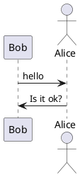
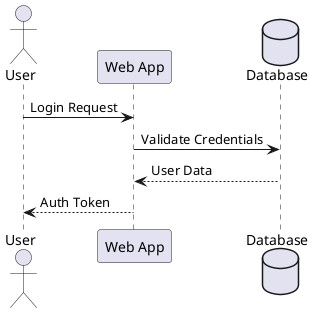
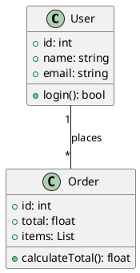
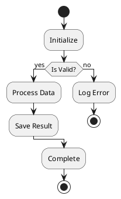
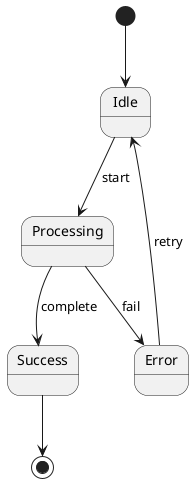
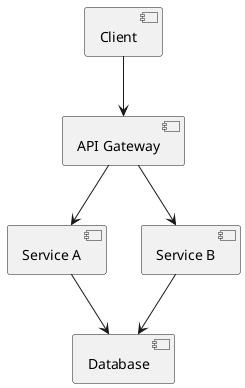
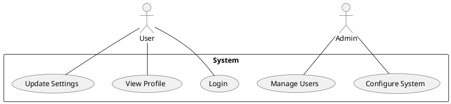
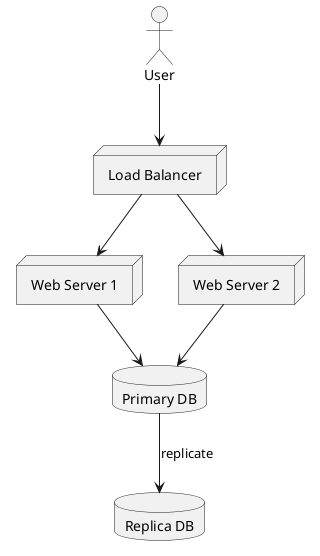

---
名称： plantuml-ascii
描述：“使用 PlantUML 文本模式生成 ASCII 艺术图。当用户要求创建 ASCII 图表、基于文本的图表、终端友好图表或提及 plantuml ascii、文本图、ascii 艺术图时使用。支持：将 PlantUML 图表转换为 ASCII 艺术图、创建 ASCII 格式的序列图、类图、流程图、使用 -utxt 标志生成 Unicode 增强型 ASCII 艺术图”
许可证：麻省理工学院
允许的工具：Bash、写入、读取
---

# PlantUML ASCII 艺术图生成器

## 概述

使用 PlantUML 创建基于文本的 ASCII 艺术图。非常适合终端环境中的文档、自述文件、电子邮件或任何不适合图形图表的场景。

## 什么是 PlantUML ASCII 艺术？

PlantUML 可以生成纯文本（ASCII 艺术）而不是图像的图表。这对于：

- 基于终端的工作流程
- 没有图像支持的 Git 提交/PR
- 需要版本控制的文档
- 图形工具不可用的环境

## 安装

```bash
# macOS
brew install plantuml

# Linux (varies by distro)
sudo apt-get install plantuml  # Ubuntu/Debian
sudo yum install plantuml      # RHEL/CentOS

# Or download JAR directly
wget https://github.com/plantuml/plantuml/releases/download/v1.2024.0/plantuml-1.2024.0.jar
```

## 输出格式

|旗帜|格式|描述 |
| ------- | ------------- | ------------------------------------ |
| __代码0__ | ASCII |纯 ASCII 字符 |
| __代码0__ | Unicode ASCII |增强了画框字符 |

## 基本工作流程

### 1.创建PlantUML图文件



### 2. 生成 ASCII 艺术作品

```bash
# Standard ASCII output
plantuml -txt diagram.puml

# Unicode-enhanced output (better looking)
plantuml -utxt diagram.puml

# Using JAR directly
java -jar plantuml.jar -txt diagram.puml
java -jar plantuml.jar -utxt diagram.puml
```

### 3. 查看输出

输出保存为 `diagram.atxt` (ASCII) 或 `diagram.utxt` (Unicode)。

## 支持的图表类型

### 时序图



### 类图



### 活动图



### 状态图



### 元件图



### 用例图



### 部署图



## 命令行选项

```bash
# Specify output directory
plantuml -txt -o ./output diagram.puml

# Process all files in directory
plantuml -txt ./diagrams/

# Include dot files (hidden files)
plantuml -txt -includeDot diagrams/

# Verbose output
plantuml -txt -v diagram.puml

# Specify charset
plantuml -txt -charset UTF-8 diagram.puml
```

## Ant 任务集成

```xml
<target name="generate-ascii">
  <plantuml dir="./src" format="txt" />
</target>

<target name="generate-unicode-ascii">
  <plantuml dir="./src" format="utxt" />
</target>
```

## 更好的 ASCII 图表的技巧

1. **保持简单**：复杂的图表在 ASCII 中不能很好地呈现
2. **短标签**：长文本破坏 ASCII 对齐
3. **使用 Unicode (`-utxt`)**：使用方框图字符获得更好的视觉质量
4. **分享前测试**：在终端中使用等宽字体验证
5. **考虑替代方案**：对于复杂的图表，请使用 Mermaid.js 或 graphviz

## 示例输出比较

**标准 ASCII (`-txt`)**：

```
     ,---.          ,---.
     |Bob|          |Alice|
     `---'          `---'
      |   hello      |
      |------------->|
      |              |
      |  Is it ok?   |
      |<-------------|
      |              |
```

**Unicode ASCII (`-utxt`)**：

```
┌─────┐        ┌─────┐
│ Bob │        │Alice│
└─────┘        └─────┘
  │   hello      │
  │─────────────>│
  │              │
  │  Is it ok?   │
  │<─────────────│
  │              │
```

## 快速参考

```bash
# Create sequence diagram in ASCII
cat > seq.puml << 'EOF'
@startuml
Alice -> Bob: Request
Bob --> Alice: Response
@enduml
EOF

plantuml -txt seq.puml
cat seq.atxt

# Create with Unicode
plantuml -utxt seq.puml
cat seq.utxt
```

## 故障排除

**问题**：Unicode 字符乱码

- **解决方案**：确保终端支持 UTF-8 并具有正确的字体

**问题**：图表看起来未对齐

- **解决方案**：使用固定宽度字体（Courier、Monaco、Consolas）

**问题**：找不到命令

- **解决方案**：安装PlantUML或直接使用Java JAR

**问题**：未创建输出文件

- **解决方案**：检查文件权限，确保 PlantUML 具有写入权限
