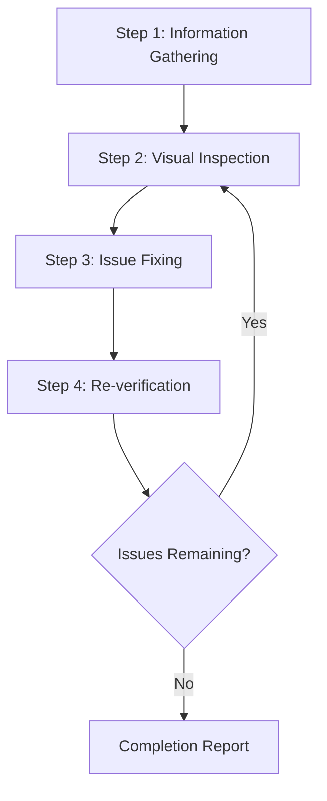
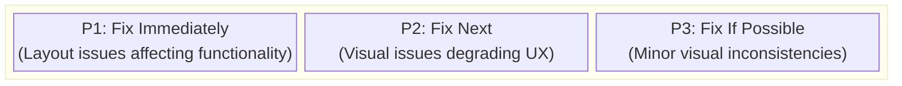
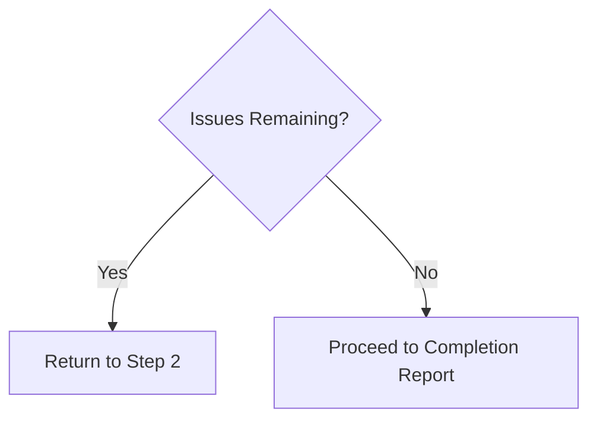

---
姓名：网页设计审阅者
描述：“此技能可以对本地或远程运行的网站进行目视检查，以识别和修复设计问题。触发“审查网站设计”、“检查用户界面”、“修复布局”、“查找设计问题”等请求。检测响应式设计、可访问性、视觉一致性和布局破坏的问题，然后在源代码级别执行修复。
---

# 网页设计审核员

这项技能可以对网站设计质量进行目视检查和验证，识别并修复源代码级别的问题。

## 适用范围

- 静态站点（HTML/CSS/JS）
- React / Vue / Angular / Svelte 等 SPA 框架
- Next.js / Nuxt / SvelteKit 等全栈框架
- CMS 平台，例如 WordPress / Drupal
- 任何其他网络应用程序

## 先决条件

### 必填

1. **目标网站必须正在运行**
   - 本地开发服务器（例如 `http://localhost:3000`）
   - 暂存环境
   - 生产环境（用于只读评论）

2. **浏览器自动化必须可用**
   - 截图捕捉
   - 页面导航
   - DOM信息检索

3. **访问源代码（进行修复时）**
   - 项目必须存在于工作区中

## 工作流程概述



---

## 第 1 步：信息收集阶段

### 1.1 网址确认

如果未提供 URL，请询问用户：

> 请提供要审核的网站的 URL（例如 `http://localhost:3000`）

### 1.2 了解项目结构

进行修复时，请收集以下信息：

|项目 |示例问题 |
|------|------------------|
|框架|您是否使用 React / Vue / Next.js 等？ |
|造型方法| CSS / SCSS / Tailwind / CSS-in-JS 等 |
|来源地点|样式文件和组件位于哪里？ |
|审查范围|仅特定页面还是整个网站？ |

### 1.3 自动项目检测

尝试从工作区中的文件自动检测：

```
Detection targets:
├── package.json     → Framework and dependencies
├── tsconfig.json    → TypeScript usage
├── tailwind.config  → Tailwind CSS
├── next.config      → Next.js
├── vite.config      → Vite
├── nuxt.config      → Nuxt
└── src/ or app/     → Source directory
```

### 1.4 识别样式方法

|方法|检测|编辑目标|
|--------|-----------|-------------|
|纯 CSS | `*.css` 文件 |全局 CSS 或组件 CSS |
| SCSS/Sass | __代码0__，__代码1__ | SCSS 文件 |
| CSS 模块 | __代码0__ |模块 CSS 文件 |
|顺风 CSS | __代码0__ |组件中的类名 |
|样式组件 |代码中的 `styled.` | JS/TS 文件 |
|情感| `@emotion/` 导入 | JS/TS 文件 |
| CSS-in-JS（其他）|内联样式 | JS/TS 文件 |

---

## 第 2 步：目视检查阶段

### 2.1 页面遍历

1. 导航到指定的 URL
2. 捕获屏幕截图
3. 检索 DOM 结构/快照（如果可能）
4. 如果存在其他页面，则通过导航遍历

### 2.2 检查项目

#### 布局问题

|问题 |描述 |严重性 |
|-------|-------------|----------|
|元素溢出|内容从父元素或视口溢出 |高|
|元素重叠|元素意外重叠 |高|
|对齐问题 |网格或 Flex 对齐问题 |中等|
|间距不一致|填充/边距不一致 |中等|
|文字剪辑|长文本处理不当 |中等|

#### 响应问题

|问题 |描述 |严重性 |
|-------|-------------|----------|
|非移动设备友好 |小屏幕上的布局中断 |高|
|断点问题 |屏幕尺寸变化时过渡不自然 |中等|
|触摸目标|手机上的按钮太小|中等|

#### 无障碍问题

|问题 |描述 |严重性 |
|-------|-------------|----------|
|对比度不足|文字与背景对比度低|高|
|无焦点状态 |无法确定键盘导航期间的状态 |高|
|缺少替代文本 |图像没有替代文字 |中等|

#### 视觉一致性

|问题 |描述 |严重性 |
|-------|-------------|----------|
|字体不一致 |混合字体系列|中等|
|颜色不一致|品牌颜色不统一|中等|
|间距不一致 |相似元素之间的间距不均匀 |低|

### 2.3 视口测试（响应式）

在以下视口进行测试：

|名称 |宽度|代表设备|
|------|-------|----------------------|
|手机 | 375 像素 | iPhone SE/12 迷你 |
|平板电脑| 768 像素 | iPad |
|桌面| 1280 像素 |标准电脑|
|宽| 1920 像素 |大显示屏|

---

## 第 3 步：问题修复阶段

### 3.1 问题优先级



### 3.2 识别源文件

从有问题的元素中识别源文件：

1. **基于选择器的搜索**
   - 按类名或 ID 搜索代码库
   - 使用 `grep_search` 探索样式定义

2. **基于组件的搜索**
   - 从元素文本或结构中识别组件
   - 使用 `semantic_search` 探索相关文件

3. **文件模式过滤**
   ```
   Style files: src/**/*.css, styles/**/*
   Components: src/components/**/*
   Pages: src/pages/**, app/**
   ```

### 3.3 应用修复

#### 特定于框架的修复指南

有关详细信息，请参阅 [references/framework-fixes.md](references/framework-fixes-zh.md)。

#### 修复原则

1. **最小更改**：仅进行解决问题所需的最小更改
2. **尊重现有模式**：遵循项目中现有的代码风格
3. **避免重大更改**：小心不要影响其他区域
4. **添加评论**：添加评论以在适当的情况下解释修复的原因

---

## 第四步：重新验证阶段

### 4.1 修复后确认

1. 重新加载浏览器（或等待开发服务器 HMR）
2. 捕获固定区域的屏幕截图
3. 比较之前和之后

### 4.2 回归测试

- 确认修复未影响其他区域
- 确认响应式显示未损坏

### 4.3 迭代决策



**迭代限制**：如果特定问题需要超过 3 次修复尝试，请咨询用户

---

## 输出格式

### 审查结果报告

```markdown
# Web Design Review Results

## Summary

| Item | Value |
|------|-------|
| Target URL | {URL} |
| Framework | {Detected framework} |
| Styling | {CSS / Tailwind / etc.} |
| Tested Viewports | Desktop, Mobile |
| Issues Detected | {N} |
| Issues Fixed | {M} |

## Detected Issues

### [P1] {Issue Title}

- **Page**: {Page path}
- **Element**: {Selector or description}
- **Issue**: {Detailed description of the issue}
- **Fixed File**: `{File path}`
- **Fix Details**: {Description of changes}
- **Screenshot**: Before/After

### [P2] {Issue Title}
...

## Unfixed Issues (if any)

### {Issue Title}
- **Reason**: {Why it was not fixed/could not be fixed}
- **Recommended Action**: {Recommendations for user}

## Recommendations

- {Suggestions for future improvements}
```

---

## 所需能力

|能力|描述 |必填 |
|------------|-------------|----------|
|网页导航|访问 URL、页面转换 | ✅ |
|截图捕捉 |页面图像捕捉| ✅ |
|图像分析|视觉问题检测 | ✅ |
| DOM 检索 |页面结构检索 |推荐|
|文件读/写 |源码阅读与编辑|需要修复 |
|代码搜索 |项目内代码搜索|需要修复 |

---

## 参考实现

### 与剧作家 MCP 一起实施

建议使用 [Playwright MCP](https://github.com/microsoft/playwright-mcp) 作为该技能的参考实现。

|能力|剧作家 MCP 工具 |目的|
|------------|---------------------|---------|
|导航 | __代码0__ |访问网址 |
|快照| __代码0__ |检索 DOM 结构 |
|截图| __代码0__ |用于目视检查的图像|
|点击 | __代码0__ |与互动元素互动 |
|调整大小 | __代码0__ |响应式测试 |
|控制台 | __代码0__ |检测 JS 错误 |

#### 配置示例（MCP服务器）

```json
{
  "mcpServers": {
    "playwright": {
      "command": "npx",
      "args": ["-y", "@playwright/mcp@latest", "--caps=vision"]
    }
  }
}
```

### 其他兼容的浏览器自动化工具

|工具|特点|
|------|----------|
|硒|广泛的浏览器支持、多语言支持 |
|傀儡师 |专注于 Chrome/Chrom，Node.js |
|柏树 |与E2E测试轻松集成|
| WebDriver 双向 |标准化的下一代协议|

使用这些工具可以实现相同的工作流程。只要它们提供必要的功能（导航、屏幕截图、DOM 检索），工具的选择就很灵活。

---

## 最佳实践

### 做（推荐）

- ✅ 在进行修复之前始终保存屏幕截图
- ✅ 一次解决一个问题并验证每个问题
- ✅ 遵循项目现有的代码风格
- ✅ 重大变更前与用户确认
- ✅ 彻底记录修复细节

### 不要（不推荐）

- ❌未经确认的大规模重构
- ❌ 忽视设计系统或品牌准则
- ❌ 修复忽略性能的问题
- ❌ 一次修复多个问题（难以验证）

---

## 故障排除

### 问题：找不到样式文件

1. 检查 `package.json` 中的依赖关系
2. 考虑 CSS-in-JS 的可能性
3. 考虑构建时生成的 CSS
4. 询问用户造型方法

### 问题：修复未反映出来

1. 检查开发服务器 HMR 是否正常工作
2. 清除浏览器缓存
3. 如果项目需要构建，则重新构建
4. 检查 CSS 特异性问题

### 问题：影响其他区域的修复

1. 回滚更改
2. 使用更具体的选择器
3. 考虑使用 CSS 模块或作用域样式
4. 咨询用户确认影响范围
