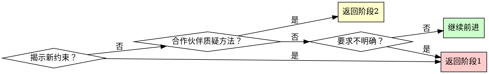

# 将想法转化为设计的头脑风暴

## 概述

通过结构化提问和替代方案探索，将粗略的想法转化为完整的设计。

**核心原则：** 先研究，提出有针对性的问题填补空白，探索替代方案，增量展示设计以供验证。

**开始时宣布：** "我正在使用头脑风暴技能，将您的想法完善为设计。"

## 快速参考

| 阶段               | 关键活动                         | 工具使用                           | 输出                       |
| ------------------ | -------------------------------- | ---------------------------------- | -------------------------- |
| **准备：自主侦察** | 检查仓库/文档/提交，形成初始模型 | 原生工具（ls、cat、git log等）     | 待确认的草稿理解           |
| **1. 理解**        | 分享发现，只询问缺失的上下文     | AskUserQuestion 用于实际决策       | 目的、约束、标准（已确认） |
| **2. 探索**        | 提出2-3种方法                    | AskUserQuestion 用于方法选择       | 带权衡的架构选项           |
| **3. 设计展示**    | 以200-300字段落展示              | 开放式问题                         | 带验证的完整设计           |
| **4. 设计文档**    | 编写设计文档                     | writing-clearly-and-concisely 技能 | docs/plans/中的设计文档    |
| **5. 工作树设置**  | 设置隔离工作区                   | using-git-worktrees 技能           | 就绪的开发环境             |
| **6. 计划交接**    | 创建实现计划                     | writing-plans 技能                 | 详细任务分解               |

## 过程

复制此清单跟踪进度：

```
头脑风暴进度：
- [ ] 准备：自主侦察（已审查仓库/文档/提交，已分享初始模型）
- [ ] 阶段1：理解（已收集目的、约束、标准）
- [ ] 阶段2：探索（已提出并评估2-3种方法）
- [ ] 阶段3：设计展示（已分段验证设计）
- [ ] 阶段4：设计文档（已将设计写入docs/plans/）
- [ ] 阶段5：工作树设置（如果要实现）
- [ ] 阶段6：计划交接（如果要实现）
```

### 准备：自主侦察

- 在提问之前，使用现有工具（文件浏览、文档、git历史、测试）了解当前项目状态。
- 形成您的草稿模型：您在解决什么问题，存在哪些工件，还存在什么问题。
- 通过分享该模型开始对话："基于探索项目状态、文档、工作副本和最近的提交，我认为这应该这样工作…"
- 仅对您无法从可用材料推断的信息提出后续问题。

### 阶段1：理解

- 首先分享您的综合理解，然后邀请纠正或补充。
- 一次只问一个焦点问题，仅针对您无法自行填补的空白。
- 仅当您需要人类在真实替代方案中做出决策时**使用AskUserQuestion工具**。
- 收集：目的、约束、成功标准（由您的合作伙伴确认或修正）

**示例总结+针对性问题：**

```
基于README和昨天的提交，我们正在将本地化扩展到仪表板和计费邮件；管理控制台仍未触及。我看到的唯一空白是本次迭代中支持响应是否需要本地化。我是否遗漏了任何重要内容？
```

### 阶段2：探索

- 提出2-3种不同的方法
- 对每种方法：核心架构、权衡、复杂度评估和您的建议
- 当您真正需要判断时**使用AskUserQuestion工具**展示方法
- 以您偏好的选项开头并解释原因；如果您的合作伙伴看法不同，邀请不同意见
- 拥有优先权：如果仓库明确了优先级，陈述它们并继续，而不是询问

**使用AskUserQuestion的示例：**

```
问题："我们应该使用哪种架构方法？"
选项：
  - "带重试逻辑的直接API调用"（简单、同步、更容易调试）←推荐用于当前范围
  - "带消息队列的事件驱动"（可扩展、设置复杂、最终一致性）
  - "带后台作业的混合模式"（平衡、中等复杂度、两全其美）

我推荐直接API方法，因为它匹配现有模式并最小化新基础设施。如果您看到阻碍我们走向其他选项的问题，请告诉我。
```

### 阶段3：设计展示

- 以连贯的段落展示；引入新材料时使用约200-300字，一旦对齐明显则使用较短摘要
- 涵盖：架构、组件、数据流、错误处理、测试
- 在自然的断点处检查，而不是每段之后："如果这与您的预期不同，请阻止我。"
- 使用开放式问题允许自由形式反馈
- 假设拥有所有权并继续，除非您的合作伙伴重定向您

### 阶段4：设计文档

验证设计后，将其写入永久文档：

- **文件位置：** `docs/plans/YYYY-MM-DD-<topic>-design.md`（使用实际日期和描述性主题）
- **推荐子技能：** 使用elements-of-style:writing-clearly-and-concisely（如果可用）以确保文档质量
- **内容：** 捕获在阶段3中讨论和验证的设计，组织为对话中出现的段落
- 在继续之前将设计文档提交到git

### 阶段5：工作树设置（用于实现）

当设计被批准且将要实现时：

- 宣布："我正在使用using-git-worktrees技能设置隔离工作区。"
- **必需子技能：** 使用superpowers:using-git-worktrees
- 遵循该技能的目录选择、安全验证和设置过程
- 工作树就绪时返回此处

### 阶段6：计划交接

询问："准备好创建实现计划了吗？"

当您的人类合作伙伴确认时（任何肯定响应）：

- 宣布："我正在使用writing-plans技能创建实现计划。"
- **必需子技能：** 使用superpowers:writing-plans
- 在工作树中创建详细计划

## 问题模式

### 何时使用AskUserQuestion工具

**在以下情况使用AskUserQuestion：**

- 您需要您的合作伙伴在真实替代方案中做出判断
- 您有建议并且可以解释为什么这是您的偏好
- 优先级不明确且无法从现有材料推断

**最佳实践：**

- 在问题中陈述您偏好的选项和理由，以便您的合作伙伴可以同意或重定向
- 如果您从仓库/文档知道答案，将其陈述为事实并继续——无需提问
- 当优先级明确时，承认它们并继续，而不是将选择委托回您的合作伙伴

### 何时使用开放式问题

**对以下情况使用开放式问题：**

- 阶段3：设计验证（"到目前为止这看起来正确吗？"）
- 当您需要详细反馈或解释时
- 当合作伙伴应该描述他们自己的要求时
- 当结构化选项会限制创造性输入时

将它们构造成确认或扩展您当前的理解，而不是重新开启已解决的主题。

**示例决策流程：**

- "什么认证方法？" → 使用AskUserQuestion（2-4个选项）
- "这个设计处理您的用例吗？" → 开放式（验证）

## 何时重新访问早期阶段



**在以下情况您可以且应该回退：**

- 合作伙伴在阶段2或3期间揭示新约束 → 返回阶段1
- 验证显示要求中的根本差距 → 返回阶段1
- 合作伙伴在阶段3期间质疑方法 → 返回阶段2
- 某些内容不合理 → 回退并澄清

**避免强制线性前进**，当回退会带来更好结果时。

## 关键原则

| 原则             | 应用                                                |
| ---------------- | --------------------------------------------------- |
| **一次一个问题** | 阶段1：仅针对您无法自行填补的空白提出单个针对性问题 |
| **结构化选择**   | 使用AskUserQuestion工具处理2-4个带权衡的选项        |
| **无情地YAGNI**  | 从所有设计中移除不必要功能                          |
| **探索替代方案** | 在确定之前总是提出2-3种方法                         |
| **增量验证**     | 分段展示设计，验证每个部分                          |
| **灵活进展**     | 需要时回退 - 灵活性 > 刚性                          |
| **拥有主动权**   | 推荐优先级和下一步；仅当要求冲突时询问是否应该继续  |
| **宣布使用**     | 在会话开始时陈述技能使用                            |
