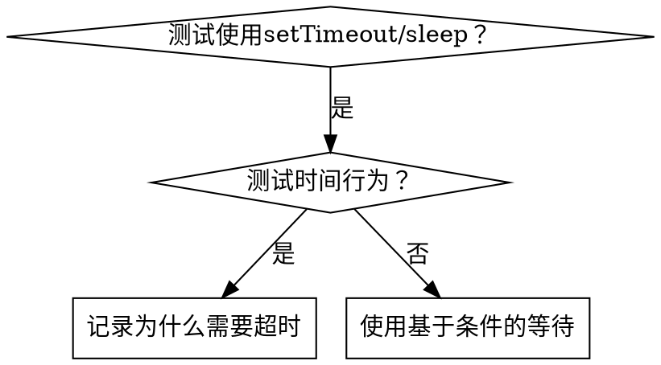

# 基于条件的等待

## 概述

不稳定的测试经常用任意延迟猜测时间。这创建竞争条件，测试在快速机器上通过但在负载下或在CI中失败。

**核心原则：** 等待您关心的实际条件，而不是关于它需要多长时间的猜测。

## 何时使用



**在以下情况使用：**

- 测试有任意延迟（`setTimeout`、`sleep`、`time.sleep()`）
- 测试不稳定（有时通过，在负载下失败）
- 测试在并行运行时超时
- 等待异步操作完成

**不要在以下情况使用：**

- 测试实际时间行为（防抖、节流间隔）
- 如果使用任意超时，总是记录为什么

## 核心模式

```typescript
// ❌ 之前：猜测时间
await new Promise(r => setTimeout(r, 50));
const result = getResult();
expect(result).toBeDefined();

// ✅ 之后：等待条件
await waitFor(() => getResult() !== undefined);
const result = getResult();
expect(result).toBeDefined();
```

## 快速模式

| 场景     | 模式                                                 |
| -------- | ---------------------------------------------------- |
| 等待事件 | `waitFor(() => events.find(e => e.type === 'DONE'))` |
| 等待状态 | `waitFor(() => machine.state === 'ready')`           |
| 等待计数 | `waitFor(() => items.length >= 5)`                   |
| 等待文件 | `waitFor(() => fs.existsSync(path))`                 |
| 复杂条件 | `waitFor(() => obj.ready && obj.value > 10)`         |

## 实现

通用轮询函数：

```typescript
async function waitFor<T>(
  condition: () => T | undefined | null | false,
  description: string,
  timeoutMs = 5000
): Promise<T> {
  const startTime = Date.now();

  while (true) {
    const result = condition();
    if (result) return result;

    if (Date.now() - startTime > timeoutMs) {
      throw new Error(`等待${description}超时，已过${timeoutMs}毫秒`);
    }

    await new Promise(r => setTimeout(r, 10)); // 每10毫秒轮询一次
  }
}
```

请参见@example.ts了解来自实际调试会话的完整实现，包含特定于域的助手（`waitForEvent`、`waitForEventCount`、`waitForEventMatch`）。

## 常见错误

**❌ 轮询太快：** `setTimeout(check, 1)` - 浪费CPU
**✅ 修复：** 每10毫秒轮询一次

**❌ 没有超时：** 如果条件永不满足则无限循环
**✅ 修复：** 总是包含带有清晰错误的超时

**❌ 陈旧数据：** 在循环前缓存状态
**✅ 修复：** 在循环内调用getter获取新数据

## 何时任意超时是正确的

```typescript
// 工具每100毫秒滴答一次 - 需要2次滴答来验证部分输出
await waitForEvent(manager, 'TOOL_STARTED'); // 首先：等待条件
await new Promise(r => setTimeout(r, 200));   // 然后：等待时间行为
// 200毫秒 = 100毫秒间隔的2次滴答 - 已记录并有理由
```

**要求：**

1. 首先等待触发条件
2. 基于已知时间（不是猜测）
3. 注释解释为什么

## 真实世界影响

来自调试会话（2025-10-03）：

- 修复了3个文件中的15个不稳定测试
- 通过率：60% → 100%
- 执行时间：快40%
- 不再有竞争条件
