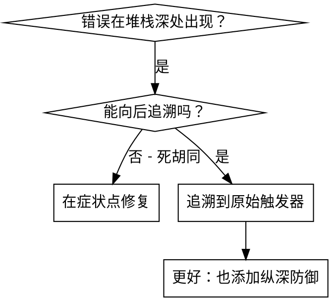
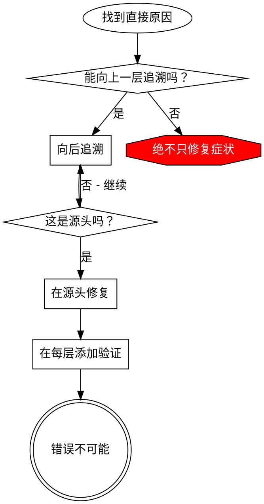

# 根本原因追踪

## 概述

错误经常在调用堆栈深处显现（在错误目录中git init，在错误位置创建文件，用错误路径打开数据库）。您的本能是修复错误出现的地方，但那是治疗症状。

**核心原则：** 向后通过调用链追溯，直到您找到原始触发器，然后在源头修复。

## 何时使用



**在以下情况使用：**
- 错误在执行深处发生（不在入口点）
- 堆栈跟踪显示长调用链
- 不清楚无效数据源于何处
- 需要找到哪个测试/代码触发问题

## 追踪过程

### 1. 观察症状
```
错误：git init在/Users/jesse/project/packages/core中失败
```

### 2. 找到直接原因
**什么代码直接导致这个？**
```typescript
await execFileAsync('git', ['init'], { cwd: projectDir });
```

### 3. 问：什么调用了这个？
```typescript
WorktreeManager.createSessionWorktree(projectDir, sessionId)
  → 被Session.initializeWorkspace()调用
  → 被Session.create()调用
  → 被Project.create()处的测试调用
```

### 4. 继续向上追踪
**传递了什么值？**
- `projectDir = ''`（空字符串！）
- 空字符串作为`cwd`解析为`process.cwd()`
- 那是源代码目录！

### 5. 找到原始触发器
**空字符串从哪里来？**
```typescript
const context = setupCoreTest(); // 返回 { tempDir: '' }
Project.create('name', context.tempDir); // 在beforeEach之前访问！
```

## 添加堆栈跟踪

当您无法手动追踪时，添加工具：

```typescript
// 在有问题的操作之前
async function gitInit(directory: string) {
  const stack = new Error().stack;
  console.error('DEBUG git init：', {
    directory,
    cwd: process.cwd(),
    nodeEnv: process.env.NODE_ENV,
    stack,
  });

  await execFileAsync('git', ['init'], { cwd: directory });
}
```

**关键：** 在测试中使用`console.error()`（不是logger - 可能不显示）

**运行并捕获：**
```bash
npm test 2>&1 | grep 'DEBUG git init'
```

**分析堆栈跟踪：**
- 寻找测试文件名
- 找到触发调用的行号
- 识别模式（相同测试？相同参数？）

## 找到哪个测试导致污染

如果在测试期间出现某些东西但您不知道哪个测试：

使用二分脚本：@find-polluter.sh

```bash
./find-polluter.sh '.git' 'src/**/*.test.ts'
```

一个一个运行测试，在第一个污染者处停止。参见脚本用法。

## 真实示例：空projectDir

**症状：** `.git`在`packages/core/`（源代码）中创建

**追踪链：**
1. `git init`在`process.cwd()`中运行 ← 空的cwd参数
2. WorktreeManager用空projectDir调用
3. Session.create()传递空字符串
4. 测试在beforeEach前访问`context.tempDir`
5. setupCoreTest()最初返回`{ tempDir: '' }`

**根本原因：** 顶级变量初始化访问空值

**修复：** 使tempDir成为如果在beforeEach前访问就抛出的getter

**也添加了纵深防御：**
- 第1层：Project.create()验证目录
- 第2层：WorkspaceManager验证非空
- 第3层：NODE_ENV防护拒绝在tmpdir外进行git init
- 第4层：git init前的堆栈跟踪日志记录

## 关键原则



**绝不只修复错误出现的地方。** 向后追溯找到原始触发器。

## 堆栈跟踪技巧

**在测试中：** 使用`console.error()`不是logger - logger可能被抑制
**操作前：** 在危险操作前记录，不是在失败后
**包含上下文：** 目录、cwd、环境变量、时间戳
**捕获堆栈：** `new Error().stack`显示完整调用链

## 真实世界影响

来自调试会话（2025-10-03）：
- 通过5级追踪找到根本原因
- 在源头修复（getter验证）
- 添加了4层防御
- 1847个测试通过，零污染