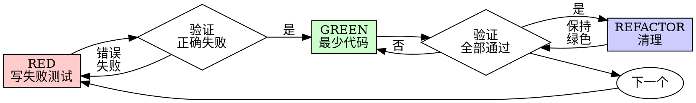

# 测试驱动开发（TDD）

## 概述

先写测试。观察它失败。编写最少的代码来通过。

**核心原则：** 如果您没有观察测试失败，您不知道它是否测试了正确的东西。

**违反规则的字面意义就是违反规则的精神。**

## 何时使用

**总是：**

- 新功能
- 错误修复
- 重构
- 行为改变

**例外（询问您的人类合作伙伴）：**

- 一次性原型
- 生成的代码
- 配置文件

想"这次跳过TDD"？停止。那是合理化。

## 铁律

```
没有失败测试就没有生产代码
```

在测试前写代码？删除它。重新开始。

**没有例外：**

- 不要保留它作为"参考"
- 不要在写测试时"适应"它
- 不要看它
- 删除意味着删除

从测试开始重新实现。就是这样。

## 红绿重构



### RED - 写失败测试

写一个最少的测试显示应该发生什么。

<好>

```typescript
test('重试失败操作3次', async () => {
  let attempts = 0;
  const operation = () => {
    attempts++;
    if (attempts < 3) throw new Error('失败');
    return '成功';
  };

  const result = await retryOperation(operation);

  expect(result).toBe('成功');
  expect(attempts).toBe(3);
});
```

名称清晰，测试真实行为，一件事
</好>

<坏>

```typescript
test('重试有效', async () => {
  const mock = jest.fn()
    .mockRejectedValueOnce(new Error())
    .mockRejectedValueOnce(new Error())
    .mockResolvedValueOnce('成功');
  await retryOperation(mock);
  expect(mock).toHaveBeenCalledTimes(3);
});
```

名称模糊，测试模拟而不是代码
</坏>

**要求：**

- 一个行为
- 清晰的名称
- 真实代码（除非不可避免否则不使用模拟）

### 验证RED - 观察它失败

**强制性。绝不跳过。**

```bash
npm test path/to/test.test.ts
```

确认：

- 测试失败（不是错误）
- 失败消息是预期的
- 因为功能缺失而失败（不是拼写错误）

**测试通过？** 您在测试现有行为。修复测试。

**测试错误？** 修复错误，重新运行直到它正确失败。

### GREEN - 最少代码

编写最简单的代码来通过测试。

<好>

```typescript
async function retryOperation<T>(fn: () => Promise<T>): Promise<T> {
  for (let i = 0; i < 3; i++) {
    try {
      return await fn();
    } catch (e) {
      if (i === 2) throw e;
    }
  }
  throw new Error('不可达');
}
```

刚好足够通过
</好>

<坏>

```typescript
async function retryOperation<T>(
  fn: () => Promise<T>,
  options?: {
    maxRetries?: number;
    backoff?: 'linear' | 'exponential';
    onRetry?: (attempt: number) => void;
  }
): Promise<T> {
  // YAGNI
}
```

过度设计
</坏>

不要添加功能、重构其他代码或"改进"超出测试范围。

### 验证GREEN - 观察它通过

**强制性。**

```bash
npm test path/to/test.test.ts
```

确认：

- 测试通过
- 其他测试仍然通过
- 输出干净（没有错误、警告）

**测试失败？** 修复代码，不是测试。

**其他测试失败？** 现在修复。

### REFACTOR - 清理

仅在绿色之后：

- 移除重复
- 改善名称
- 提取助手

保持测试绿色。不要添加行为。

### 重复

为下一个功能写下一个失败测试。

## 好测试

| 质量         | 好                             | 坏                               |
| ------------ | ------------------------------ | -------------------------------- |
| **最少**     | 一件事。名称中有"和"？分割它。 | `test('验证邮件和域和空白字符')` |
| **清晰**     | 名称描述行为                   | `test('测试1')`                  |
| **显示意图** | 展示期望的API                  | 遮蔽代码应该做什么               |

## 为什么顺序重要

**"我会在之后写测试来验证它有效"**

在代码之后写的测试立即通过。立即通过证明不了什么：

- 可能测试错误的东西
- 可能测试实现，不是行为
- 可能错过您忘记的边界情况
- 您从未看到它捕获错误

测试先行强制您观察测试失败，证明它确实测试了某些东西。

**"我已经手动测试了所有边界情况"**

手动测试是临时的。您认为您测试了一切但是：

- 没有测试记录
- 代码更改时无法重新运行
- 在压力下容易忘记情况
- "当我尝试时它有效" ≠ 全面

自动化测试是系统性的。它们每次都以相同方式运行。

**"删除X小时工作是浪费的"**

沉没成本谬误。时间已经过去了。您现在的选择：

- 删除并用TDD重写（X更多小时，高信心）
- 保留它并在之后添加测试（30分钟，低信心，可能错误）

"浪费"是保留您无法信任的代码。没有真实测试的工作代码是技术债务。

**"TDD是教条的，务实意味着适应"**

TDD是务实的：

- 在提交前发现错误（比之后调试更快）
- 防止回归（测试立即捕获破坏）
- 记录行为（测试显示如何使用代码）
- 启用重构（自由更改，测试捕获破坏）

"务实"捷径 = 在生产中调试 = 更慢。

**"之后的测试达到相同目标 - 是精神不是仪式"**

不。测试后回答"这做什么？"测试先回答"这应该做什么？"

测试后被您的实现偏向。您测试您构建的，不是要求的。您验证记得的边界情况，不是发现的。

测试先强制在实现前发现边界情况。测试后验证您记得一切（您没有）。

30分钟的测试后 ≠ TDD。您获得覆盖率，失去测试有效的证明。

## 常见合理化

| 借口                     | 现实                                           |
| ------------------------ | ---------------------------------------------- |
| "太简单无需测试"         | 简单代码会坏。测试需要30秒。                   |
| "我会在之后测试"         | 立即通过的测试证明不了什么。                   |
| "之后的测试达到相同目标" | 测试后 = "这做什么？"测试先 = "这应该做什么？" |
| "已经手动测试了"         | 临时 ≠ 系统性。无记录，无法重新运行。          |
| "删除X小时是浪费的"      | 沉没成本谬误。保留未验证代码是技术债务。       |
| "保留为参考，先写测试"   | 您会适应它。那是测试后。删除意味着删除。       |
| "需要先探索"             | 可以。丢弃探索，从TDD开始。                    |
| "测试难 = 设计不明确"    | 听测试。难测试 = 难使用。                      |
| "TDD会拖慢我"            | TDD比调试快。务实 = 测试先行。                 |
| "手动测试更快"           | 手动不证明边界情况。您会重新测试每个更改。     |
| "现有代码没有测试"       | 您在改进它。为现有代码添加测试。               |

## 红旗 - 停止并重新开始

- 测试前有代码
- 实现后有测试
- 测试立即通过
- 无法解释为什么测试失败
- 测试"稍后"添加
- 合理化"就这一次"
- "我已经手动测试了它"
- "之后的测试达到相同目的"
- "是精神不是仪式"
- "保留为参考"或"适应现有代码"
- "已经花了X小时，删除是浪费的"
- "TDD是教条的，我是务实的"
- "这不同因为..."

**所有这些都意味着：删除代码。用TDD重新开始。**

## 示例：错误修复

**错误：** 接受空邮件

**RED**

```typescript
test('拒绝空邮件', async () => {
  const result = await submitForm({ email: '' });
  expect(result.error).toBe('需要邮件');
});
```

**验证RED**

```bash
$ npm test
FAIL: expected '需要邮件', got undefined
```

**GREEN**

```typescript
function submitForm(data: FormData) {
  if (!data.email?.trim()) {
    return { error: '需要邮件' };
  }
  // ...
}
```

**验证GREEN**

```bash
$ npm test
PASS
```

**REFACTOR**
如果需要，为多个字段提取验证。

## 验证清单

在标记工作完成之前：

- [ ] 每个新函数/方法都有测试
- [ ] 在实现前观察每个测试失败
- [ ] 每个测试都因预期原因失败（功能缺失，不是拼写错误）
- [ ] 编写最少的代码来通过每个测试
- [ ] 所有测试通过
- [ ] 输出干净（没有错误、警告）
- [ ] 测试使用真实代码（除非不可避免否则不使用模拟）
- [ ] 边界情况和错误已覆盖

无法检查所有框？您跳过了TDD。重新开始。

## 当卡住时

| 问题           | 解决方案                                    |
| -------------- | ------------------------------------------- |
| 不知道如何测试 | 写期望的API。先写断言。问您的人类合作伙伴。 |
| 测试太复杂     | 设计太复杂。简化接口。                      |
| 必须模拟一切   | 代码太耦合。使用依赖注入。                  |
| 测试设置巨大   | 提取助手。仍然复杂？简化设计。              |

## 调试集成

发现错误？写重现它的失败测试。遵循TDD循环。测试证明修复并防止回归。

绝没有测试地修复错误。

## 最终规则

```
生产代码 → 测试存在且先失败
否则 → 不是TDD
```

没有您人类合作伙伴许可的例外。
