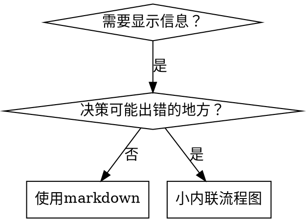

# 编写技能

## 概述

**编写技能就是应用到流程文档的测试驱动开发。**

**个人技能存在于代理特定目录（Claude Code的`~/.claude/skills`，Codex的`~/.codex/skills`）**

您编写测试用例（带子代理的压力场景），观察它们失败（基线行为），写技能（文档），观察测试通过（代理合规），并重构（关闭漏洞）。

**核心原则：** 如果您没有观察代理在没有技能的情况下失败，您不知道技能是否教授正确的东西。

**必需背景：** 在使用此技能之前您必须理解superpowers:test-driven-development。该技能定义基本的RED-GREEN-REFACTOR循环。此技能将TDD适应到文档。

**官方指导：** 关于Anthropic的官方技能编写最佳实践，参见anthropic-best-practices.md。此文档提供补充此技能中TDD重点方法的额外模式和指南。

## 什么是技能？

**技能**是已证技术、模式或工具的参考指南。技能帮助未来Claude实例找到并应用有效方法。

**技能是：** 可重用技术、模式、工具、参考指南

**技能不是：** 关于您如何一次解决问题的叙述

## 技能的TDD映射

| TDD概念 | 技能创建 |
|-------------|----------------|
| **测试用例** | 带子代理的压力场景 |
| **生产代码** | 技能文档（SKILL.md） |
| **测试失败（RED）** | 代理无技能违规规则（基线） |
| **测试通过（GREEN）** | 代理有技能存在时合规 |
| **重构** | 保持合规时关闭漏洞 |
| **先写测试** | 写技能前运行基线场景 |
| **观察它失败** | 记录代理使用的确切合理化 |
| **最少代码** | 写解决那些特定违规的技能 |
| **观察它通过** | 验证代理现在合规 |
| **重构循环** | 找到新合理化 → 堵塞 → 重新验证 |

整个技能创建过程遵循RED-GREEN-REFACTOR。

## 何时创建技能

**在以下情况创建：**
- 技术对您不直观明显
- 您会在项目中再次参考这个
- 模式广泛适用（不是项目特定）
- 其他人会受益

**不要为以下情况创建：**
- 一次性解决方案
- 其他地方有良好记录的标准实践
- 项目特定约定（放在CLAUDE.md中）

## 技能类型

### 技术
有步骤要遵循的具体方法（condition-based-waiting、root-cause-tracing）

### 模式
思考问题的方式（flatten-with-flags、test-invariants）

### 参考
API文档、语法指南、工具文档（office文档）

## 目录结构

```
skills/
  skill-name/
    SKILL.md              # 主要参考（必需）
    supporting-file.*     # 仅在需要时
```

**扁平命名空间** - 所有技能在一个可搜索命名空间中

**分离文件用于：**
1. **繁重参考**（100+行） - API文档、全面语法
2. **可重用工具** - 脚本、实用程序、模板

**保持内联：**
- 原则和概念
- 代码模式（<50行）
- 其他一切

## SKILL.md结构

**Frontmatter（YAML）：**
- 只支持两个字段：`name`和`description`
- 最大1024字符总计
- `name`：仅使用字母、数字和连字符（无括号、特殊字符）
- `description`：第三人称，包含它做什么和何时使用两者
  - 以"Use when..."开始聚焦触发条件
  - 包含具体症状、情况和上下文
  - 如果可能保持500字符以下

```markdown
---
name: Skill-Name-With-Hyphens
description: Use when [specific triggering conditions and symptoms] - [what the skill does and how it helps, written in third person]
---

# Skill Name

## 概述
这是什么？核心原则1-2句话。

## 何时使用
[如果决策不明显使用小内联流程图]

症状和用例的项目列表
何时不使用

## 核心模式（针对技术/模式）
前后代码比较

## 快速参考
表格或项目用于扫描常见操作

## 实现
简单模式的内联代码
繁重参考或可重用工具链接到文件

## 常见错误
什么出错 + 修复

## 真实世界影响（可选）
具体结果
```


## Claude搜索优化（CSO）

**对发现关键：** 未来Claude需要找到您的技能

### 1. 丰富描述字段

**目的：** Claude阅读描述决定为给定任务加载哪些技能。使它回答："我现在应该读这个技能吗？"

**格式：** 以"Use when..."开始聚焦触发条件，然后解释它做什么

**内容：**
- 使用具体触发器、症状和情况表明此技能适用
- 描述*问题*（竞争条件、不一致行为）不是*语言特定症状*（setTimeout、sleep）
- 保持触发器技术不可知，除非技能本身技术特定
- 如果技能技术特定，在触发器中明确
- 第三人称写（注入到系统提示中）

```yaml
# ❌ 坏：太抽象、模糊，不包含何时使用
description: For async testing

# ❌ 坏：第一人称
description: I can help you with async tests when they're flaky

# ❌ 坏：提到技术但技能不特定于它
description: Use when tests use setTimeout/sleep and are flaky

# ✅ 好：以"Use when"开始，描述问题，然后它做什么
description: Use when tests have race conditions, timing dependencies, or pass/fail inconsistently - replaces arbitrary timeouts with condition polling for reliable async tests

# ✅ 好：技术特定技能带明确触发器
description: Use when using React Router and handling authentication redirects - provides patterns for protected routes and auth state management
```

### 2. 关键词覆盖

使用Claude会搜索的词：
- 错误消息："Hook timed out"、"ENOTEMPTY"、"race condition"
- 症状："flaky"、"hanging"、"zombie"、"pollution"
- 同义词："timeout/hang/freeze"、"cleanup/teardown/afterEach"
- 工具：实际命令、库名、文件类型

### 3. 描述性命名

**使用主动语态，动词优先：**
- ✅ `creating-skills`不是`skill-creation`
- ✅ `testing-skills-with-subagents`不是`subagent-skill-testing`

### 4. 令牌效率（关键）

**问题：** getting-started和频繁引用的技能加载到每个对话中。每个令牌都重要。

**目标字数：**
- getting-started工作流：每个<150字
- 频繁加载技能：总计<200字
- 其他技能：<500字（仍然简洁）

**技术：**

**移动细节到工具帮助：**
```bash
# ❌ 坏：在SKILL.md中记录所有标志
search-conversations supports --text, --both, --after DATE, --before DATE, --limit N

# ✅ 好：引用--help
search-conversations supports multiple modes and filters. Run --help for details.
```

**使用交叉引用：**
```markdown
# ❌ 坏：重复工作流细节
搜索时，用模板派遣子代理...
[20行重复指令]

# ✅ 好：引用其他技能
总是使用子代理（50-100倍上下文节省）。必需：使用[other-skill-name]进行工作流。
```

**压缩示例：**
```markdown
# ❌ 坏：冗长示例（42字）
您的人类合作伙伴："我们以前在React Router中如何处理认证错误？"
您：我搜索过去对话的React Router认证模式。
[派遣子代理搜索查询："React Router认证错误处理401"]

# ✅ 好：最小示例（20字）
合作伙伴："我们以前在React Router中如何处理认证错误？"
您：搜索中...
[派遣子代理 → 综合]
```

**消除冗余：**
- 不要重复交叉引用技能中的内容
- 不要解释从命令明显的内容
- 不要包含相同模式的多个示例

**验证：**
```bash
wc -w skills/path/SKILL.md
# getting-started工作流：目标是每个<150
# 其他频繁加载：目标是总计<200
```

**按您做什么或核心洞察命名：**
- ✅ `condition-based-waiting` > `async-test-helpers`
- ✅ `using-skills`不是`skill-usage`
- ✅ `flatten-with-flags` > `data-structure-refactoring`
- ✅ `root-cause-tracing` > `debugging-techniques`

**动名词（-ing）对过程很好：**
- `creating-skills`、`testing-skills`、`debugging-with-logs`
- 主动，描述您正在采取的行动

### 4. 交叉引用其他技能

**当编写引用其他技能的文档时：**

仅使用技能名称，带明确要求标记：
- ✅ 好：`**必需子技能：** 使用superpowers:test-driven-development`
- ✅ 好：`**必需背景：** 您必须理解superpowers:systematic-debugging`
- ❌ 坏：`参见skills/testing/test-driven-development`（不清楚是否必需）
- ❌ 坏：`@skills/testing/test-driven-development/SKILL.md`（强制加载，烧毁上下文）

**为什么没有@链接：** `@`语法立即强制加载文件，在您需要它们之前消耗200k+上下文。

## 流程图使用



**仅对以下情况使用流程图：**
- 非明显的决策点
- 您可能过早停止的过程循环
- "何时使用A vs B"决策

**永不对以下情况使用流程图：**
- 参考材料 → 表格、列表
- 代码示例 → Markdown块
- 线性指令 → 编号列表
- 无语义意义的标签（step1、helper2）

参见@graphviz-conventions.dot了解graphviz样式规则。

## 代码示例

**一个优秀示例胜过多个平庸示例**

选择最相关语言：
- 测试技术 → TypeScript/JavaScript
- 系统调试 → Shell/Python
- 数据处理 → Python

**好示例：**
- 完整可运行
- 解释为什么的良好注释
- 来自真实场景
- 清楚显示模式
- 准备适应（不是通用模板）

**不要：**
- 用5+语言实现
- 创建填空模板
- 写人为示例

您擅长移植 - 一个优秀示例足够。

## 文件组织

### 自包含技能
```
defense-in-depth/
  SKILL.md    # 一切内联
```
当：所有内容适合，不需要繁重参考

### 带可重用工具的技能
```
condition-based-waiting/
  SKILL.md    # 概述 + 模式
  example.ts  # 可适应的工作助手
```
当：工具是可重用代码，不只是叙述

### 带繁重参考的技能
```
pptx/
  SKILL.md       # 概述 + 工作流
  pptxgenjs.md   # 600行API参考
  ooxml.md       # 500行XML结构
  scripts/       # 可执行工具
```
当：参考材料太大不适合内联

## 铁律（与TDD相同）

```
没有失败测试就没有技能
```

这适用于新技能和对现有技能的编辑。

测试前写技能？删除它。重新开始。
无测试编辑技能？相同违规。

**没有例外：**
- 不是"简单添加"
- 不是"仅添加段落"
- 不是"文档更新"
- 不要保留未测试更改作为"参考"
- 运行测试时不要"适应"
- 删除意味着删除

**必需背景：** superpowers:test-driven-development技能解释为什么这重要。相同原则适用于文档。

## 测试所有技能类型

不同技能类型需要不同测试方法：

### 执行纪律技能（规则/要求）

**示例：** TDD、verification-before-completion、designing-before-coding

**用以下测试：**
- 学术问题：他们理解规则吗？
- 压力场景：他们在压力下合规吗？
- 多重压力结合：时间 + 沉没成本 + 疲劳
- 识别合理化并添加明确对策

**成功标准：** 代理在最大压力下遵循规则

### 技术技能（操作指南）

**示例：** condition-based-waiting、root-cause-tracing、defensive-programming

**用以下测试：**
- 应用场景：他们能正确应用技术吗？
- 变化场景：他们处理边界情况吗？
- 缺失信息测试：指令有缺口吗？

**成功标准：** 代理成功将技术应用到新场景

### 模式技能（心智模型）

**示例：** reducing-complexity、information-hiding concepts

**用以下测试：**
- 识别场景：他们识别何时模式适用吗？
- 应用场景：他们能使用心智模型吗？
- 反例：他们知道何时不应用吗？

**成功标准：** 代理正确识别何时/如何应用模式

### 参考技能（文档/API）

**示例：** API文档、命令参考、库指南

**用以下测试：**
- 检索场景：他们能找到正确信息吗？
- 应用场景：他们能正确使用找到的内容吗？
- 缺口测试：常见用例覆盖了吗？

**成功标准：** 代理找到并正确应用参考信息

## 跳过测试的常见合理化

| 借口 | 现实 |
|--------|---------|
| "技能明显清楚" | 对您清楚 ≠ 对其他代理清楚。测试它。 |
| "这只是参考" | 参考可能有缺口、不清楚部分。测试检索。 |
| "测试过度" | 未测试技能有问题。总是。15分钟测试节省小时。 |
| "问题出现时我再测试" | 问题 = 代理无法使用技能。部署前测试。 |
| "测试太繁琐" | 测试不如调试生产中坏技能繁琐。 |
| "我有信心它好" | 过度自信保证有问题。无论如何测试。 |
| "学术审查足够" | 阅读 ≠ 使用。测试应用场景。 |
| "没时间测试" | 部署未测试技能浪费更多时间修复它。 |

**所有这些都意味着：部署前测试。没有例外。**

## 使技能防合理化

执行纪律的技能（如TDD）需要抵抗合理化。代理聪明，会在压力下找到漏洞。

**心理学注意：** 理解为什么说服技术有效帮助您系统应用它们。参见persuasion-principles.md了解权威、承诺、稀缺、社会认同和团结原则的研究基础（Cialdini，2021；Meincke等，2025）。

### 明确关闭每个漏洞

不要只陈述规则 - 禁止特定变通方法：

<坏>
```markdown
测试前写代码？删除它。
```
</坏>

<好>
```markdown
测试前写代码？删除它。重新开始。

**没有例外：**
- 不要保留为"参考"
- 写测试时不要"适应"它
- 不要看它
- 删除意味着删除
```
</好>

### 解决"精神 vs 字面"论点

早期添加基本原则：

```markdown
**违反规则字面意义就是违反规则精神。**
```

这切断了整个类"我遵循精神"合理化。

### 构建合理化表

从基线测试捕获合理化（见下面的测试部分）。代理做的每个借口都进入表中：

```markdown
| 借口 | 现实 |
|--------|---------|
| "太简单无需测试" | 简单代码会坏。测试需要30秒。 |
| "我之后测试" | 立即通过的测试什么都证明不了。 |
| "测试后达到相同目标" | 测试后 = "这做什么？"测试先 = "这应该做什么？" |
```

### 创建红旗列表

使代理容易在合理化时自检：

```markdown
## 红旗 - 停止并重新开始

- 测试前代码
- "我已经手动测试了"
- "测试后达到相同目的"
- "关于精神不是仪式"
- "这不同因为..."

**所有这些都意味着：删除代码。用TDD重新开始。**
```

### 为违规症状更新CSO

添加到描述：当您将要违规时的症状：

```yaml
description: 在实现任何功能或错误修复前，在编写实现代码时使用
```

## 技能的RED-GREEN-REFACTOR

遵循TDD循环：

### RED：写失败测试（基线）

无技能运行带子代理的压力场景。记录确切行为：
- 他们做了什么选择？
- 他们使用了什么合理化（逐字）？
- 哪些压力触发违规？

这是"观察测试失败" - 您必须在写技能前观察代理自然做什么。

### GREEN：写最小技能

写解决那些特定合理化的技能。不要为假设情况添加额外内容。

带技能运行相同场景。代理现在应该合规。

### REFACTOR：关闭漏洞

代理找到新合理化？添加明确对策。重新测试直到防弹。

**必需子技能：** 使用superpowers:testing-skills-with-subagents了解完整测试方法论：
- 如何写压力场景
- 压力类型（时间、沉没成本、权威、疲劳）
- 系统性堵塞漏洞
- 元测试技术

## 反模式

### ❌ 叙述示例
"在2025-10-03会话中，我们发现空projectDir导致..."
**为什么坏：** 太具体，不可重用

### ❌ 多语言稀释
example-js.js、example-py.py、example-go.go
**为什么坏：** 质量平庸，维护负担

### ❌ 流程图中代码
```dot
step1 [label="import fs"];
step2 [label="read file"];
```
**为什么坏：** 无法复制粘贴，难以阅读

### ❌ 通用标签
helper1、helper2、step3、pattern4
**为什么坏：** 标签应该有语义意义

## 停止：在移动到下一个技能之前

**写任何技能后，您必须停止并完成部署过程。**

**不要：**
- 无测试批量创建多个技能
- 当前技能验证前移动到下一个技能
- "批处理更高效"跳过测试

**下面的部署清单对每个技能是强制性的。**

部署未测试技能 = 部署未测试代码。这是违反质量标准。

## 技能创建清单（TDD适应）

**重要：** 使用TodoWrite为下面每个清单项目创建todos。

**RED阶段 - 写失败测试：**
- [ ] 创建压力场景（执行纪律技能3+组合压力）
- [ ] 无技能运行场景 - 逐字记录基线行为
- [ ] 识别合理化/失败中的模式

**GREEN阶段 - 写最小技能：**
- [ ] 名称仅使用字母、数字、连字符（无括号/特殊字符）
- [ ] 仅带名称和描述的YAML frontmatter（最大1024字符）
- [ ] 描述以"Use when..."开始并包含具体触发器/症状
- [ ] 第三人称写描述
- [ ] 为搜索遍布关键词（错误、症状、工具）
- [ ] 带核心原则的清楚概述
- [ ] 解决RED中识别的特定基线失败
- [ ] 内联代码或链接到分离文件
- [ ] 一个优秀示例（不是多语言）
- [ ] 带技能运行场景 - 验证代理现在合规

**REFACTOR阶段 - 关闭漏洞：**
- [ ] 从测试识别新合理化
- [ ] 添加明确对策（如果是执行纪律技能）
- [ ] 从所有测试迭代构建合理化表
- [ ] 创建红旗列表
- [ ] 重新测试直到防弹

**质量检查：**
- [ ] 仅在决策不明显时使用小流程图
- [ ] 快速参考表
- [ ] 常见错误部分
- [ ] 无叙述讲故事
- [ ] 支持文件仅用于工具或繁重参考

**部署：**
- [ ] 如果配置将技能提交到git并推送到您的fork
- [ ] 考虑通过PR贡献回来（如果广泛有用）

## 发现工作流

未来Claude如何找到您的技能：

1. **遇到问题**（"测试不稳定"）
3. **找到技能**（描述匹配）
4. **扫描概述**（这相关吗？）
5. **读取模式**（快速参考表）
6. **加载示例**（仅在实现时）

**为此流程优化** - 早期并经常放置可搜索术语。

## 底线

**创建技能就是文档的TDD。**

相同铁律：没有失败测试就没有技能。
相同循环：RED（基线）→ GREEN（写技能）→ REFACTOR（关闭漏洞）。
相同好处：更好质量、更少意外、防弹结果。

如果您对代码遵循TDD，就对技能遵循它。这是应用到文档的相同纪律。