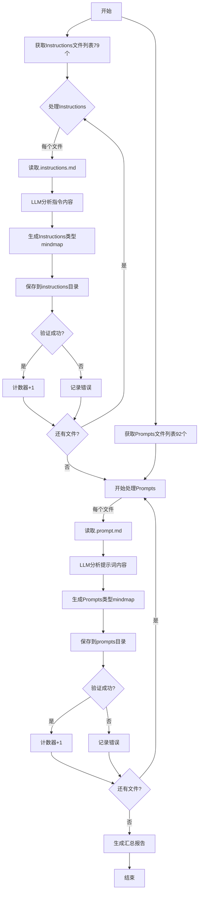

# LLM驱动的Instructions和Prompts Mindmap生成任务计划

## 项目目标

利用大语言模型的理解能力,读取 instructions 和 prompts 目录下的 .md 文件,智能分析内容后生成高质量的 .mindmap.md 文件

## 文件路径信息

- **源文件目录1**: `D:\mycode\awesome-copilot\instructions\`
- **源文件目录2**: `D:\mycode\awesome-copilot\prompts\`
- **输出目录1**: `D:\mycode\awesome-copilot\my-custom\Mind Map\instructions\`
- **输出目录2**: `D:\mycode\awesome-copilot\my-custom\Mind Map\prompts\`
- **Instructions文件总数**: 79个 .instructions.md 文件
- **Prompts文件总数**: 92个 .prompt.md 文件
- **总文件数**: 171个.md文件

## 任务列表结构

### 📋 任务循环框架

```
FOR EACH directory IN [instructions, prompts]:
    FOR EACH file IN directory:
        ├─ Task 1: 读取源文件
        ├─ Task 2: 分析文件内容
        ├─ Task 3: 生成Mindmap结构
        ├─ Task 4: 保存到目标文件
        └─ Task 5: 验证输出质量
```

---

## 🔄 详细任务步骤 (每个文件循环执行)

### Task 1: 读取源文件内容

**任务ID**: `READ_SOURCE_FILE`  
**优先级**: 🔴 必须  

**操作步骤**:

1. 识别当前处理的文件类型 (.instructions.md 或 .prompt.md)
2. 获取当前处理的文件名
3. 读取文件完整内容
4. 将内容提供给后续任务

**输入**:

- 文件路径:
  - Instructions: `D:\mycode\awesome-copilot\instructions\{filename}.instructions.md`
  - Prompts: `D:\mycode\awesome-copilot\prompts\{filename}.prompt.md`

**输出**:

- 变量 `$sourceContent`: 包含完整的markdown文本
- 变量 `$fileType`: 'instructions' 或 'prompts'

**工具建议**: `read_file()`

---

### Task 2: 智能分析文件内容

**任务ID**: `ANALYZE_CONTENT_WITH_LLM`  
**优先级**: 🔴 必须  

#### 2.1 Instructions文件分析维度

1. **指导目标**: 这个instruction的主要目的是什么?
2. **适用范围**: 适用于哪些文件类型、编程语言或框架? (从applyTo字段提取)
3. **核心规则**: 包含哪些关键的编码规范或最佳实践?
4. **技术要点**: 涉及哪些技术栈、工具或概念?
5. **层级结构**: 规则的组织层次是什么?
6. **应用场景**: 什么时候应该参考这个instruction?

#### 2.2 Prompts文件分析维度

1. **提示目标**: 这个prompt要完成什么任务?
2. **工作流程**: prompt的执行步骤是什么?
3. **输入要求**: 需要什么样的输入信息?
4. **输出格式**: 期望产生什么样的输出?
5. **工具使用**: 涉及哪些工具或API调用?
6. **使用时机**: 什么场景下使用这个prompt最合适?

**输入**:

- `$sourceContent` (来自Task 1)
- `$fileType` (来自Task 1)

**输出**:

- `$analysisResult`: JSON结构,包含对应类型的分析维度

**示例输出结构 (Instructions)**:

```json
{
  "title": "TypeScript 5 & ES2022 开发指南",
  "description": "TypeScript 5.x 和 ES2022 目标的开发标准",
  "file_type": "instructions",
  "applies_to": "**/*.ts",
  "core_themes": ["类型安全", "现代JavaScript特性", "编译配置"],
  "key_rules": [
    "使用严格模式和最新TypeScript特性",
    "优先使用ES2022+语法",
    "配置tsconfig.json以获得最佳类型检查"
  ],
  "technologies": ["TypeScript 5.x", "ES2022", "Node.js"],
  "hierarchy": {
    "level1": ["项目配置", "类型系统", "最佳实践"],
    "level2": {
      "项目配置": ["tsconfig.json", "编译选项", "路径映射"],
      "类型系统": ["类型推断", "泛型", "工具类型"]
    }
  },
  "key_terms": ["strict模式", "类型守卫", "装饰器", "模块解析"],
  "use_when": "开发TypeScript项目,需要现代化的类型安全代码"
}
```

**示例输出结构 (Prompts)**:

```json
{
  "title": "创建实现计划",
  "description": "基于规范文档生成详细的实现计划",
  "file_type": "prompts",
  "task_goal": "将功能规范转换为可执行的实现任务",
  "workflow_steps": [
    "读取规范文档",
    "分析技术需求",
    "拆分实现任务",
    "生成任务清单"
  ],
  "required_inputs": [
    "规范文档路径",
    "技术栈信息",
    "项目约束条件"
  ],
  "output_format": "结构化的Markdown任务清单",
  "tools_involved": ["文件读取", "语义分析", "任务生成"],
  "key_features": ["任务拆分", "优先级排序", "依赖管理"],
  "use_scenarios": [
    "项目启动阶段",
    "需求变更后",
    "技术重构前"
  ]
}
```

---

### Task 3: 生成Mindmap Markdown内容

**任务ID**: `GENERATE_MINDMAP_MARKDOWN`  
**优先级**: 🔴 必须  

#### 3.1 Instructions文件Mindmap结构

```markdown
# {标题} - Instructions Mindmap

## 📊 摘要
{2-3句话概括这个instruction的核心价值和适用范围}

## 🎯 适用范围
- **文件类型**: {从applyTo提取}
- **技术栈**: {相关技术、框架、工具}
- **场景**: {什么时候使用这个指令}

## 💡 核心规则与最佳实践

### {规则分类1}
- {具体规则}
  - {实施要点}
  - {注意事项}
- {具体规则}

### {规则分类2}
- {具体规则}
  - {示例说明}

## 📝 关键技术要点

### {技术领域1}
- {要点}
  - {详细说明}
- {要点}

### {技术领域2}
- {要点}

## 🗺️ 思维导图

\```mindmap
- {根节点:Instruction标题}
  - {适用范围}
    - {文件类型}
    - {技术栈}
  - {核心规则}
    - {规则分类1}
      - {具体规则}
    - {规则分类2}
  - {技术要点}
    - {关键概念}
  - {最佳实践}
\```

## 💾 保存说明
- 文件名: {original-filename}.mindmap.md
- 位置: Mind Map/instructions/
```

#### 3.2 Prompts文件Mindmap结构

```markdown
# {标题} - Prompt Mindmap

## 📊 摘要
{2-3句话概括这个prompt的任务目标和价值}

## 🚀 使用场景
- **主要用途**: {prompt的核心功能}
- **适用时机**: {什么情况下使用}
- **预期效果**: {使用后能达到什么目标}

## 💡 工作流程

### 输入准备
- {需要准备的输入1}
- {需要准备的输入2}

### 执行步骤
1. {步骤1描述}
   - {细节说明}
2. {步骤2描述}
   - {细节说明}
3. {步骤3描述}

### 输出内容
- {输出类型}
- {输出格式}
- {质量标准}

## 📝 关键特性

### {特性分类1}
- {具体特性}
  - {说明}
- {具体特性}

### {特性分类2}
- {具体特性}

## 🗺️ 思维导图

\```mindmap
- {根节点:Prompt任务}
  - {输入}
    - {输入类型1}
    - {输入类型2}
  - {处理流程}
    - {步骤1}
    - {步骤2}
    - {步骤3}
  - {输出}
    - {输出格式}
  - {工具与技术}
    - {工具1}
    - {工具2}
\```

## 💾 保存说明
- 文件名: {original-filename}.mindmap.md
- 位置: Mind Map/prompts/
```

**输入**:

- `$analysisResult` (来自Task 2)
- `$fileType` (来自Task 1)

**输出**:

- `$mindmapContent`: 完整的markdown文本内容

**质量标准**:

- ✅ 摘要简洁精准(50-100字)
- ✅ 结构层次清晰(2-3层)
- ✅ 关键术语准确无误
- ✅ Instructions: 突出规则和最佳实践
- ✅ Prompts: 突出工作流程和使用方法
- ✅ 格式符合markdown规范

---

### Task 4: 保存到目标文件

**任务ID**: `SAVE_TO_FILE`  
**优先级**: 🔴 必须  

**操作步骤**:

1. 根据文件类型确定输出目录
2. 确定输出文件名: `{original-name}.mindmap.md`
3. 确保输出目录存在
4. 写入 `$mindmapContent` 到文件

**输入**:

- `$mindmapContent` (来自Task 3)
- `$originalFilename` (来自Task 1)
- `$fileType` (来自Task 1)

**输出路径规则**:

- Instructions: `D:\mycode\awesome-copilot\my-custom\Mind Map\instructions\{filename}.mindmap.md`
- Prompts: `D:\mycode\awesome-copilot\my-custom\Mind Map\prompts\{filename}.mindmap.md`

**输出**:

- 文件: 对应目录下的.mindmap.md文件
- 状态码: SUCCESS/FAILED

**工具建议**: `create_file()` 或 `replace_string_in_file()`

---

### Task 5: 验证输出质量

**任务ID**: `VALIDATE_OUTPUT`  
**优先级**: 🟡 推荐  

**验证检查项**:

- [ ] 文件成功创建在正确的目录
- [ ] 文件大小 > 500字节
- [ ] 包含所有必需章节:
  - Instructions: 摘要、适用范围、核心规则、技术要点、思维导图
  - Prompts: 摘要、使用场景、工作流程、关键特性、思维导图
- [ ] Markdown格式正确
- [ ] 思维导图代码块正确闭合
- [ ] 内容与源文件类型匹配

**输入**:

- 输出文件路径
- `$fileType`

**输出**:

- 验证报告: PASS/FAIL + 错误详情

---

## 📊 进度跟踪

### 进度变量

```python
# Instructions统计
instructions_total = 79
instructions_processed = 0
instructions_success = 0
instructions_failed = 0

# Prompts统计
prompts_total = 92
prompts_processed = 0
prompts_success = 0
prompts_failed = 0

# 总计
total_files = 171
total_processed = 0
total_success = 0
total_failed = 0

failed_list = []
```

### 进度报告格式

```
[Instructions] 正在处理: {filename} ({instructions_processed}/{instructions_total})
[Prompts] 正在处理: {filename} ({prompts_processed}/{prompts_total})

总进度: {total_processed}/{total_files} ({percentage}%)
状态: ✓ 成功 / ✗ 失败
累计成功: {total_success}
累计失败: {total_failed}
```

---

## 🔧 执行策略建议

### 策略A: 按目录顺序处理(推荐)

```python
# 先处理所有instructions
for filename in instructions_files:
    process_instruction_file(filename)
    report_progress('instructions')

# 再处理所有prompts
for filename in prompts_files:
    process_prompt_file(filename)
    report_progress('prompts')
```

### 策略B: 混合批量处理

```python
# 交替处理,避免单一类型处理疲劳
batch_size = 10
for i in range(0, max(len(instructions), len(prompts)), batch_size):
    process_batch(instructions[i:i+batch_size], 'instructions')
    process_batch(prompts[i:i+batch_size], 'prompts')
```

### 策略C: 断点续传(处理中断恢复)

```python
processed_log = load_processed_log()
remaining_instructions = [f for f in instructions if f not in processed_log]
remaining_prompts = [f for f in prompts if f not in processed_log]

for file in remaining_instructions + remaining_prompts:
    process_file(file)
    save_to_processed_log(file)
```

---

## 📝 提示词模板

### Instructions文件提示词模板

````markdown
你是一个专业的技术文档分析和思维导图生成专家,擅长分析编程指南和最佳实践文档。

**任务**: 阅读以下instruction配置文件,生成结构化的mindmap.md文件。

**文件类型**: Instructions (编程规范/最佳实践指南)

**源文件内容**:
```
{在这里插入完整的.instructions.md文件内容}
```

**重点关注**:
1. Front Matter中的 `applyTo` 字段(适用文件类型)
2. Front Matter中的 `description` 字段(指令描述)
3. 核心编程规范和最佳实践
4. 技术栈和工具要求
5. 代码示例和反模式(如果有)

**输出格式**:

# {文件标题} - Instructions Mindmap

## 📊 摘要
{用2-3句话总结这个instruction的核心价值,强调它解决什么问题}

## 🎯 适用范围
- **文件类型**: {从applyTo提取,列出适用的文件扩展名或路径模式}
- **技术栈**: {相关技术、框架、工具}
- **使用场景**: {什么项目、什么阶段使用这个指令}

## 💡 核心规则与最佳实践

{提取文件中的关键规则,按主题分组展示,保持2-3层深度}

### {规则分类1}
- {具体规则或原则}
  - {实施要点或示例}
  - {注意事项}
- {具体规则或原则}

### {规则分类2}
- {具体规则或原则}
  - {详细说明}

## 📝 关键技术要点

{提取技术相关的重要概念、配置、工具使用等}

### {技术领域1}
- {要点}
  - {详细说明}
- {要点}

### {技术领域2}
- {要点}

## 🗺️ 思维导图

\```mindmap
- {根节点:Instruction核心主题}
  - 适用范围
    - {文件类型}
    - {技术栈}
    - {使用场景}
  - 核心规则
    - {规则分类1}
      - {具体规则}
    - {规则分类2}
  - 技术要点
    - {关键概念}
    - {工具配置}
  - 最佳实践
    - {实践建议}
\```

## 💾 保存说明
- 文件名: {original-filename}.mindmap.md
- 位置: Mind Map/instructions/

**重要提示**:
- 直接输出完整的markdown内容,不要添加额外解释
- 确保所有代码块正确闭合
- 思维导图保持2-3层,每个分支不超过5个子节点
- 突出instruction的规范性和指导性
````

### Prompts文件提示词模板

````markdown
你是一个专业的AI提示词分析和思维导图生成专家,擅长分析工作流程和任务执行逻辑。

**任务**: 阅读以下prompt配置文件,生成结构化的mindmap.md文件。

**文件类型**: Prompts (AI任务提示词/工作流程)

**源文件内容**:
```
{在这里插入完整的.prompt.md文件内容}
```

**重点关注**:
1. Front Matter中的 `description` 字段(prompt描述)
2. Front Matter中的 `tools` 字段(使用的工具)
3. 任务目标和预期输出
4. 执行步骤和工作流程
5. 输入要求和输出格式
6. 工具调用和API使用

**输出格式**:

# {文件标题} - Prompt Mindmap

## 📊 摘要
{用2-3句话总结这个prompt的任务目标和核心价值}

## 🚀 使用场景
- **主要用途**: {prompt要完成的核心任务}
- **适用时机**: {什么情况下使用这个prompt}
- **预期效果**: {使用后能达到什么目标}
- **推荐模型**: {如果有指定,列出推荐的AI模型}

## 💡 工作流程

### 输入准备
- {需要准备的输入信息1}
- {需要准备的输入信息2}
- {需要准备的输入信息3}

### 执行步骤
1. {步骤1描述}
   - {细节说明或子步骤}
2. {步骤2描述}
   - {细节说明}
3. {步骤3描述}
   - {细节说明}

### 输出内容
- **格式**: {输出的文件格式或数据类型}
- **结构**: {输出的组织结构}
- **质量标准**: {输出应满足的质量要求}

## 📝 关键特性

{提取prompt的核心功能、特殊能力、技术亮点}

### {特性分类1}
- {具体特性}
  - {说明}
- {具体特性}

### {特性分类2}
- {具体特性}
  - {说明}

## 🔧 工具与技术

{列出prompt使用的工具、API、技术}

- **工具**: {从tools字段提取}
- **技术栈**: {相关技术}
- **依赖**: {需要的环境或前置条件}

## 🗺️ 思维导图

\```mindmap
- {根节点:Prompt任务名称}
  - 使用场景
    - {主要用途}
    - {适用时机}
  - 输入要求
    - {输入类型1}
    - {输入类型2}
  - 处理流程
    - {步骤1}
    - {步骤2}
    - {步骤3}
  - 输出结果
    - {输出格式}
    - {质量标准}
  - 工具技术
    - {工具1}
    - {工具2}
\```

## 💾 保存说明
- 文件名: {original-filename}.mindmap.md
- 位置: Mind Map/prompts/

**重要提示**:
- 直接输出完整的markdown内容,不要添加额外解释
- 确保所有代码块正确闭合
- 思维导图保持2-3层,突出工作流程逻辑
- 突出prompt的任务性和可执行性
````

---

## 🎯 质量控制检查点

### Instructions文件输出质量标准

- [ ] 准确提取applyTo字段信息
- [ ] 核心规则分类清晰(不超过5个主要分类)
- [ ] 技术要点具体可查(包含具体的技术名称、版本)
- [ ] 最佳实践可操作(开发者可以直接应用)
- [ ] 思维导图突出规范性(规则-实践-技术的逻辑关系)
- [ ] 术语使用与源文件一致

### Prompts文件输出质量标准

- [ ] 任务目标明确具体
- [ ] 工作流程步骤完整(输入-处理-输出)
- [ ] 工具列表准确(从tools字段提取)
- [ ] 使用场景描述清晰
- [ ] 输入输出格式说明详细
- [ ] 思维导图突出流程性(输入-执行-输出的逻辑流)

### 通用质量标准

- [ ] 摘要精准(50-100字)
- [ ] 格式规范(符合markdown标准)
- [ ] 层次清晰(2-3层为佳)
- [ ] 内容完整(包含所有必需章节)

---

## 📁 文件清单

### Instructions目录 (79个文件)

#### Group 1: Web前端框架 (9个)

- [ ] angular.instructions.md
- [ ] astro.instructions.md
- [ ] blazor.instructions.md
- [ ] nextjs-tailwind.instructions.md
- [ ] nextjs.instructions.md
- [ ] reactjs.instructions.md
- [ ] svelte.instructions.md
- [ ] tanstack-start-shadcn-tailwind.instructions.md
- [ ] vuejs3.instructions.md

#### Group 2: 后端语言与框架 (15个)

- [ ] aspnet-rest-apis.instructions.md
- [ ] clojure.instructions.md
- [ ] csharp-ja.instructions.md
- [ ] csharp-ko.instructions.md
- [ ] csharp.instructions.md
- [ ] dart-n-flutter.instructions.md
- [ ] dotnet-architecture-good-practices.instructions.md
- [ ] dotnet-framework.instructions.md
- [ ] dotnet-maui.instructions.md
- [ ] dotnet-wpf.instructions.md
- [ ] go.instructions.md
- [ ] java.instructions.md
- [ ] nestjs.instructions.md
- [ ] nodejs-javascript-vitest.instructions.md
- [ ] oqtane.instructions.md

#### Group 3: Java生态 (8个)

- [ ] java-11-to-java-17-upgrade.instructions.md
- [ ] java-17-to-java-21-upgrade.instructions.md
- [ ] java-21-to-java-25-upgrade.instructions.md
- [ ] quarkus-mcp-server-sse.instructions.md
- [ ] quarkus.instructions.md
- [ ] springboot.instructions.md
- [ ] convert-jpa-to-spring-data-cosmos.instructions.md
- [ ] langchain-python.instructions.md

#### Group 4: 脚本语言与工具 (9个)

- [ ] powershell-pester-5.instructions.md
- [ ] powershell.instructions.md
- [ ] python.instructions.md
- [ ] ruby-on-rails.instructions.md
- [ ] rust.instructions.md
- [ ] typescript-5-es2022.instructions.md
- [ ] genaiscript.instructions.md
- [ ] ansible.instructions.md
- [ ] cmake-vcpkg.instructions.md

#### Group 5: Azure与云原生 (11个)

- [ ] azure-devops-pipelines.instructions.md
- [ ] azure-functions-typescript.instructions.md
- [ ] azure-logic-apps-power-automate.instructions.md
- [ ] azure-verified-modules-terraform.instructions.md
- [ ] bicep-code-best-practices.instructions.md
- [ ] containerization-docker-best-practices.instructions.md
- [ ] generate-modern-terraform-code-for-azure.instructions.md
- [ ] kubernetes-deployment-best-practices.instructions.md
- [ ] terraform-azure.instructions.md
- [ ] terraform.instructions.md
- [ ] devbox-image-definition.instructions.md

#### Group 6: Power Platform (5个)

- [ ] declarative-agents-microsoft365.instructions.md
- [ ] power-apps-canvas-yaml.instructions.md
- [ ] power-apps-code-apps.instructions.md
- [ ] power-platform-connector.instructions.md
- [ ] power-platform-mcp-development.instructions.md

#### Group 7: 测试与质量 (5个)

- [ ] playwright-python.instructions.md
- [ ] playwright-typescript.instructions.md
- [ ] security-and-owasp.instructions.md
- [ ] performance-optimization.instructions.md
- [ ] object-calisthenics.instructions.md

#### Group 8: 开发流程与规范 (10个)

- [ ] a11y.instructions.md
- [ ] ai-prompt-engineering-safety-best-practices.instructions.md
- [ ] copilot-thought-logging.instructions.md
- [ ] devops-core-principles.instructions.md
- [ ] gilfoyle-code-review.instructions.md
- [ ] github-actions-ci-cd-best-practices.instructions.md
- [ ] localization.instructions.md
- [ ] markdown.instructions.md
- [ ] memory-bank.instructions.md
- [ ] self-explanatory-code-commenting.instructions.md

#### Group 9: 专用工具与平台 (7个)

- [ ] coldfusion-cfc.instructions.md
- [ ] coldfusion-cfm.instructions.md
- [ ] collections.instructions.md
- [ ] joyride-user-project.instructions.md
- [ ] joyride-workspace-automation.instructions.md
- [ ] ms-sql-dba.instructions.md
- [ ] wordpress.instructions.md

#### Group 10: 其他 (0个)

- [ ] spec-driven-workflow-v1.instructions.md
- [ ] sql-sp-generation.instructions.md
- [ ] taming-copilot.instructions.md
- [ ] task-implementation.instructions.md
- [ ] tasksync.instructions.md

---

### Prompts目录 (92个文件)

#### Group 1: 项目规划与架构 (12个)

- [ ] architecture-blueprint-generator.prompt.md
- [ ] breakdown-epic-arch.prompt.md
- [ ] breakdown-epic-pm.prompt.md
- [ ] breakdown-feature-implementation.prompt.md
- [ ] breakdown-feature-prd.prompt.md
- [ ] breakdown-plan.prompt.md
- [ ] breakdown-test.prompt.md
- [ ] create-architectural-decision-record.prompt.md
- [ ] create-implementation-plan.prompt.md
- [ ] create-specification.prompt.md
- [ ] update-implementation-plan.prompt.md
- [ ] update-specification.prompt.md

#### Group 2: 代码生成与项目创建 (10个)

- [ ] create-spring-boot-java-project.prompt.md
- [ ] create-spring-boot-kotlin-project.prompt.md
- [ ] aspnet-minimal-api-openapi.prompt.md
- [ ] containerize-aspnet-framework.prompt.md
- [ ] containerize-aspnetcore.prompt.md
- [ ] multi-stage-dockerfile.prompt.md
- [ ] power-apps-code-app-scaffold.prompt.md
- [ ] power-platform-mcp-connector-suite.prompt.md
- [ ] mcp-copilot-studio-server-generator.prompt.md
- [ ] declarative-agents.prompt.md

#### Group 3: 文档生成 (14个)

- [ ] add-educational-comments.prompt.md
- [ ] comment-code-generate-a-tutorial.prompt.md
- [ ] create-agentsmd.prompt.md
- [ ] create-llms.prompt.md
- [ ] create-oo-component-documentation.prompt.md
- [ ] create-readme.prompt.md
- [ ] documentation-writer.prompt.md
- [ ] generate-custom-instructions-from-codebase.prompt.md
- [ ] mkdocs-translations.prompt.md
- [ ] update-llms.prompt.md
- [ ] update-markdown-file-index.prompt.md
- [ ] update-oo-component-documentation.prompt.md
- [ ] editorconfig.prompt.md
- [ ] readme-blueprint-generator.prompt.md

#### Group 4: GitHub集成 (9个)

- [ ] create-github-action-workflow-specification.prompt.md
- [ ] create-github-issue-feature-from-specification.prompt.md
- [ ] create-github-issues-feature-from-implementation-plan.prompt.md
- [ ] create-github-issues-for-unmet-specification-requirements.prompt.md
- [ ] create-github-pull-request-from-specification.prompt.md
- [ ] gen-specs-as-issues.prompt.md
- [ ] git-flow-branch-creator.prompt.md
- [ ] my-issues.prompt.md
- [ ] my-pull-requests.prompt.md

#### Group 5: 代码质量与重构 (12个)

- [ ] csharp-async.prompt.md
- [ ] csharp-docs.prompt.md
- [ ] dotnet-best-practices.prompt.md
- [ ] dotnet-design-pattern-review.prompt.md
- [ ] java-docs.prompt.md
- [ ] java-refactoring-extract-method.prompt.md
- [ ] review-and-refactor.prompt.md
- [ ] code-exemplars-blueprint-generator.prompt.md
- [ ] copilot-instructions-blueprint-generator.prompt.md
- [ ] folder-structure-blueprint-generator.prompt.md
- [ ] project-workflow-analysis-blueprint-generator.prompt.md
- [ ] technology-stack-blueprint-generator.prompt.md

#### Group 6: 测试 (9个)

- [ ] csharp-mstest.prompt.md
- [ ] csharp-nunit.prompt.md
- [ ] csharp-tunit.prompt.md
- [ ] csharp-xunit.prompt.md
- [ ] java-junit.prompt.md
- [ ] javascript-typescript-jest.prompt.md
- [ ] playwright-automation-fill-in-form.prompt.md
- [ ] playwright-explore-website.prompt.md
- [ ] playwright-generate-test.prompt.md

#### Group 7: 数据库与优化 (7个)

- [ ] cosmosdb-datamodeling.prompt.md
- [ ] ef-core.prompt.md
- [ ] postgresql-code-review.prompt.md
- [ ] postgresql-optimization.prompt.md
- [ ] sql-code-review.prompt.md
- [ ] sql-optimization.prompt.md
- [ ] az-cost-optimize.prompt.md

#### Group 8: Azure与云服务 (3个)

- [ ] azure-resource-health-diagnose.prompt.md
- [ ] update-avm-modules-in-bicep.prompt.md
- [ ] create-technical-spike.prompt.md

#### Group 9: AI与提示工程 (7个)

- [ ] ai-prompt-engineering-safety-review.prompt.md
- [ ] boost-prompt.prompt.md
- [ ] first-ask.prompt.md
- [ ] github-copilot-starter.prompt.md
- [ ] memory-merger.prompt.md
- [ ] prompt-builder.prompt.md
- [ ] remember-interactive-programming.prompt.md

#### Group 10: 其他工具与功能 (9个)

- [ ] conventional-commit.prompt.md
- [ ] java-springboot.prompt.md
- [ ] kotlin-springboot.prompt.md
- [ ] next-intl-add-language.prompt.md
- [ ] remember.prompt.md
- [ ] repo-story-time.prompt.md
- [ ] suggest-awesome-github-copilot-chatmodes.prompt.md
- [ ] suggest-awesome-github-copilot-collections.prompt.md
- [ ] suggest-awesome-github-copilot-instructions.prompt.md
- [ ] suggest-awesome-github-copilot-prompts.prompt.md

---

## 🚀 执行流程图



---

## 📊 最终报告格式

```markdown
# Instructions和Prompts Mindmap生成任务完成报告

**执行时间**: {开始时间} - {结束时间}
**总耗时**: {X分钟}

## 统计数据

### Instructions处理结果
- 总文件数: 79
- 成功生成: {instructions_success}
- 失败: {instructions_failed}
- 成功率: {instructions_success_rate}%

### Prompts处理结果
- 总文件数: 92
- 成功生成: {prompts_success}
- 失败: {prompts_failed}
- 成功率: {prompts_success_rate}%

### 总计
- 总文件数: 171
- 总成功数: {total_success}
- 总失败数: {total_failed}
- 总成功率: {total_success_rate}%

## 失败文件清单

### Instructions失败文件
{列出失败的instructions文件及原因}

### Prompts失败文件
{列出失败的prompts文件及原因}

## 输出位置
- Instructions Mindmaps: `D:\mycode\awesome-copilot\my-custom\Mind Map\instructions\`
- Prompts Mindmaps: `D:\mycode\awesome-copilot\my-custom\Mind Map\prompts\`

## 质量分析
- 平均文件大小: {avg_file_size} bytes
- 最大文件: {max_file_name} ({max_file_size} bytes)
- 最小文件: {min_file_name} ({min_file_size} bytes)

## 建议
{根据处理过程,提出改进建议}
```

---

## 💡 执行建议

### 给执行模型的关键提示

#### 对于Instructions文件

1. **重视Front Matter**: applyTo和description是关键信息
2. **提取规范性内容**: 重点是规则、标准、最佳实践
3. **保持技术准确性**: 技术术语、版本号要准确
4. **结构化规则**: 将零散的规则按主题分类组织
5. **突出适用性**: 明确指出何时、何地、如何使用这个instruction

#### 对于Prompts文件

1. **识别工作流**: 重点是任务流程和执行步骤
2. **明确输入输出**: 清楚说明需要什么、产出什么
3. **提取工具调用**: 从tools字段和内容中识别工具使用
4. **描述实际用法**: 提供具体的使用场景和时机
5. **突出可执行性**: Mindmap应该帮助用户理解如何使用prompt

### 效率与质量建议

- **批量处理**: 建议分组处理,每组10-20个文件
- **质量优先**: 使用GPT-4或Claude-3-Opus确保准确性
- **API限流**: 建议添加2-3秒延迟,避免达到速率限制
- **增量处理**: 先处理小批量(5-10个)验证质量后再批量执行
- **断点续传**: 实现日志记录,支持中断恢复
- **差异化处理**: Instructions和Prompts使用不同的分析策略

### 常见问题预防

- ❌ 不要混淆Instructions和Prompts的mindmap结构
- ❌ 不要忽略Front Matter中的元数据
- ❌ 不要生成过于通用的内容
- ✅ 确保思维导图反映文件类型特点(规范性 vs 流程性)
- ✅ 确保提取的信息与源文件完全对应
- ✅ 确保输出文件保存到正确的目录

---

## ✅ 任务就绪检查

在开始执行前,确认:

- [ ] 已理解Instructions和Prompts的区别
- [ ] 已理解两种文件类型的不同mindmap结构
- [ ] 已准备好访问两个源文件目录
- [ ] 已准备好创建两个输出目录
- [ ] 已准备好两套不同的提示词模板
- [ ] 已选择合适的LLM模型
- [ ] 已了解171个文件的分组和分布
- [ ] 已准备好差异化的进度跟踪机制
- [ ] 已理解Front Matter的重要性
- [ ] 已准备好处理工具字段(tools)的提取

---

**本任务计划创建时间**: 2025-01-13  
**版本**: v1.0  
**创建者**: GitHub Copilot  
**目标文件数**: 171 (79 Instructions + 92 Prompts)  
**预计耗时**: 根据模型性能,预计30-90分钟  
**适用模型**: GPT-4, Claude-3-Opus, 或其他高级LLM
