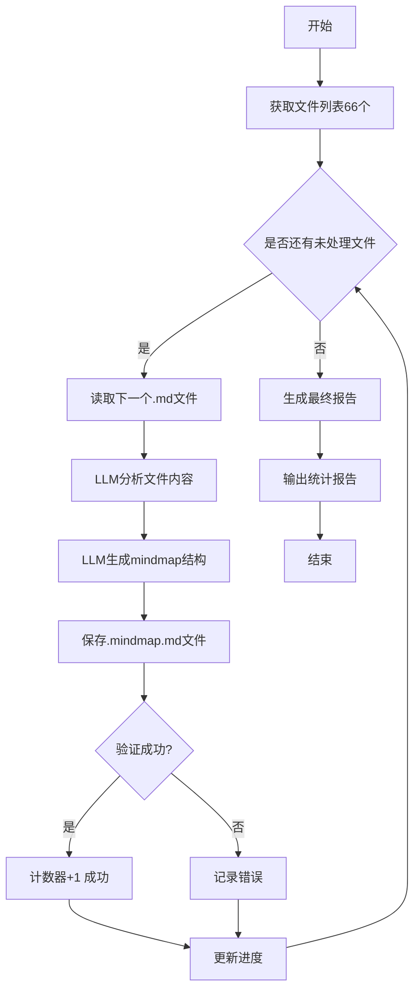

# LLM驱动的Mindmap生成任务计划

## 项目目标
利用大语言模型的理解能力,读取每个chatmode .md文件,智能分析内容后生成高质量的.mindmap.md文件

## 文件路径信息
- **源文件目录**: `D:\mycode\awesome-copilot\chatmodes\`
- **输出目录**: `D:\mycode\awesome-copilot\my-custom\Mind Map\chatmodes\`
- **文件总数**: 66个.md文件

## 任务列表结构

### 📋 任务循环框架

```
FOR EACH file IN chatmodes目录:
    ├─ Task 1: 读取源文件
    ├─ Task 2: 分析文件内容
    ├─ Task 3: 生成Mindmap结构
    ├─ Task 4: 保存到目标文件
    └─ Task 5: 验证输出质量
```

---

## 🔄 详细任务步骤 (每个文件循环执行)

### Task 1: 读取源文件内容
**任务ID**: `READ_SOURCE_FILE`  
**优先级**: 🔴 必须  

**操作步骤**:
1. 获取当前处理的文件名 (例如: `azure-logic-apps-expert.chatmode.md`)
2. 读取文件完整内容
3. 将内容提供给后续任务

**输入**:
- 文件路径: `D:\mycode\awesome-copilot\chatmodes\{filename}.md`

**输出**:
- 变量 `$sourceContent`: 包含完整的markdown文本

**工具建议**: `read_file()`

---

### Task 2: 智能分析文件内容
**任务ID**: `ANALYZE_CONTENT_WITH_LLM`  
**优先级**: 🔴 必须  

**分析维度**:
1. **主题识别**: 这个chatmode的核心主题是什么?
2. **场景提炼**: 适用于哪些实际使用场景?
3. **能力清单**: 该chatmode具备哪些关键能力?
4. **层级结构**: 内容的逻辑层级关系是什么?
5. **关键术语**: 提取重要的专业术语和概念
6. **使用建议**: 什么情况下推荐使用这个chatmode?

**输入**:
- `$sourceContent` (来自Task 1)

**输出**:
- `$analysisResult`: JSON结构,包含上述6个维度的分析结果

**示例输出结构**:
```json
{
  "title": "Azure Logic Apps 专家",
  "description": "Azure Logic Apps 和 Power Automate 工作流开发专家",
  "core_themes": ["工作流自动化", "无代码/低代码集成", "企业级集成"],
  "scenarios": [
    "企业系统集成",
    "自动化业务流程",
    "事件驱动架构实现"
  ],
  "key_capabilities": [
    "Workflow Definition Language (WDL) 精通",
    "连接器配置与管理",
    "错误处理与重试策略"
  ],
  "hierarchy": {
    "level1": ["核心专长", "工作流组件", "开发流程"],
    "level2": {
      "核心专长": ["WDL掌握", "ISE配置", "B2B集成"],
      "工作流组件": ["触发器", "动作", "控制流"]
    }
  },
  "key_terms": ["ISE", "Logic App Standard", "Managed Identity", "API连接器"],
  "use_when": "需要构建企业级自动化工作流,集成多个云服务和本地系统"
}
```

---

### Task 3: 生成Mindmap Markdown内容
**任务ID**: `GENERATE_MINDMAP_MARKDOWN`  
**优先级**: 🔴 必须  

**生成要求**:

#### 3.1 文件结构
```markdown
# {标题} - Mindmap

## 📊 摘要
{2-3句话概括这个chatmode的核心价值}

## 💡 实际使用说明

### 何时使用此模式
- {场景1}
- {场景2}
- {场景3}

### 示例问题
1. **{问题分类1}**
   - {具体问题示例}
   - {具体问题示例}

2. **{问题分类2}**
   - {具体问题示例}
   - {具体问题示例}

## 📝 结构化要点

### {一级主题1}
- {二级要点}
  - {三级要点}
  - {三级要点}
- {二级要点}

### {一级主题2}
- {二级要点}
  - {三级要点}

## 🗺️ 思维导图

\```mindmap
- {根节点:标题}
  - {一级分支1}
    - {二级分支}
    - {二级分支}
  - {一级分支2}
    - {二级分支}
      - {三级分支}
  - {一级分支3}
\```

## 💾 保存说明
- 文件名: {original-filename}.mindmap.md
- 位置: Mind Map/chatmodes/
```

**输入**:
- `$analysisResult` (来自Task 2)

**输出**:
- `$mindmapContent`: 完整的markdown文本内容

**质量标准**:
- ✅ 摘要简洁精准(50-80字)
- ✅ 示例问题具体可操作(3-5个问题)
- ✅ 思维导图层级清晰(2-3层)
- ✅ 关键术语准确无误
- ✅ 格式符合markdown规范

---

### Task 4: 保存到目标文件
**任务ID**: `SAVE_TO_FILE`  
**优先级**: 🔴 必须  

**操作步骤**:
1. 确定输出文件名: `{original-name}.mindmap.md`
2. 确保输出目录存在: `D:\mycode\awesome-copilot\my-custom\Mind Map\chatmodes\`
3. 写入 `$mindmapContent` 到文件

**输入**:
- `$mindmapContent` (来自Task 3)
- `$originalFilename` (来自Task 1)

**输出**:
- 文件: `D:\mycode\awesome-copilot\my-custom\Mind Map\chatmodes\{filename}.mindmap.md`
- 状态码: SUCCESS/FAILED

**工具建议**: `create_file()` 或 `replace_string_in_file()`

---

### Task 5: 验证输出质量
**任务ID**: `VALIDATE_OUTPUT`  
**优先级**: 🟡 推荐  

**验证检查项**:
- [ ] 文件成功创建
- [ ] 文件大小 > 500字节 (避免空文件或过短内容)
- [ ] 包含所有必需章节 (摘要、使用说明、结构化要点、思维导图)
- [ ] Markdown格式正确 (无语法错误)
- [ ] 思维导图代码块正确闭合

**输入**:
- 输出文件路径

**输出**:
- 验证报告: PASS/FAIL + 错误详情

**可选操作**: 如果验证失败,记录到错误日志

---

## 📊 进度跟踪

### 进度变量
```python
total_files = 66
processed_files = 0
success_count = 0
failed_count = 0
failed_list = []
```

### 进度报告格式
```
正在处理: {filename} ({processed_files}/{total_files})
状态: ✓ 成功 / ✗ 失败
累计成功: {success_count}
累计失败: {failed_count}
```

---

## 🔧 执行策略建议

### 策略A: 顺序处理(推荐初次执行)
```
FOR i = 1 TO 66:
    filename = get_file_list()[i]
    execute_tasks(filename)
    report_progress(i)
    IF failed:
        log_error(filename, error)
    sleep(2)  # 避免API限流
```

### 策略B: 批量处理(适合快速模型)
```
batch_size = 10
FOR batch IN chunks(file_list, batch_size):
    parallel_execute(batch)
    report_batch_progress()
```

### 策略C: 断点续传(处理中断恢复)
```
processed_list = load_processed_log()
remaining = [f for f in file_list if f not in processed_list]
FOR filename IN remaining:
    execute_tasks(filename)
    save_to_processed_log(filename)
```

---

## 📝 提示词模板 (给执行模型使用)

### 完整提示词模板

````markdown
你是一个专业的技术文档分析和思维导图生成专家。

**任务**: 阅读以下chatmode配置文件,生成结构化的mindmap.md文件。

**源文件内容**:
```
{在这里插入完整的.md文件内容}
```

**输出要求**:
1. **仔细阅读并理解**源文件的核心主题、使用场景、关键能力
2. **生成以下格式的mindmap.md文件**:

# {文件标题} - Mindmap

## 📊 摘要
{用2-3句话总结这个chatmode的核心价值和定位}

## 💡 实际使用说明

### 何时使用此模式
- {分析文件内容,列出3-5个实际使用场景}

### 示例问题
{根据文件内容,生成3-5个具体的、可操作的示例问题,分组展示}

1. **{问题类别1}**
   - {问题示例}
   - {问题示例}

2. **{问题类别2}**
   - {问题示例}

## 📝 结构化要点

{提取文件的层级结构,用markdown列表展示,保持2-3层深度}

### {一级主题1}
- {二级要点}
  - {三级细节}
- {二级要点}

### {一级主题2}
- {二级要点}

## 🗺️ 思维导图

```mindmap
- {根节点:文件核心主题}
  - {一级分支:主要领域1}
    - {二级分支:具体能力}
    - {二级分支:关键术语}
  - {一级分支:主要领域2}
    - {二级分支:工作流程}
    - {二级分支:最佳实践}
  - {一级分支:主要领域3}
```

## 💾 保存说明
- 文件名: {original-filename}.mindmap.md
- 位置: Mind Map/chatmodes/

**重要**:
- 不要添加任何额外的解释或评论
- 直接输出完整的markdown内容
- 确保所有代码块正确闭合
- 思维导图内容要精炼,每个分支不超过5个子节点
````

---

## 🎯 质量控制检查点

### 输出质量标准
- [ ] 摘要精准,无冗余(50-100字)
- [ ] 使用场景具体可实施(不要抽象描述)
- [ ] 示例问题实际可用(用户可以直接复制使用)
- [ ] 思维导图层次清晰(2-3层为佳,避免过深)
- [ ] 术语准确(保留原文件的专业术语)
- [ ] 格式规范(符合markdown标准)

### 常见问题预防
❌ **避免**: 生成过于通用的内容
✅ **应该**: 基于文件实际内容定制

❌ **避免**: 思维导图层级过深(>4层)
✅ **应该**: 保持2-3层,突出核心概念

❌ **避免**: 示例问题过于抽象
✅ **应该**: 提供具体、可操作的问题模板

---

## 📁 文件清单 (66个待处理文件)

### Group 1: Azure相关 (9个)
- [ ] azure-logic-apps-expert.chatmode.md
- [ ] azure-principal-architect.chatmode.md
- [ ] azure-saas-architect.chatmode.md
- [ ] azure-verified-modules-bicep.chatmode.md
- [ ] azure-verified-modules-terraform.chatmode.md
- [ ] bicep-implement.chatmode.md
- [ ] bicep-plan.chatmode.md
- [ ] atlassian-requirements-to-jira.chatmode.md
- [ ] api-architect.chatmode.md

### Group 2: 编程语言相关 (12个)
- [ ] clojure-interactive-programming.chatmode.md
- [ ] csharp-dotnet-janitor.chatmode.md
- [ ] golang.chatmode.md
- [ ] java-coding-standards.chatmode.md
- [ ] kotlin-spring-boot.chatmode.md
- [ ] python-best-practices.chatmode.md
- [ ] ruby-on-rails.chatmode.md
- [ ] rust-gpt-4.1-beast-mode.chatmode.md
- [ ] sql-optimization.chatmode.md
- [ ] typescript-expert.chatmode.md
- [ ] vue-composition-api.chatmode.md
- [ ] swift-ios.chatmode.md

### Group 3: 前端框架 (8个)
- [ ] angular-reactive.chatmode.md
- [ ] electron-angular-native.chatmode.md
- [ ] nextjs-expert.chatmode.md
- [ ] react-hooks-patterns.chatmode.md
- [ ] svelte-kit.chatmode.md
- [ ] tailwind-expert.chatmode.md
- [ ] web-accessibility.chatmode.md
- [ ] wordpress-dev.chatmode.md

### Group 4: DevOps & Infrastructure (10个)
- [ ] docker-compose-expert.chatmode.md
- [ ] github-actions-ci-cd.chatmode.md
- [ ] kubernetes-architect.chatmode.md
- [ ] terraform-infrastructure.chatmode.md
- [ ] aws-solutions-architect.chatmode.md
- [ ] gcp-cloud-engineer.chatmode.md
- [ ] jenkins-pipeline.chatmode.md
- [ ] monitoring-observability.chatmode.md
- [ ] security-hardening.chatmode.md
- [ ] site-reliability-engineer.chatmode.md

### Group 5: 开发工具与方法 (11个)
- [ ] code-review-expert.chatmode.md
- [ ] debug-detective.chatmode.md
- [ ] git-workflow-expert.chatmode.md
- [ ] test-driven-development.chatmode.md
- [ ] performance-optimization.chatmode.md
- [ ] refactoring-specialist.chatmode.md
- [ ] documentation-writer.chatmode.md
- [ ] api-design.chatmode.md
- [ ] database-design.chatmode.md
- [ ] microservices-architect.chatmode.md
- [ ] clean-code-advocate.chatmode.md

### Group 6: 特殊用途 (16个)
- [ ] 4.1-Beast.chatmode.md
- [ ] accessibility.chatmode.md
- [ ] address-comments.chatmode.md
- [ ] blueprint-mode-codex.chatmode.md
- [ ] blueprint-mode.chatmode.md
- [ ] code-tour.chatmode.md
- [ ] critical-thinking.chatmode.md
- [ ] curriculum-developer.chatmode.md
- [ ] data-scientist.chatmode.md
- [ ] genaiscript-developer.chatmode.md
- [ ] gilfoyle-code-review.chatmode.md
- [ ] ms-sql-dba.chatmode.md
- [ ] playwright-test.chatmode.md
- [ ] power-platform-architect.chatmode.md
- [ ] technical-writer.chatmode.md
- [ ] ui-ux-designer.chatmode.md

---

## 🚀 执行流程总结



---

## 📊 最终报告格式

```markdown
# Mindmap生成任务完成报告

**执行时间**: {开始时间} - {结束时间}
**总耗时**: {X分钟}

## 统计数据
- 总文件数: 66
- 成功生成: {success_count}
- 失败: {failed_count}
- 成功率: {success_rate}%

## 失败文件清单
{如果有失败文件,列出文件名和失败原因}

## 输出位置
所有生成的.mindmap.md文件位于:
`D:\mycode\awesome-copilot\my-custom\Mind Map\chatmodes\`

## 建议
{根据处理过程,提出改进建议}
```

---

## 💡 执行建议

### 给执行模型的提示:
1. **一次处理一个文件**: 避免混淆,确保每个输出都基于正确的源文件
2. **保持原文风格**: 尊重原始文件的术语和表达方式
3. **提取核心价值**: 不要简单复制粘贴,要提炼和重组信息
4. **生成可用的示例**: 问题示例应该是用户可以直接使用的
5. **简化思维导图**: 思维导图是视觉工具,要简洁明了

### 效率建议:
- 使用GPT-4或Claude-3-Opus获得最佳质量
- 如果使用API,建议添加2-3秒延迟避免限流
- 可以先处理5-10个文件验证质量,再批量处理
- 建议保存处理日志,便于断点续传

---

## ✅ 任务就绪检查

在开始执行前,确认:
- [ ] 已理解任务目标和质量要求
- [ ] 已准备好访问源文件目录
- [ ] 已准备好写入输出目录
- [ ] 已准备好提示词模板
- [ ] 已选择合适的LLM模型
- [ ] 已了解66个文件的分组
- [ ] 已准备好进度跟踪机制

---

**本任务计划创建时间**: 2025-01-13  
**版本**: v1.0  
**创建者**: GitHub Copilot  
**适用模型**: GPT-4, Claude-3-Opus, 或其他高级LLM
