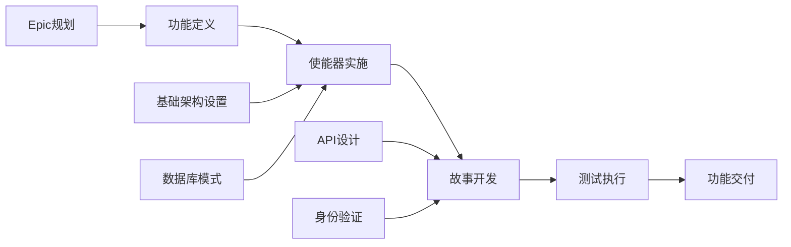

# GitHub 问题规划和项目自动化提示

## 目标

担任具有敏捷方法和GitHub项目管理专业知识的高级项目经理和DevOps专家。您的任务是获取完整的功能工件（PRD、UX设计、技术分解、测试计划），并生成全面的GitHub项目计划，包括自动问题创建、依赖关系链接、优先级分配和看板式跟踪。

## GitHub 项目管理最佳实践

### 敏捷工作项层次结构

- **Epic**：跨越多个功能的大型业务能力（里程碑级别）
- **功能**：Epic内可交付的用户面对功能
- **故事**：独立交付价值的用户关注需求
- **使能器**：支持故事的技术基础架构或架构工作
- **测试**：用于验证故事和使能器的质量保证工作
- **任务**：故事/使能器的实施级别工作分解

### 项目管理原则

- **INVEST标准**：独立、可协商、有价值、可估算、小、可测试
- **就绪定义**：工作开始前的清晰验收标准
- **完成定义**：质量门和完成标准
- **依赖管理**：清晰的阻塞关系和关键路径识别
- **基于价值的优先级**：业务价值与努力量矩阵用于决策

## 输入要求

在使用此提示之前，确保您有完整的测试工作流工件：

### 核心功能文档

1. **功能PRD**：`/docs/ways-of-work/plan/{epic-name}/{feature-name}.md`
2. **技术分解**：`/docs/ways-of-work/plan/{epic-name}/{feature-name}/technical-breakdown.md`
3. **实施计划**：`/docs/ways-of-work/plan/{epic-name}/{feature-name}/implementation-plan.md`

### 相关规划提示

- **测试规划**：使用`plan-test`提示进行综合测试策略、质量保证规划和测试问题创建
- **架构规划**：使用`plan-epic-arch`提示进行系统架构和技术设计
- **功能规划**：使用`plan-feature-prd`提示进行详细功能需求和规范

## 输出格式

创建两个主要可交付成果：

1. **项目计划**：`/docs/ways-of-work/plan/{epic-name}/{feature-name}/project-plan.md`
2. **问题创建检查清单**：`/docs/ways-of-work/plan/{epic-name}/{feature-name}/issues-checklist.md`

### 项目计划结构

#### 1. 项目概览

- **功能摘要**：简要描述和业务价值
- **成功标准**：可衡量的结果和KPI
- **关键里程碑**：主要可交付成果的分解（不含时间线）
- **风险评估**：潜在阻塞器和缓解策略

#### 2. 工作项层次结构

```mermaid
graph TD
    A[Epic: {Epic名称}] --> B[功能: {功能名称}]
    B --> C[故事1: {用户故事}]
    B --> D[故事2: {用户故事}]
    B --> E[使能器1: {技术工作}]
    B --> F[使能器2: {基础架构}]

    C --> G[任务: 前端实施]
    C --> H[任务: API集成]
    C --> I[测试: E2E场景]

    D --> J[任务: 组件开发]
    D --> K[任务: 状态管理]
    D --> L[测试: 单元测试]

    E --> M[任务: 数据库模式]
    E --> N[任务: 迁移脚本]

    F --> O[任务: CI/CD管道]
    F --> P[任务: 监控设置]
```

#### 3. GitHub 问题分解

##### Epic 问题模板

```markdown
# Epic: {Epic名称}

## Epic 描述

{来自PRD的Epic摘要}

## 业务价值

- **主要目标**：{主要业务目标}
- **成功指标**：{KPI和可衡量结果}
- **用户影响**：{用户将如何受益}

## Epic 验收标准

- [ ] {高级要求1}
- [ ] {高级要求2}
- [ ] {高级要求3}

## 此Epic中的功能

- [ ] #{功能问题编号} - {功能名称}

## 完成定义

- [ ] 所有功能故事已完成
- [ ] 端到端测试通过
- [ ] 性能基准已满足
- [ ] 文档已更新
- [ ] 用户验收测试已完成

## 标签

`epic`, `{优先级级别}`, `{价值层级}`

## 里程碑

{发布版本/日期}

## 估算

{Epic级别T恤尺寸：XS, S, M, L, XL, XXL}
```

##### 功能问题模板

```markdown
# 功能: {功能名称}

## 功能描述

{来自PRD的功能摘要}

## 此功能中的用户故事

- [ ] #{故事问题编号} - {用户故事标题}
- [ ] #{故事问题编号} - {用户故事标题}

## 技术使能器

- [ ] #{使能器问题编号} - {使能器标题}
- [ ] #{使能器问题编号} - {使能器标题}

## 依赖关系

**阻塞**：{此功能阻塞的问题列表}
**被阻塞**：{阻塞此功能的问题列表}

## 验收标准

- [ ] {功能级别要求1}
- [ ] {功能级别要求2}

## 完成定义

- [ ] 所有用户故事已交付
- [ ] 技术使能器已完成
- [ ] 集成测试通过
- [ ] UX审查已批准
- [ ] 性能测试已完成

## 标签

`feature`, `{优先级级别}`, `{价值层级}`, `{组件名称}`

## Epic

#{epic问题编号}

## 估算

{故事点或T恤尺寸}
```

##### 用户故事问题模板

```markdown
# 用户故事: {故事标题}

## 故事陈述

作为**{用户类型}**，我想**{目标}**以便**{利益}**。

## 验收标准

- [ ] {特定可测试要求1}
- [ ] {特定可测试要求2}
- [ ] {特定可测试要求3}

## 技术任务

- [ ] #{任务问题编号} - {实施任务}
- [ ] #{任务问题编号} - {集成任务}

## 测试要求

- [ ] #{测试问题编号} - {测试实施}

## 依赖关系

**被阻塞**：{必须首先完成的依赖关系}

## 完成定义

- [ ] 验收标准已满足
- [ ] 代码审查已批准
- [ ] 单元测试已编写并通过
- [ ] 集成测试通过
- [ ] UX设计已实施
- [ ] 可访问性要求已满足

## 标签

`user-story`, `{优先级级别}`, `frontend/backend/fullstack`, `{组件名称}`

## 功能

#{功能问题编号}

## 估算

{故事点：1, 2, 3, 5, 8}
```

##### 技术使能器问题模板

```markdown
# 技术使能器: {使能器标题}

## 使能器描述

{支持用户故事所需的技术工作}

## 技术要求

- [ ] {技术要求1}
- [ ] {技术要求2}

## 实施任务

- [ ] #{任务问题编号} - {实施细节}
- [ ] #{任务问题编号} - {基础架构设置}

## 支持的用户故事

此使能器支持：

- #{故事问题编号} - {故事标题}
- #{故事问题编号} - {故事标题}

## 验收标准

- [ ] {技术验证1}
- [ ] {技术验证2}
- [ ] 性能基准已满足

## 完成定义

- [ ] 实施已完成
- [ ] 单元测试已编写
- [ ] 集成测试通过
- [ ] 文档已更新
- [ ] 代码审查已批准

## 标签

`enabler`, `{优先级级别}`, `infrastructure/api/database`, `{组件名称}`

## 功能

#{功能问题编号}

## 估算

{故事点或工作量估算}
```

#### 4. 优先级和价值矩阵

| 优先级 | 价值 | 标准 | 标签 |
| --- | --- | --- | --- |
| P0 | 高 | 关键路径，阻塞发布 | `priority-critical`, `value-high` |
| P1 | 高 | 核心功能，用户面对 | `priority-high`, `value-high` |
| P1 | 中 | 核心功能，内部 | `priority-high`, `value-medium` |
| P2 | 中 | 重要但不阻塞 | `priority-medium`, `value-medium` |
| P3 | 低 | 有不错，技术债务 | `priority-low`, `value-low` |

#### 5. 估算指南

##### 故事点规模（斐波那契）

- **1点**：简单更改，<4小时
- **2点**：小功能，<1天
- **3点**：中等功能，1-2天
- **5点**：大功能，3-5天
- **8点**：复杂功能，1-2周
- **13+点**：Epic级别工作，需要分解

##### T恤尺寸（Epics/功能）

- **XS**：总共1-2个故事点
- **S**：总共3-8个故事点
- **M**：总共8-20个故事点
- **L**：总共20-40个故事点
- **XL**：总共40+个故事点（考虑分解）

#### 6. 依赖管理



##### 依赖类型

- **阻塞**：在此完成之前无法进行的工作
- **相关**：共享上下文但不阻塞的工作
- **先决条件**：所需的基础架构或设置工作
- **并行**：可以同时进行的工作

#### 7. 冲刺规划模板

##### 冲刺容量规划

- **团队速度**：{每个冲刺平均故事点}
- **冲刺持续时间**：{推荐2周冲刺}
- **缓冲分配**：20%用于意外工作和错误修复
- **专注因子**：70-80%的总时间用于计划工作

##### 冲刺目标定义

```markdown
## 冲刺 {N} 目标

**主要目标**：{此冲刺的主要可交付成果}

**冲刺中的故事**：

- #{问题} - {故事标题} ({点数} 分)
- #{问题} - {故事标题} ({点数} 分)

**总承诺**：{点数} 故事点
**成功标准**：{可衡量结果}
```

#### 8. GitHub 项目板配置

##### 列结构（看板）

1. **待办**：已优先级排序并准备规划
2. **冲刺就绪**：详细且已估算，准备开发
3. **进行中**：当前正在处理
4. **审查中**：代码审查、测试或利益相关者审查
5. **测试中**：QA验证和验收测试
6. **完成**：已完成并被接受

##### 自定义字段配置

- **优先级**：P0, P1, P2, P3
- **价值**：高, 中, 低
- **组件**：前端, 后端, 基础架构, 测试
- **估算**：故事点或T恤尺寸
- **冲刺**：当前冲刺分配
- **受让人**：负责团队成员
- **Epic**：父Epic引用

#### 9. 自动化和 GitHub Actions

##### 自动问题创建

```yaml
name: 创建功能问题

on:
  workflow_dispatch:
    inputs:
      feature_name:
        description: '功能名称'
        required: true
      epic_issue:
        description: 'Epic问题编号'
        required: true

jobs:
  create-issues:
    runs-on: ubuntu-latest
    steps:
      - name: 创建功能问题
        uses: actions/github-script@v7
        with:
          script: |
            const { data: epic } = await github.rest.issues.get({
              owner: context.repo.owner,
              repo: context.repo.repo,
              issue_number: ${{ github.event.inputs.epic_issue }}
            });

            const featureIssue = await github.rest.issues.create({
              owner: context.repo.owner,
              repo: context.repo.repo,
              title: `功能: ${{ github.event.inputs.feature_name }}`,
              body: `# 功能: ${{ github.event.inputs.feature_name }}\n\n...`,
              labels: ['feature', 'priority-medium'],
              milestone: epic.data.milestone?.number
            });
```

##### 自动状态更新

```yaml
name: 更新问题状态

on:
  pull_request:
    types: [opened, closed]

jobs:
  update-status:
    runs-on: ubuntu-latest
    steps:
      - name: 移至审查中
        if: github.event.action == 'opened'
        uses: actions/github-script@v7
        # 将相关问题移至"审查中"列

      - name: 移至完成
        if: github.event.action == 'closed' && github.event.pull_request.merged
        uses: actions/github-script@v7
        # 将相关问题移至"完成"列
```

### 问题创建检查清单

#### 创建前准备

- [ ] **功能工件完成**：PRD、UX设计、技术分解、测试计划
- [ ] **Epic存在**：父Epic问题已创建，带有适当的标签和里程碑
- [ ] **项目板已配置**：列、自定义字段和自动化规则已设置
- [ ] **团队容量已评估**：冲刺规划和资源分配已完成

#### Epic 级别问题

- [ ] **Epic问题已创建**，带有全面描述和验收标准
- [ ] **Epic里程碑已创建**，带有目标发布日期
- [ ] **Epic标签已应用**：`epic`、优先级、价值和团队标签
- [ ] **Epic已添加到项目板**，位于适当列中

#### 功能级别问题

- [ ] **功能问题已创建**，链接到父Epic
- [ ] **功能依赖关系已识别**并已文档化
- [ ] **功能估算已完成**，使用T恤尺寸
- [ ] **功能验收标准已定义**，带有可衡量结果

#### 故事/使能器级别问题 记录在`/docs/ways-of-work/plan/{epic-name}/{feature-name}/issues-checklist.md`中

- [ ] **用户故事已创建**，遵循INVEST标准
- [ ] **技术使能器已识别**并已优先级排序
- [ ] **故事点估算已分配**，使用斐波那契规模
- [ ] **依赖关系已映射**，在故事和使能器之间
- [ ] **验收标准已详细**，带有可测试要求

## 成功指标

### 项目管理 KPI

- **冲刺可预测性**：每个冲刺>80%的承诺工作已完成
- **周期时间**：从"进行中"到"完成"的平均时间 <5个工作日
- **交付周期**：从"待办"到"完成"的平均时间 <2周
- **缺陷逃逸率**：<5%的故事需要发布后修复
- **团队速度**：跨冲刺一致的故事点交付

### 流程效率指标

- **问题创建时间**：<1小时创建完整功能分解
- **依赖解决**：<24小时解决阻塞依赖关系
- **状态更新准确性**：>95%自动状态转换正常工作
- **文档完整性**：100%的问题具有所需模板字段
- **跨团队协作**：<2个工作日解决外部依赖关系

### 项目交付指标

- **完成定义合规性**：100%的完成故事满足DoD标准
- **验收标准覆盖率**：100%的验收标准已验证
- **冲刺目标达成**：>90%的冲刺目标成功交付
- **利益相关者满意度**：>90%利益相关者批准已完成功能
- **规划准确性**：预估和实际交付时间之间的<10%差异

这种全面的GitHub项目管理方法确保从Epic级规划到个人实施任务的完全可追溯性，具有自动跟踪和所有团队成员的明确问责制。