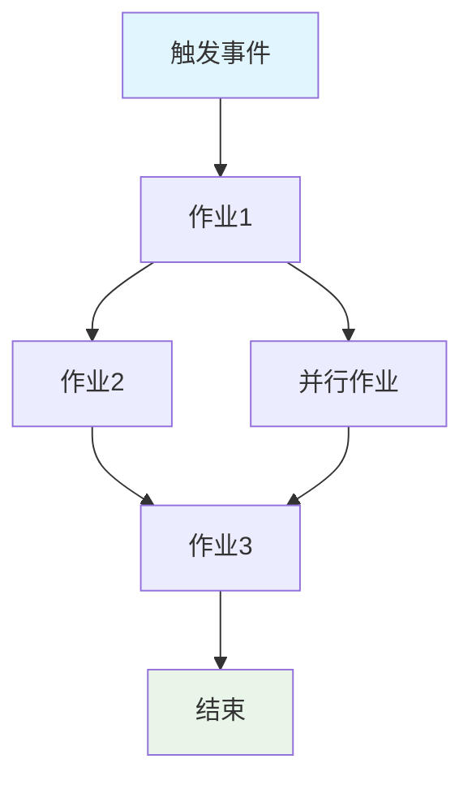
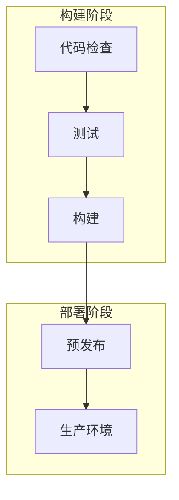

# 创建GitHub Actions工作流规范

为GitHub Actions工作流创建全面规范：`${input:WorkflowFile}`。

此规范作为工作流行为、需求和约束的说明。必须与实现无关，重点关注工作流完成的**内容**而不是实现的**方式**。

## AI优化要求

- **令牌效率**：使用简洁语言而不牺牲清晰度
- **结构化数据**：利用表格、列表和图表传递密集信息
- **语义清晰**：全文使用精确术语保持一致
- **实现抽象**：避免特定语法、命令或工具版本
- **可维护性**：设计为在工作流演进时易于更新

## 规范模板

保存为：`/spec/spec-process-cicd-[workflow-name].md`

```md
---
title: CI/CD工作流规范 - [工作流名称]
version: 1.0
date_created: [YYYY-MM-DD]
last_updated: [YYYY-MM-DD]
owner: DevOps团队
tags: [process, cicd, github-actions, automation, [领域特定标签]]
---

## 工作流概述

**目的**：[一句话描述工作流的主要目标]
**触发事件**：[列出触发条件]
**目标环境**：[环境范围]

## 执行流程图



## 作业与依赖关系

| 作业名称 | 目的 | 依赖项 | 执行上下文 |
|----------|---------|--------------|-------------------|
| job-1 | [目的] | [先决条件] | [运行器/环境] |
| job-2 | [目的] | job-1 | [运行器/环境] |

## 需求矩阵

### 功能需求
| ID | 需求 | 优先级 | 验收标准 |
|----|-------------|----------|-------------------|
| REQ-001 | [需求] | 高 | [可测试标准] |
| REQ-002 | [需求] | 中 | [可测试标准] |

### 安全需求
| ID | 需求 | 实现约束 |
|----|-------------|---------------------------|
| SEC-001 | [安全需求] | [约束描述] |

### 性能需求
| ID | 指标 | 目标 | 测量方法 |
|----|-------|--------|-------------------|
| PERF-001 | [指标] | [目标值] | [测量方式] |

## 输入/输出契约

### 输入

```yaml
# 环境变量
ENV_VAR_1: string  # 目的：[描述]
ENV_VAR_2: secret  # 目的：[描述]

# 仓库触发器
paths: [路径过滤器列表]
branches: [分支模式列表]
```

### 输出

```yaml
# 作业输出
job_1_output: string  # 描述：[目的]
build_artifact: file  # 描述：[内容类型]
```

### 密钥与变量

| 类型 | 名称 | 目的 | 范围 |
|------|------|---------|-------|
| 密钥 | SECRET_1 | [目的] | 工作流 |
| 变量 | VAR_1 | [目的] | 仓库 |

## 执行约束

### 运行时约束

- **超时**：[最大执行时间]
- **并发性**：[并行执行限制]
- **资源限制**：[内存/CPU约束]

### 环境约束

- **运行器要求**：[操作系统/硬件需求]
- **网络访问**：[外部连接需求]
- **权限**：[所需访问级别]

## 错误处理策略

| 错误类型 | 响应 | 恢复操作 |
|------------|----------|-----------------|
| 构建失败 | [响应] | [恢复步骤] |
| 测试失败 | [响应] | [恢复步骤] |
| 部署失败 | [响应] | [恢复步骤] |

## 质量门控

### 门控定义

| 门控 | 标准 | 绕过条件 |
|------|----------|-------------------|
| 代码质量 | [标准] | [允许时] |
| 安全扫描 | [阈值] | [允许时] |
| 测试覆盖率 | [百分比] | [允许时] |

## 监控与可观察性

### 关键指标

- **成功率**：[目标百分比]
- **执行时间**：[目标持续时间]
- **资源使用**：[监控方法]

### 告警

| 条件 | 严重性 | 通知目标 |
|-----------|----------|-------------------|
| [条件] | [级别] | [谁/哪里] |

## 集成点

### 外部系统

| 系统 | 集成类型 | 数据交换 | SLA要求 |
|--------|------------------|---------------|------------------|
| [系统] | [类型] | [数据格式] | [要求] |

### 依赖工作流

| 工作流 | 关系 | 触发机制 |
|----------|--------------|-------------------|
| [工作流] | [类型] | [如何触发] |

## 合规与治理

### 审计要求

- **执行日志**：[保留策略]
- **审批门控**：[所需审批]
- **变更控制**：[更新流程]

### 安全控制

- **访问控制**：[权限模型]
- **密钥管理**：[轮换策略]
- **漏洞扫描**：[扫描频率]

## 边缘情况与异常

### 场景矩阵

| 场景 | 预期行为 | 验证方法 |
|----------|-------------------|-------------------|
| [边缘情况] | [行为] | [如何验证] |

## 验证标准

### 工作流验证

- **VLD-001**：[验证规则]
- **VLD-002**：[验证规则]

### 性能基准

- **PERF-001**：[基准标准]
- **PERF-002**：[基准标准]

## 变更管理

### 更新流程

1. **规范更新**：首先修改本文档
2. **审查与批准**：[批准流程]
3. **实现**：将变更应用到工作流
4. **测试**：[验证方法]
5. **部署**：[发布流程]

### 版本历史

| 版本 | 日期 | 变更 | 作者 |
|---------|------|---------|--------|
| 1.0 | [日期] | 初始规范 | [作者] |

## 相关规范

- [相关工作流规范的链接]
- [基础设施规范的链接]
- [部署规范的链接]

```

## 分析说明

分析工作流文件时：

1. **提取核心目的**：识别主要业务目标
2. **映射作业流程**：创建显示执行顺序的依赖图
3. **识别契约**：记录输入、输出和接口
4. **捕获约束**：提取超时、权限和限制
5. **定义质量门控**：识别验证和批准点
6. **记录错误路径**：映射失败场景和恢复
7. **抽象实现**：关注行为，而非语法

## Mermaid图表指南

### 流程类型
- **顺序**：`A --> B --> C`
- **并行**：`A --> B & A --> C; B --> D & C --> D`
- **条件**：`A --> B{决策}; B -->|是| C; B -->|否| D`

### 样式
```mermaid
style TriggerNode fill:#e1f5fe
style SuccessNode fill:#e8f5e8
style FailureNode fill:#ffebee
style ProcessNode fill:#f3e5f5
```

### 复杂工作流
对于5个以上作业的工作流，使用子图：


## 令牌优化策略

1. **使用表格**：结构化格式中的密集信息
2. **一致缩写**：定义一次，全文使用
3. **要点**：避免散文段落
4. **代码块**：结构化数据优于叙述
5. **交叉引用**：链接而非重复信息

专注于创建既作为文档又作为工作流更新模板的规范。