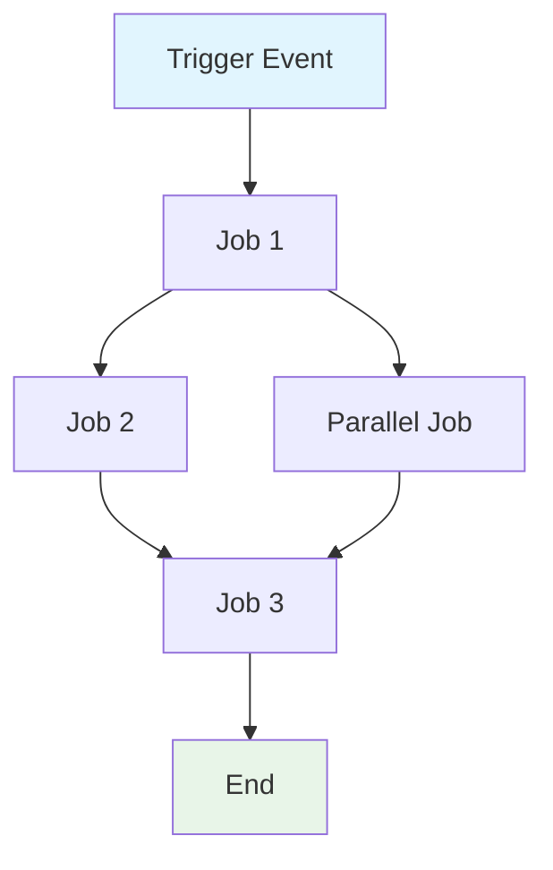

# 创建 GitHub Actions 工作流规格说明

为工作流 `${input:WorkflowFile}` 创建一份完整规格说明。

该规格专注于工作流的行为、需求与约束，需与实现解耦，即强调“做什么”而非“如何做”。

## 面向 AI 的要求

- 令牌高效：语言简洁而不牺牲清晰度
- 结构化数据：使用表格、列表、图表承载密集信息
- 语义清晰：全程术语一致
- 实现抽象：避免具体语法、命令或工具版本
- 可维护性：易随工作流演进更新

## 规格模板

保存为：`/spec/spec-process-cicd-[workflow-name].md`

````md
---
title: CI/CD Workflow Specification - [Workflow Name]
version: 1.0
date_created: [YYYY-MM-DD]
last_updated: [YYYY-MM-DD]
owner: DevOps Team
tags: [process, cicd, github-actions, automation, [domain-specific-tags]]
---

## Workflow Overview

**Purpose**: [One sentence describing workflow's primary goal]
**Trigger Events**: [List trigger conditions]
**Target Environments**: [Environment scope]

## Execution Flow Diagram


````

## Jobs & Dependencies

| Job Name | Purpose   | Dependencies    | Execution Context    |
| -------- | --------- | --------------- | -------------------- |
| job-1    | [Purpose] | [Prerequisites] | [Runner/Environment] |
| job-2    | [Purpose] | job-1           | [Runner/Environment] |

## Requirements Matrix

### Functional Requirements

| ID      | Requirement   | Priority | Acceptance Criteria |
| ------- | ------------- | -------- | ------------------- |
| REQ-001 | [Requirement] | High     | [Testable criteria] |
| REQ-002 | [Requirement] | Medium   | [Testable criteria] |

### Security Requirements

| ID      | Requirement            | Implementation Constraint |
| ------- | ---------------------- | ------------------------- |
| SEC-001 | [Security requirement] | [Constraint description]  |

### Performance Requirements

| ID       | Metric   | Target         | Measurement Method |
| -------- | -------- | -------------- | ------------------ |
| PERF-001 | [Metric] | [Target value] | [How measured]     |

## Input/Output Contracts

### Inputs

```yaml
# Environment Variables
ENV_VAR_1: string # Purpose: [description]
ENV_VAR_2: secret # Purpose: [description]

# Repository Triggers
paths: [list of path filters]
branches: [list of branch patterns]
```

### Outputs

```yaml
# Job Outputs
job_1_output: string # Description: [purpose]
build_artifact: file # Description: [content type]
```

### Secrets & Variables

| Type     | Name     | Purpose   | Scope      |
| -------- | -------- | --------- | ---------- |
| Secret   | SECRET_1 | [Purpose] | Workflow   |
| Variable | VAR_1    | [Purpose] | Repository |

## Execution Constraints

### Runtime Constraints

- **Timeout**: [Maximum execution time]
- **Concurrency**: [Parallel execution limits]
- **Resource Limits**: [Memory/CPU constraints]

### Environmental Constraints

- **Runner Requirements**: [OS/hardware needs]
- **Network Access**: [External connectivity needs]
- **Permissions**: [Required access levels]

## Error Handling Strategy

| Error Type         | Response   | Recovery Action  |
| ------------------ | ---------- | ---------------- |
| Build Failure      | [Response] | [Recovery steps] |
| Test Failure       | [Response] | [Recovery steps] |
| Deployment Failure | [Response] | [Recovery steps] |

## Quality Gates

### Gate Definitions

| Gate          | Criteria     | Bypass Conditions |
| ------------- | ------------ | ----------------- |
| Code Quality  | [Standards]  | [When allowed]    |
| Security Scan | [Thresholds] | [When allowed]    |
| Test Coverage | [Percentage] | [When allowed]    |

## Monitoring & Observability

### Key Metrics

- **Success Rate**: [Target percentage]
- **Execution Time**: [Target duration]
- **Resource Usage**: [Monitoring approach]

### Alerting

| Condition   | Severity | Notification Target |
| ----------- | -------- | ------------------- |
| [Condition] | [Level]  | [Who/Where]         |

## Integration Points

### External Systems

| System   | Integration Type | Data Exchange | SLA Requirements |
| -------- | ---------------- | ------------- | ---------------- |
| [System] | [Type]           | [Data format] | [Requirements]   |

### Dependent Workflows

| Workflow   | Relationship | Trigger Mechanism |
| ---------- | ------------ | ----------------- |
| [Workflow] | [Type]       | [How triggered]   |

## Compliance & Governance

### Audit Requirements

- **Execution Logs**: [Retention policy]
- **Approval Gates**: [Required approvals]
- **Change Control**: [Update process]

### Security Controls

- **Access Control**: [Permission model]
- **Secret Management**: [Rotation policy]
- **Vulnerability Scanning**: [Scan frequency]

## Edge Cases & Exceptions

### Scenario Matrix

| Scenario    | Expected Behavior | Validation Method |
| ----------- | ----------------- | ----------------- |
| [Edge case] | [Behavior]        | [How to verify]   |

## Validation Criteria

### Workflow Validation

- **VLD-001**: [Validation rule]
- **VLD-002**: [Validation rule]

### Performance Benchmarks

- **PERF-001**: [Benchmark criteria]
- **PERF-002**: [Benchmark criteria]

## Change Management

### Update Process

1. **Specification Update**: Modify this document first
2. **Review & Approval**: [Approval process]
3. **Implementation**: Apply changes to workflow
4. **Testing**: [Validation approach]
5. **Deployment**: [Release process]

### Version History

| Version | Date   | Changes               | Author   |
| ------- | ------ | --------------------- | -------- |
| 1.0     | [Date] | Initial specification | [Author] |

## Related Specifications

- [Link to related workflow specs]
- [Link to infrastructure specs]
- [Link to deployment specs]

````

## 分析指引

在分析工作流文件时：

1. 提取核心目的：识别主要业务目标
2. 绘制作业流：给出依赖图与执行顺序
3. 定义契约：记录输入、输出与接口
4. 捕获约束：提取超时、权限与限制
5. 设定质量门禁：列出验证与审批点
6. 记录错误路径：映射失败场景与恢复
7. 实现抽象化：专注行为而非语法

## Mermaid 图指引

### 流程类型
- 顺序：`A --> B --> C`
- 并行：`A --> B & A --> C; B --> D & C --> D`
- 条件：`A --> B{Decision}; B -->|Yes| C; B -->|No| D`

### 样式
```mermaid
style TriggerNode fill:#e1f5fe
style SuccessNode fill:#e8f5e8
style FailureNode fill:#ffebee
style ProcessNode fill:#f3e5f5
````

### 复杂工作流

对于 5 个以上作业的工作流，使用子图：

```mermaid
graph TD
    subgraph "Build Phase"
        A[Lint] --> B[Test] --> C[Build]
    end
    subgraph "Deploy Phase"
        D[Staging] --> E[Production]
    end
    C --> D
```

## Token 优化策略

1. 使用表格：用结构化数据承载密集信息
2. 统一缩写：定义一次，全程复用
3. 列表优先：避免冗长散文
4. 代码块：偏好结构化数据而非叙述
5. 交叉引用：链接替代重复

目标是产出既是文档也是更新模板的规格说明。
